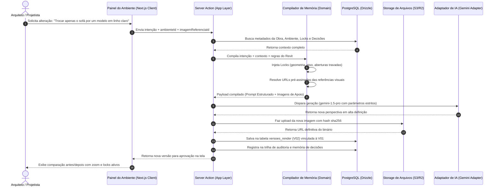

# ARQUITETURA TÉCNICA DEFINITIVA
## ARQVERTICE STUDIO — FUNDAÇÃO ESTRUTURAL DA PLATAFORMA
**Versão:** 1.0.0  
**Data:** 21 de Setembro de 2026  
**Documento:** ARCHITECTURE.md  
**Status:** Aprovado para Fundação / Base Técnica do Sistema  

---

### 1. VISÃO GERAL E FILOSOFIA DE ARQUITETURA

O **ARQVERTICE STUDIO** é a plataforma operacional, técnica e visual da **ArqVértice Arquitetura e Interiores**. Sua missão é unificar o ciclo de vida completo do projeto arquitetônico e executivo:

$$\text{Cliente} \longrightarrow \text{Briefing} \longrightarrow \text{Estudos} \longrightarrow \text{Projeto} \longrightarrow \text{Ambientes} \longrightarrow \text{Visualização} \longrightarrow \text{Apresentação} \longrightarrow \text{Cronograma} \longrightarrow \text{Entrega}$$

#### Princípios Arquiteturais Inegociáveis:
1. **O Revit é a Autoridade Geométrica e Documental:** A plataforma não substitui o Autodesk Revit nem tenta recriar um CAD/BIM no navegador. Ela atua como camada de orquestração, organização espacial por ambientes, enriquecimento visual por IA, acompanhamento e apresentação ao cliente.
2. **Organização Centralizada por Ambientes:** O projeto divide-se em unidades espaciais autônomas (Sala, Cozinha, Suíte, Deck...). Cada ambiente carrega seu próprio contexto, referências, plantas, câmeras, renders, móveis, materiais, decisões e locks.
3. **Memória Contextual Multicamada para IA:** A inteligência artificial nunca opera às cegas com prompts isolados. Toda geração consome a hierarquia de contexto (Projeto $\rightarrow$ Ambiente $\rightarrow$ Imagem $\rightarrow$ Locks $\rightarrow$ Decisões), garantindo consistência volumétrica e estilística.
4. **Isolamento Lógico Multi-Tenant (Múltiplos Clientes e Obras):** Separação estrita entre dados do cliente e especificações de cada projeto. Um cliente pode possuir múltiplos empreendimentos simultâneos.
5. **Preservação e Integração do Cronograma:** O sistema de cronograma multidisciplinar existente (`cronograma-residencia-praia`) é absorvido como o módulo canônico de planejamento de projetos e obras.

---

### 2. PILHA TECNOLÓGICA DEFINITIVA (STACK SELECTION)

Com base nas conclusões da auditoria técnica (`docs/RECOMENDACAO_ARQUITETURA.md`), a plataforma adota uma infraestrutura full-stack moderna, fortemente tipada e otimizada para a Vercel e PostgreSQL:

```
┌────────────────────────────────────────────────────────────────────────┐
│                        ARQVERTICE STUDIO STACK                         │
├───────────────────────┬────────────────────────────────────────────────┤
│ Meta-Framework        │ Next.js 15+ (App Router, Server Components)    │
│ Camada de Apresentação│ React 19 + Tailwind CSS + Lucide Icons         │
│ Linguagem de Tipagem  │ TypeScript 5.5+ (Strict Mode Obrigatório)      │
│ Banco de Dados        │ PostgreSQL 16 (Supabase ou Neon Serverless)    │
│ Camada de Dados (ORM) │ Drizzle ORM (Type-safe SQL com Zero Overhead)  │
│ Validação de Schemas  │ Zod v3 (Validação estrita em APIs e Formulários)│
│ Armazenamento Mídia   │ Supabase Storage / Cloudflare R2 / Vercel Blob │
│ Provedores de IA      │ Adaptador Agnóstico (Gemini 3.8 Pro / Flash)    │
│ Geração de Documentos │ @react-pdf/renderer (Renderização nativa no SRV)│
│ Testes Unitários/E2E  │ Vitest + Playwright                            │
│ Hospedagem / Deploy   │ Vercel (Edge Network + Serverless Functions)   │
└───────────────────────┴────────────────────────────────────────────────┘
```

---

### 3. ARQUITETURA EM 11 CAMADAS

A aplicação segue uma arquitetura em camadas concêntricas (Clean Architecture adaptada para Next.js App Router), onde as dependências apontam estritamente para o centro (Domain):

```
┌────────────────────────────────────────────────────────────────────────┐
│ 1. PRESENTATION (App Router, Server Components, Client Components)     │
├────────────────────────────────────────────────────────────────────────┤
│ 2. APPLICATION (Use Cases, Server Actions, Route Handlers, DTOs)       │
├────────────────────────────────────────────────────────────────────────┤
│ 3. DOMAIN (Entities, Value Objects, Domain Events, Domain Rules)       │
├────────────────────────────────────────────────────────────────────────┤
│ 4. DATA / REPOSITORIES (Drizzle ORM, Migrations, Postgres Queries)     │
├────────────────────────────────────────────────────────────────────────┤
│ 5. AI ENGINE (Context Compiler, Provider Adapters, Lock Filters)       │
├────────────────────────────────────────────────────────────────────────┤
│ 6. FILES / STORAGE (S3/R2 Client, Presigned URLs, Hash Validator)      │
├────────────────────────────────────────────────────────────────────────┤
│ 7. REPORTING (PDF Document Generators, Plate Layout Engines)           │
├────────────────────────────────────────────────────────────────────────┤
│ 8. SCHEDULING (Critical Path, Phase Detector, Deadline Calculator)     │
├────────────────────────────────────────────────────────────────────────┤
│ 9. AUTH & RBAC (Session Management, Permissions, Public Tokens)        │
├────────────────────────────────────────────────────────────────────────┤
│ 10. AUDIT & LOGS (Change History, Version Snapshots, Action Tracing)   │
├────────────────────────────────────────────────────────────────────────┤
│ 11. INTEGRATIONS (Revit Exporter Importer, Video Prompters, Webhooks)  │
└────────────────────────────────────────────────────────────────────────┘
```

#### Responsabilidades Detalhadas:
1. **Presentation:** Páginas dinâmicas, layouts responsivos, componentes de UI acessíveis, tema escuro/claro nativo, feedback visual com toasts e formulários react-hook-form.
2. **Application:** Orquestração de casos de uso (`CriarProjeto`, `AdicionarAmbiente`, `CompilarPromptIA`, `AtualizarProgressoCronograma`). Valida dados com schemas Zod.
3. **Domain:** Entidades puras e invariantes de negócio independentes de banco ou framework (ex.: cálculo de status de tarefa, regra da fase atual no painel, bloqueio de locks de IA).
4. **Data:** Esquemas relacionais tipados em Drizzle, mapeadores de modelo de banco para entidades de domínio, transações ACID.
5. **AI Engine:** Orquestrador de inteligência artificial. Monta o payload de contexto multicamada, envia para o adapter configurado (Gemini) e registra a versão de imagem gerada.
6. **Files / Storage:** Gerador de URLs pré-assinadas para uploads multipart diretos do navegador para o storage bucket, sem trafegar arquivos pesados pelo servidor serverless.
7. **Reporting:** Renderizador server-side de pranchas e relatórios contratuais em PDF de alta resolução.
8. **Scheduling:** Motor do cronograma herdado e expandido. Calcula dependências entre etapas, caminhos críticos e distribui tarefas por projetista.
9. **Auth & RBAC:** Identificação segura de administradores e colaboradores da ArqVértice. Geração de tokens efêmeros de link público para clientes.
10. **Audit:** Trilha de auditoria imutável (quem alterou, o que alterou, quando e snapshot da versão anterior).
11. **Integrations:** Utilitários para processamento de metadados extraídos de arquivos CAD/BIM e gerador de roteiros para ferramentas externas de vídeo.

---

### 4. ESTRUTURA DE DIRETÓRIOS DO PROJETO

A estrutura foi planejada para garantir máxima coesão e facilidade de localização:

```
ARQVERTICE-STUDIO/
├── .github/                      # Workflows de CI/CD (Lint, Vitest, Playwright)
├── docs/                         # Documentação viva e decisões arquiteturais (ADRs)
├── public/                       # Assets estáticos institucionais (logos, favicons)
├── src/
│   ├── app/                      # Next.js App Router (Rotas de UI e API)
│   │   │── (admin)/              # Grupo de Rotas Administrativas (Protegidas)
│   │   │   ├── dashboard/        # Visão Geral Multi-projetos e KPIs do Escritório
│   │   │   ├── clientes/         # Gestão de Clientes e Contatos
│   │   │   └── projetos/         # Gestão Completa de Obras
│   │   │       ├── page.tsx      # Listagem de Todos os Projetos
│   │   │       ├── novo/         # Assistente de Criação de Projeto
│   │   │       └── [projetoId]/  # Raiz de um Projeto Específico
│   │   │           ├── layout.tsx# Header da Obra, Ficha Técnica e Navegação
│   │   │           ├── page.tsx  # Visão Geral da Obra e Dossiê
│   │   │           ├── cronograma/     # Módulo Canônico de Cronograma (Kanban + Datagrid)
│   │   │           ├── ambientes/      # Grid de Ambientes do Projeto
│   │   │           │   └── [ambienteId]/ # Detalhe do Ambiente (Renders, Câmeras, Locks)
│   │   │           ├── briefing/       # Consolidação Interna do Briefing Técnico
│   │   │           ├── visualizacao/   # Galeria Geral de Renders e Perspectivas
│   │   │           ├── materiais/      # Especificações de Acabamentos e Catálogo
│   │   │           ├── moveis/         # Mobiliário, Medidas e Fornecedores
│   │   │           ├── moodboards/     # Pranchas Conceituais e Fichas de Estilo
│   │   │           ├── apresentacao/   # Editor de Pranchas (A4, A3, A2, A1)
│   │   │           ├── revisoes/       # Histórico de Versões e Comentários do Cliente
│   │   │           ├── relatorios/     # Emissão de Relatório Executivo em PDF
│   │   │           └── entrega/        # Finalização, Consolidação e Roteiro de Vídeo
│   │   ├── (publico)/            # Grupo de Rotas Públicas (Sem Login)
│   │   │   ├── briefing/
│   │   │   │   └── [token]/      # Entrevista Pública Guiada para o Cliente
│   │   │   └── obra/
│   │   │       └── [token]/      # Painel do Cliente ("Estamos Aqui" somente leitura)
│   │   ├── api/                  # Route Handlers REST / Webhooks
│   │   │   ├── auth/             # Endpoints de Autenticação
│   │   │   ├── storage/presign/  # Emissão de URL assinada para upload de arquivos
│   │   │   └── ia/gerar/         # Gatilho assíncrono para gerações de imagem
│   │   ├── layout.tsx            # Layout Raiz (Provedores de Tema, Auth, Query)
│   │   └── globals.css           # Design Tokens, Paleta ArqVértice e CSS Utilitário
│   │
│   ├── core/                     # Lógica de Negócio e Domínio Puro (Agnóstica de UI)
│   │   ├── domain/               # Entidades, Value Objects e Tipos de Domínio
│   │   │   ├── cliente.ts
│   │   │   ├── projeto.ts
│   │   │   ├── ambiente.ts
│   │   │   ├── cronograma.ts     # Tarefa, Disciplina, Status, Fase
│   │   │   ├── memoria.ts        # Contexto, Locks, Decisões, Restrições
│   │   │   ├── arquivo.ts        # Metadados de Mídia, Categoria, MIME
│   │   │   └── briefing.ts       # Seções, Perguntas, Respostas
│   │   ├── application/          # Casos de Uso (Use Cases) e DTOs
│   │   │   ├── projetos/
│   │   │   ├── cronograma/
│   │   │   ├── ambientes/
│   │   │   ├── ia/
│   │   │   └── relatorios/
│   │   └── services/             # Portas para Serviços Externos (Interfaces)
│   │       ├── IAProvider.ts     # Interface agnóstica de IA
│   │       ├── StorageService.ts # Interface de upload/download de storage
│   │       └── PDFGenerator.ts   # Interface de geração de documentos
│   │
│   ├── infrastructure/           # Implementações Técnicas e Conectores
│   │   ├── database/             # Conexão PostgreSQL e Drizzle ORM
│   │   │   ├── schema/           # Definição das Tabelas Drizzle
│   │   │   │   ├── clientes.ts
│   │   │   │   ├── projetos.ts
│   │   │   │   ├── tarefas.ts    # Mapeamento estrito da tabela legada
│   │   │   │   ├── ambientes.ts
│   │   │   │   ├── arquivos.ts
│   │   │   │   ├── memoria.ts
│   │   │   │   └── auditoria.ts
│   │   │   ├── migrations/       # Scripts SQL versionados gerados pelo Drizzle Kit
│   │   │   └── index.ts          # Singleton de Pool do Drizzle Client
│   │   ├── storage/              # Adaptador Supabase Storage / S3
│   │   ├── ai/                   # Implementação Gemini Provider Adapter
│   │   ├── auth/                 # Sessões e verificação de tokens HMAC
│   │   └── pdf/                  # Implementações @react-pdf/renderer
│   │
│   ├── components/               # Componentes React Reutilizáveis
│   │   ├── ui/                   # Design System Base (Botões, Modais, Inputs, Tabs)
│   │   ├── layout/               # MasterHeader, Sidebar, ProjectDossier
│   │   ├── cronograma/           # KanbanBoard, DataGrid, PhaseStrip, TeamRoster
│   │   ├── ambientes/            # CardAmbiente, VisualizadorPerspectivas, LockManager
│   │   ├── briefing/             # QuestionarioGuiado, CartoesIlustradosSVG
│   │   └── relatorios/           # TemplateRelatorioExecutivo, VisualizadorPDF
│   │
│   └── shared/                   # Utilitários, Helpers e Validações Comuns
│       ├── validations/          # Schemas Zod de Entrada e Saída
│       ├── formatters/           # Datas BR/ISO, Moedas, Áreas, Slugs
│       └── constants/            # Disciplinas canônicas, Códigos de Cores
├── drizzle.config.ts             # Configuração do Drizzle ORM e Migrations
├── next.config.ts                # Configuração do Next.js (Imagens remotas, CORS)
├── tailwind.config.ts            # Configuração de Cores e Tipografia da ArqVértice
└── package.json                  # Dependências do Projeto
```

---

### 5. FLUXO TÉCNICO DE PROCESSAMENTO DE IA E MEMÓRIA

A arquitetura estabelece que nenhuma geração de IA é executada com prompts arbitrários ou isolados:



---

### 6. COMPATIBILIDADE E PRESERVAÇÃO DA BASE ATUAL

Para cumprir o princípio de que **nenhum dado será perdido e nenhuma funcionalidade será degradada**:

1. **Paridade com a Tabela `tarefas` Existente:** A tabela `tarefas` no novo banco manterá exatamente as mesmas colunas (`id UUID`, `descricao_etapa`, `disciplina_projeto`, `projetista`, `data_conclusao DATE`, `porcentagem`, `ordem`, `status GENERATED`). Ela receberá uma coluna `projeto_id UUID` cujo valor padrão corresponderá ao ID da "Residência de Praia".
2. **Preservação das Regras de Cálculo:** As funções puras `calculateStatus`, `computePhases`, `buildResumoExecutivo` e `getDaysRemaining` serão migradas com 100% de correspondência lógica para TypeScript em `src/core/domain/cronograma.ts`.
3. **Preservação Visual:** Todas as variáveis CSS de cor por disciplina (`--c-arq`, `--c-3d`, `--c-est`, `--c-comp`, `--c-obr`) e estilos de impressão serão mapeadas no `tailwind.config.ts`.
