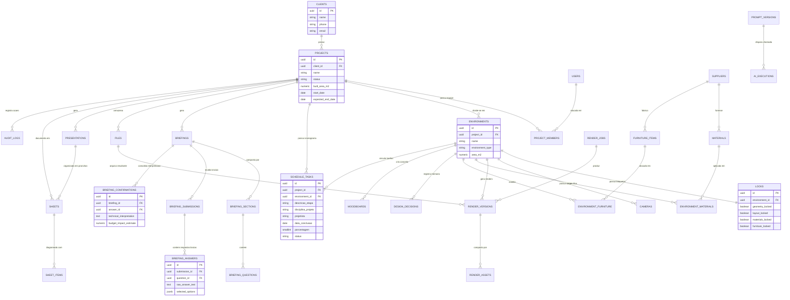

# RELACIONAMENTOS E DIAGRAMA ENTIDADE-RELACIONAMENTO (ERD)
## ARQVERTICE STUDIO — CARDINALIDADES E MAPA VISUAL DO BANCO
**Versão:** 1.0.0  
**Data:** 21 de Setembro de 2026  
**Documento:** DATABASE_RELATIONSHIPS.md  

---

### 1. MAPA DE CARDINALIDADES E REGRAS DE INTEGRIDADE

| Entidade Origem | Relação | Entidade Destino | Política ON DELETE | Justificativa de Negócio |
| :--- | :---: | :--- | :--- | :--- |
| `clients` | **1 : N** | `projects` | `ON DELETE RESTRICT` | Impede apagar um cliente que possua projetos ativos no escritório. |
| `projects` | **1 : N** | `environments` | `ON DELETE CASCADE` | Ambientes são partes indissociáveis de um projeto específico. |
| `projects` | **1 : N** | `schedule_tasks` | `ON DELETE CASCADE` | Tarefas de cronograma pertencem estritamente ao escopo daquele projeto. |
| `projects` | **1 : N** | `files` | `ON DELETE CASCADE` | Exclusão do projeto remove os metadados dos seus arquivos. |
| `projects` | **1 : N** | `briefings` | `ON DELETE CASCADE` | As sessões de briefing pertencem ao projeto. |
| `environments` | **1 : 1** | `locks` | `ON DELETE CASCADE` | Cada ambiente possui exatamente uma configuração de bloqueios de IA. |
| `environments` | **1 : N** | `cameras` | `ON DELETE CASCADE` | Pontos de vista e perspectivas vinculados ao espaço físico. |
| `environments` | **1 : N** | `render_versions` | `ON DELETE CASCADE` | Imagens geradas pertencem ao ambiente retratado. |
| `environments` | **N : M** | `materials` | `via environment_materials` | Um material pode ser usado em vários cômodos; um cômodo tem vários materiais. |
| `environments` | **N : M** | `furniture_items` | `via environment_furniture` | Um móvel pode se repetir em vários cômodos com contagens independentes. |
| `briefings` | **1 : N** | `briefing_sections`| `ON DELETE CASCADE` | As seções estruturam o questionário daquela sessão. |
| `briefing_sections`| **1 : N** | `briefing_questions`| `ON DELETE CASCADE` | Perguntas pertencem à seção. |
| `briefing_submissions`| **1 : N**| `briefing_answers` | `ON DELETE CASCADE` | As respostas brutas enviadas pelo cliente. |
| `briefing_answers`| **1 : 1** | `briefing_confirmations`| `ON DELETE SET NULL` | A interpretação técnica da ArqVértice vinculada à resposta do cliente. |
| `users` | **1 : N** | `audit_logs` | `ON DELETE SET NULL` | Se um funcionário sair da empresa, o histórico das alterações é mantido. |

---

### 2. DIAGRAMA ENTIDADE-RELACIONAMENTO VISUAL (MERMAID ERD)



---

### 3. PRESERVAÇÃO DAS INVARIANTES DO CRONOGRAMA

O relacionamento entre `projects` e `schedule_tasks` preserva integralmente as regras auditadas no A01:
1. **Disciplina Canônica Obrigatória:** Apenas valores em `('Arquitetura', '3D', 'Estrutura', 'Complementares', 'Obras')` são aceitos pelo CHECK de banco.
2. **Coluna de Status Centralizada no Banco:** Nenhuma aplicação externa calcula o status de forma divergente:
   ```sql
   status TEXT GENERATED ALWAYS AS (
       CASE
           WHEN porcentagem = 0   THEN 'Não Iniciado'
           WHEN porcentagem = 100 THEN 'Finalizado'
           ELSE 'Em Andamento'
       END
   ) STORED
   ```
3. **Ordenação com Índice Composto:** A busca por `(project_id, ordem, data_conclusao)` assegura renderização instantânea do Kanban mesmo com múltiplos projetos no banco.
