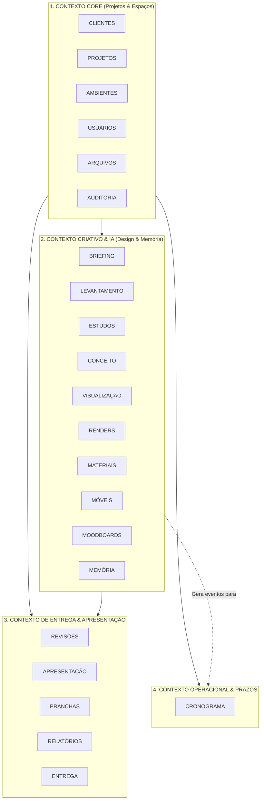

# MAPEAMENTO DE DOMÍNIOS E FRONTEIRAS DE CONTEXTO (DDD)
## ARQVERTICE STUDIO — DOMAIN-DRIVEN DESIGN & BOUNDED CONTEXTS
**Versão:** 1.0.0  
**Data:** 21 de Setembro de 2026  
**Documento:** DOMAIN_BOUNDARIES.md  

---

### 1. VISÃO GERAL DOS BOUNDED CONTEXTS

Para garantir manutenibilidade e escalabilidade sem acoplamento caótico, o **ARQVERTICE STUDIO** divide-se em **4 Grandes Contextos Delimitados (Bounded Contexts)**, que englobam os 22 domínios essenciais:



---

### 2. DETALHAMENTO DOS 22 DOMÍNIOS

#### 2.1. Domínio CLIENTES
- **Responsabilidade:** Identificação civil, dados de contato e relacionamento comercial com contratantes.
- **Entidades:** `Cliente` (id, nome, email, telefone, documento, endereco, criadoEm).
- **Invariante de Negócio:** Um cliente pode possuir múltiplos projetos, mas um projeto pertence a exatamente um cliente contratante.

#### 2.2. Domínio PROJETOS
- **Responsabilidade:** A entidade agregadora central de todo o trabalho do escritório.
- **Entidades:** `Projeto` (id, clienteId, nomeObra, localizacao, loteQuadra, zona, areaConstruidaM2, areaTerrenoM2, tipologia, dataInicio, previsaoConclusao, status, criadoEm, atualizadoEm).
- **Agregados:** Agrega Ambientes, Tarefas de Cronograma, Arquivos e Sessões de Briefing.

#### 2.3. Domínio AMBIENTES
- **Responsabilidade:** Unidade espacial autônoma do projeto (Sala, Cozinha, Suíte, Deck Gourmet...).
- **Entidades:** `Ambiente` (id, projetoId, nome, tipoAmbiente, descricao, ordemExibicao, statusAprovacao).
- **Invariante de Negócio:** Toda geração visual e especificação técnica de mobiliário/acabamento deve pertencer obrigatoriamente a um ambiente.

#### 2.4. Domínio BRIEFING
- **Responsabilidade:** Coleta e consolidação das necessidades do cliente e diretrizes da ArqVértice.
- **Subdomínios:**
  - *Briefing Externo (Cliente):* Roteiro de 32 perguntas respondido via link único seguro sem login.
  - *Briefing Interno (Técnico):* Interpretação técnica da equipe para direcionar arquitetura, interiores e compras.
- **Entidades:** `SessaoBriefing`, `Pergunta`, `Resposta`, `TokenAcessoBriefing`.

#### 2.5. Domínio LEVANTAMENTO
- **Responsabilidade:** Registro de dados do local existente (topografia, medidas reais in loco, fotos de vistoria e plantas preexistentes).
- **Entidades:** `ItemLevantamento`, `MedicaoTecnica`, `FotoVistoria`.

#### 2.6. Domínio ESTUDOS
- **Responsabilidade:** Estudos preliminares de viabilidade, programa de necessidades e distribuição de massas.
- **Entidades:** `EstudoPreliminar`, `DiretrizSolar`, `ZoneamentoUrbano`.

#### 2.7. Domínio CONCEITO
- **Responsabilidade:** Diretrizes conceituais, linguagem arquitetônica e narrativa do projeto.
- **Entidades:** `ConceitoProjeto`, `PaletaIdentidade`, `SensacaoPretendida`.

#### 2.8. Domínio VISUALIZAÇÃO
- **Responsabilidade:** Organização de vistas, ângulos de observação e câmeras vinculadas às plantas do Revit.
- **Entidades:** `CameraView` (angulo, altura, lente, posicaoX, posicaoY, ambienteId).

#### 2.9. Domínio RENDERS
- **Responsabilidade:** Geração, versionamento e aprovação de imagens fotorrealistas e perspectivas humanizadas.
- **Entidades:** `RenderItem` (id, ambienteId, cameraViewId, versao, urlImagem, promptUtilizado, seed, statusAprovacao).
- **Invariante:** Cada nova renderização gera uma versão incremental (V01 $\rightarrow$ V02), preservando a imagem anterior no histórico.

#### 2.10. Domínio MATERIAIS
- **Responsabilidade:** Especificação rigorosa de acabamentos (revestimentos, tintas, pedras, metais, pisos e marcenaria).
- **Entidades:** `MaterialItem` (nome, fabricante, codigoCor, texturaUrl, ambienteId, linkCompra, especificacaoTecnica).

#### 2.11. Domínio MÓVEIS
- **Responsabilidade:** Catálogo e curadoria de mobiliário solto e marcenaria sob medida.
- **Entidades:** `MovelItem` (nome, dimensoes, fornecedor, acabamento, precoEstimado, ambienteId, statusCompra).

#### 2.12. Domínio MOODBOARDS
- **Responsabilidade:** Pranchas visuais conceituais que reúnem referências, texturas, cores e mobiliário de cada ambiente.
- **Entidades:** `Moodboard` (id, ambienteId, layoutGrid, itensAssociados, versao).

#### 2.13. Domínio REVISÕES
- **Responsabilidade:** Ciclo formal de apontamentos, solicitações de alteração pelo cliente e controle de revisões.
- **Entidades:** `RevisaoItem` (numeroRevisao, autor, solicitacao, dataSolicitacao, resolucao, dataConclusao).

#### 2.14. Domínio APRESENTAÇÃO
- **Responsabilidade:** Montagem da narrativa executiva para entrega intermediária ou final ao cliente.
- **Entidades:** `ApresentacaoDeck`, `SlideApresentacao`, `OrdemNarrativa`.

#### 2.15. Domínio PRANCHAS
- **Responsabilidade:** Diagramação profissional em folhas técnicas (formatos A4, A3, A2 e A1) em orientações retrato ou paisagem, com carimbo oficial da ArqVértice, escalas e legendas.
- **Entidades:** `PranchaTecnica` (formato, escala, carimboDados, slotsGraficos).

#### 2.16. Domínio RELATÓRIOS
- **Responsabilidade:** Emissão de documentos formais em PDF (Relatório Executivo de Cronograma com Parecer Técnico, Relatório de Briefing Consolidado, Lista de Compras).
- **Entidades:** `RelatorioExecutivo`, `ParecerTecnico`, `AssinaturaContratual`.

#### 2.17. Domínio ENTREGA
- **Responsabilidade:** Marco de fechamento do projeto. Ação "Finalizar Projeto" consolida o dossiê executivo completo e gera a base para roteiro de vídeo.
- **Entidades:** `PacoteEntrega`, `StoryboardVideo`, `RoteiroCenas`.

#### 2.18. Domínio CRONOGRAMA
- **Responsabilidade:** Planejamento multidisciplinar, acompanhamento físico e prazos executivos da obra.
- **Entidades:** `Tarefa` (id, projetoId, ambienteId, descricaoEtapa, disciplina, projetista, dataConclusao, porcentagem, ordem, status).
- **Regra Invariante:** As disciplinas canônicas são fixadas em:
  1. `Arquitetura`
  2. `3D`
  3. `Estrutura`
  4. `Complementares`
  5. `Obras`
  O status é derivado estritamente de `porcentagem` (0 = Não Iniciado, 1-99 = Em Andamento, 100 = Finalizado).

#### 2.19. Domínio MEMÓRIA (Contexto Multicamada para IA)
- **Responsabilidade:** Preservar a consistência e a inteligência do projeto ao longo das iterações visuais.
- **Estrutura Multicamada:**
  - *Memória de Projeto:* Estilo geral, identidade visual, localização, restrições urbanísticas.
  - *Memória de Ambiente:* Layout aprovado, aberturas, tipo de iluminação natural, dimensões aproximadas.
  - *Memória de Decisões:* Registros expressos de escolhas (ex.: "O cliente aprovou o piso em travertino").
  - *Memória de Locks (Bloqueios):* Elementos protegidos contra alteração da IA (ex.: "LOCK: paredes e forro fixos; alterar somente o mobiliário").
  - *Memória de Prompts e Seeds:* Histórico de parâmetros que geraram cada versão de render.

#### 2.20. Domínio USUÁRIOS
- **Responsabilidade:** Identidade da equipe técnica e controle de permissões.
- **Entidades:** `Usuario` (id, nome, email, cargo, avatarUrl, perfilAcesso: ADMIN | ARQUITETO | ENGENHEIRO).

#### 2.21. Domínio ARQUIVOS
- **Responsabilidade:** Governança e catálogo de ativos digitais (plantas, modelos 3D, relatórios, fotos).
- **Entidades:** `ArquivoMetadados` (id, projetoId, ambienteId, categoria, nomeArquivo, mimeType, tamanhoBytes, urlStorage, hashSha256, versao).

#### 2.22. Domínio AUDITORIA
- **Responsabilidade:** Rastreabilidade imutável de todas as modificações críticas no sistema.
- **Entidades:** `LogAuditoria` (id, usuarioId, acao, entidadeAfetada, entidadeId, dadosAnteriores, dadosNovos, timestamp).

---

### 3. RELAÇÃO COM O REVIT (AUTORIDADE TÉCNICA)

```
┌────────────────────────────────────────────────────────┐
│                   AUTODESK REVIT                       │
│        (Ambiente Central de Modelagem e Geometria)      │
│                                                        │
│ • Geometria paramétrica e cálculos estruturais         │
│ • Documentação técnica legal e plantas baixas cotadas  │
│ • Cortes, fachadas e tabelas de esquadrias             │
└──────────────────────────┬─────────────────────────────┘
                           │ Exporta Plantas, DWG, IFC,
                           │ Vistas Técnicas e Imagens
                           ▼
┌────────────────────────────────────────────────────────┐
│                  ARQVERTICE STUDIO                     │
│         (Orquestração, Espaço, IA e Apresentação)       │
│                                                        │
│ • Organização por Ambientes (Contexto & Memória)       │
│ • Humanização e Renders Consistentes via IA            │
│ • Gestão do Cronograma Físico Multidisciplinar         │
│ • Relacionamento com o Cliente e Apresentações         │
└────────────────────────────────────────────────────────┘
```

A plataforma ArqVertice Studio recebe os artefatos provenientes do Revit e os organiza no contexto de cada ambiente. Nenhuma IA tem autorização para inventar uma alteração de layout técnico sem que a diretriz seja explicitamente aprovada pela equipe técnica.
