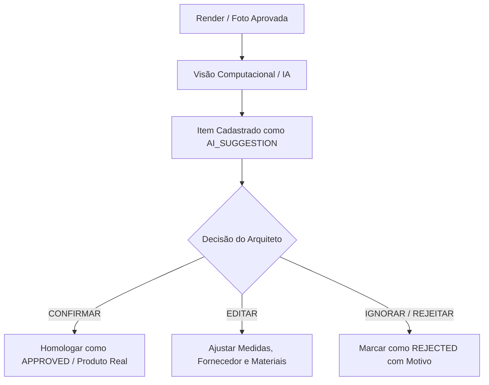

# Diretrizes de Identificação por Imagem e Anti-Alucinação (FURNITURE_IDENTIFICATION.md)

## 1. Princípio da Separação entre Aparência e Produto

> [!WARNING]
> Uma imagem renderizada ou fotografia apresenta formas, cores e acabamentos **aparentes**, mas **NÃO define automaticamente uma marca, SKU comercial ou fabricante específico**.

A IA do ArqVértice Studio é instruída a seguir a regra de ouro:
- Nunca transformar: `"sofá bege de 3 lugares"`
- Em: `"Sofá Natuzzi Mod. XYZ da Loja ABC"` sem documento ou evidência cadastral comprovada.

---

## 2. Rotulação de Incerteza

Quando um modelo visual de móvel não tiver sido homologado formalmente pelo arquiteto ou cliente, a IA deve classificá-lo estritamente sob um dos três rótulos canônicos:

1. **`NÃO IDENTIFICADO`**: Objeto visualizado na imagem cujas dimensões, fabricante ou características não puderam ser verificadas com segurança.
2. **`REFERÊNCIA VISUAL`**: Peça presente no render ou briefing utilizada como inspiração estética de linguagem, proporção ou textura, sem compromisso de fornecimento do item idêntico.
3. **`SUGESTÃO` (`AI_SUGGESTION` / `SUGGESTED`)**: Proposta gerada pela visão computacional como ponto de partida para o arquiteto avaliar.

---

## 3. Fluxo de Decisão Humana

Para qualquer item detectado ou sugerido por IA, o usuário tem a soberania da decisão:

1. **CONFIRMAR (`confirmAISuggestion`):** O arquiteto homologa a sugestão, associa fornecedor, valida preço e transforma em especificação executiva oficial.
2. **EDITAR (`updateFurnitureItem`):** Ajusta os parâmetros apurados pela IA (corrigindo medidas de projeto, materiais reais de catálogo).
3. **IGNORAR / REJEITAR (`rejectFurnitureItem`):** Descarta a sugestão registrando o motivo (ex: *"Não atende à ergonomia da circulação"*). O registro não é excluído silenciosamente, permanecendo arquivado no histórico.

---

## 4. Medições Técnicas vs Estimativas Visuais

- Para **Marcenaria Sob Medida (`CUSTOM_MILLWORK`)**, as medidas técnicas finais **devem vir obrigatoriamente do projeto arquitetônico / prancha executiva**, e nunca de estimativas de IA visual quando precisão milimétrica for necessária para corte e fabricação.
