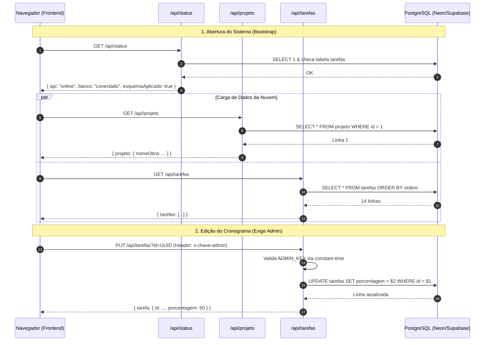

# MAPA DO BACKEND E ANÁLISE DE APIS
## ARQVERTICE STUDIO — ARQUITETURA SERVERLESS E SERVIÇOS
**Data:** 21 de Setembro de 2026  
**Documento:** MAPA_BACKEND.md  

---

### 1. VISÃO GERAL DA ARQUITETURA DE BACKEND

O backend da aplicação atual é estruturado no formato **Vercel Serverless Functions** em Node.js (CommonJS), residindo na pasta `api/` de `cronograma-residencia-praia`.

Não existe um servidor HTTP tradicional (Express ou Fastify) escutando portas de forma persistente. Cada arquivo sob `api/*.js` é compilado pela infraestrutura da Vercel como uma função independente (AWS Lambda por baixo dos panos), disparada sob demanda por eventos HTTP.

```
cronograma-residencia-praia/api/
├── _db.js       (3.3 KB, 99 linhas)  — Pool PostgreSQL, guardas de autenticação e conversores
├── status.js    (1.5 KB, 46 linhas)  — Healthcheck e diagnóstico público de infraestrutura
├── projeto.js   (2.8 KB, 84 linhas)  — Endpoint de Ficha Técnica (GET público / PUT admin)
└── tarefas.js   (5.9 KB, 147 linhas) — CRUD completo de Etapas (GET público / POST/PUT/DELETE admin)
```

---

### 2. AUDITORIA DETALHADA DOS ENDPOINTS

#### 2.1. `GET /api/status` — Diagnóstico Público
- **Propósito:** Informar ao frontend em qual modo de operação ele deve inicializar (`nuvem` ou `local`).
- **Autenticação:** Nenhuma (Endpoint público).
- **Parâmetros:** Nenhum.
- **Lógica de Execução:**
  1. Verifica se `process.env.DATABASE_URL` está preenchida; se não estiver, retorna imediatamente com `databaseUrlConfigurada: false` e `banco: 'DATABASE_URL ausente'`.
  2. Executa `SELECT 1` para testar o handshake com o PostgreSQL.
  3. Executa `SELECT to_regclass('public.tarefas') IS NOT NULL AS tem_tabela` para validar se o `schema.sql` foi devidamente executado.
  4. Se a tabela existir, executa `SELECT COUNT(*)::int AS total FROM tarefas`.
  5. Retorna status 200 com JSON sanitizado (nunca expõe senhas, host ou a chave admin).

#### 2.2. `/api/projeto` — Ficha Técnica da Obra
- **Propósito:** Leitura e atualização da linha única da tabela `projeto` (`id = 1`).
- **Métodos Suportados:**
  - **`GET /api/projeto`**:
    - **Acesso:** Público (Qualquer cliente com o link pode visualizar).
    - **Query SQL:** `SELECT * FROM projeto WHERE id = 1`.
    - **Resposta:** Objeto JSON com as propriedades mapeadas de snake_case para camelCase:
      `{ projeto: { nomeObra, cliente, localizacao, loteQuadra, zona, areaConstruida, areaTerreno, tipologia, dataInicio, previsaoConclusao, prazoTotal, empresa } }`.
  - **`PUT /api/projeto`**:
    - **Acesso:** Exige cabeçalho `x-chave-admin` válido. Se inválido, retorna HTTP 401.
    - **Validação:** Rejeita qualquer campo que exceda 300 caracteres (HTTP 400).
    - **Query SQL:** UPSERT relacional:
      ```sql
      INSERT INTO projeto (id, ...) VALUES (1, ...)
      ON CONFLICT (id) DO UPDATE SET ... RETURNING *
      ```
    - **Resposta:** Objeto do projeto atualizado (HTTP 200).

#### 2.3. `/api/tarefas` — Cronograma Multidisciplinar
- **Propósito:** Operações CRUD sobre a tabela `tarefas`.
- **Métodos Suportados:**
  - **`GET /api/tarefas`**:
    - **Acesso:** Público.
    - **Query SQL:** `SELECT id, descricao_etapa, disciplina_projeto, projetista, data_conclusao, porcentagem, ordem FROM tarefas ORDER BY ordem, data_conclusao`.
    - **Conversão de Dados:** Converte o tipo `DATE` do Postgres (`YYYY-MM-DD`) para a máscara brasileira da interface (`DD-MM-YYYY`).
    - **Resposta:** `{ tarefas: [...] }` (HTTP 200).
  - **`POST /api/tarefas`**:
    - **Acesso:** Exige cabeçalho `x-chave-admin`.
    - **Validação Estrita:**
      - `descricao_etapa`: obrigatória, trim > 0, max 255 chars.
      - `disciplina_projeto`: deve pertencer estritamente a `['Arquitetura', '3D', 'Estrutura', 'Complementares', 'Obras']`.
      - `projetista`: obrigatório, trim > 0, max 100 chars.
      - `data_conclusao`: deve bater na regex `^\d{2}-\d{2}-\d{4}$` e ser uma data válida no calendário gregoriano (evita 31/02).
      - `porcentagem`: número inteiro de 0 a 100.
    - **Query SQL:** Insere gerando UUID nativo (`gen_random_uuid()`) caso o front não envie, e calcula a próxima `ordem` via subquery:
      ```sql
      INSERT INTO tarefas (id, descricao_etapa, disciplina_projeto, projetista, data_conclusao, porcentagem, ordem)
      VALUES (COALESCE($1::uuid, gen_random_uuid()), $2, $3, $4, $5::date, $6,
              COALESCE($7, (SELECT COALESCE(MAX(ordem), 0) + 1 FROM tarefas)))
      RETURNING *
      ```
    - **Resposta:** `{ tarefa: [...] }` com HTTP 201 Created.
  - **`PUT /api/tarefas?id=UUID`**:
    - **Acesso:** Exige cabeçalho `x-chave-admin`.
    - **Validação:** Valida formato de UUID v4 no query param `id`. Valida individualmente apenas os campos fornecidos no body.
    - **Query SQL:** Monta a cláusula `SET` dinamicamente com parâmetros indexados (`$1`, `$2`...), sem concatenação insegura.
    - **Resposta:** `{ tarefa: [...] }` (HTTP 200) ou HTTP 404 se não existir.
  - **`DELETE /api/tarefas?id=UUID`**:
    - **Acesso:** Exige cabeçalho `x-chave-admin`.
    - **Query SQL:** `DELETE FROM tarefas WHERE id = $1::uuid`.
    - **Resposta:** `{ removida: id }` (HTTP 200).

---

### 3. CONEXÃO COM BANCO DE DADOS E POOLING SERVERLESS (`api/_db.js`)

#### 3.1. Reutilização de Conexões em Ambiente Serverless
Em ambientes serverless como a Vercel, cada invocação de função pode congelar entre requisições. Criar um novo `new Pool()` a cada request esgotaria o limite de conexões do PostgreSQL gerenciado (que no plano gratuito do Neon ou Supabase costuma ser entre 10 e 20 conexões simultâneas).

O arquivo `_db.js` resolve isso com caching no escopo global do processo:
```javascript
let pool = globalThis.__cronogramaPool;

function getPool() {
  if (pool) return pool;
  // ...
  pool = new Pool({
    connectionString: process.env.DATABASE_URL,
    ssl: connectionString.includes('localhost') ? false : { rejectUnauthorized: false },
    max: 3,
    idleTimeoutMillis: 10000,
    connectionTimeoutMillis: 8000
  });
  globalThis.__cronogramaPool = pool;
  return pool;
}
```

#### 3.2. Configuração SSL
Bancos em nuvem (Neon, Supabase, AWS RDS) exigem criptografia TLS/SSL. A configuração `{ rejectUnauthorized: false }` é adotada porque pools intermediários (como PgBouncer) frequentemente operam com certificados internos ou autoassinados na borda do pooler.

---

### 4. MECANISMO DE AUTENTICAÇÃO E AUTORIZAÇÃO

A segurança da aplicação adota o modelo **Guarda de Escrita por Chave Compartilhada**:

```javascript
function escritaAutorizada(req) {
  const esperado = process.env.ADMIN_KEY;
  if (!esperado) return false;

  const recebido = req.headers['x-chave-admin'];
  if (typeof recebido !== 'string' || recebido.length !== esperado.length) return false;

  let diferenca = 0;
  for (let i = 0; i < esperado.length; i++) {
    diferenca |= esperado.charCodeAt(i) ^ recebido.charCodeAt(i);
  }
  return diferenca === 0;
}
```

#### Avaliação de Segurança:
- **Ponto Positivo:** O algoritmo compara a string caractere a caractere em **tempo constante** (`diferenca |= esperado.charCodeAt(i) ^ recebido.charCodeAt(i)`). Isso impede com sucesso ataques de temporização (*timing attacks*) que tentariam deduzir o prefixo ou tamanho da chave por variações de milissegundos na resposta HTTP.
- **Ponto Negativo Crítico:** Não existem identidades de usuários. A chave é estática e compartilhada por toda a equipe interna. Uma vez comprometida, qualquer pessoa pode alterar todo o cronograma. Se a variável `ADMIN_KEY` não estiver definida no ambiente Vercel, a escrita fica travada permanentemente para todos.

---

### 5. MATRIZ DE DEPENDÊNCIAS FRONTEND-BACKEND



---

### 6. GARGALOS E REQUISITOS PARA O ARQVERTICE STUDIO

1. **Ausência de Suporte a Multi-inquilino / Múltiplos Projetos**:
   - As rotas `/api/tarefas` e `/api/projeto` não recebem `projeto_id`. Para listar tarefas de uma obra específica em um cenário com 10 obras simultâneas, os endpoints precisariam ser refatorados para `/api/projetos/[id]/tarefas`.
2. **Ausência de Endpoints para Arquivos e Mídia**:
   - Não há rotas para upload, download assinado de plantas ou geração de miniaturas de render. O backend atual lida exclusivamente com metadados textuais e numéricos curtos.
3. **Ausência de Endpoints de Inteligência Artificial**:
   - Não há rotas para invocar modelos LLM (Gemini) com contexto de projeto/ambiente ou para consolidar relatórios via IA.
