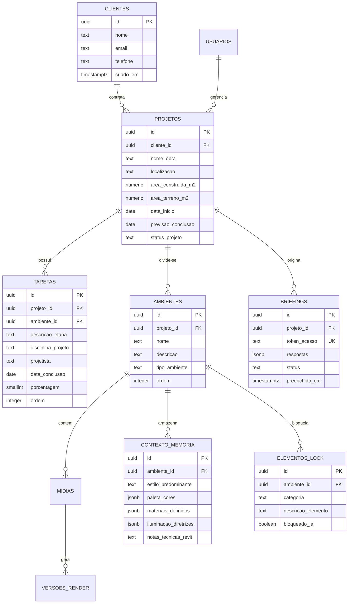

# MAPA DO BANCO DE DADOS E MODELAGEM RELACIONAL
## ARQVERTICE STUDIO — ANÁLISE DO ESQUEMA POSTGRESQL
**Data:** 21 de Setembro de 2026  
**Documento:** MAPA_BANCO.md  

---

### 1. ANÁLISE DO ESQUEMA ATUAL (`database/schema.sql`)

O script de banco de dados atual possui 121 linhas e foi projetado para ser **idempotente** (pode ser executado repetidas vezes via `psql "$DATABASE_URL" -f database/schema.sql` sem gerar duplicidades ou quebrar a base).

Abaixo está o mapeamento detalhado dos objetos criados:

---

### 2. DICIONÁRIO DE DADOS DAS TABELAS EXISTENTES

#### 2.1. Tabela `projeto` (Ficha Técnica da Obra)
Concebida como uma tabela de **registro único (singleton)** para a "Residência de Praia".

| Coluna | Tipo SQL | Nulo? | Padrão | Restrições (Constraints) | Observações e Limitações Técnicas |
| :--- | :--- | :--- | :--- | :--- | :--- |
| `id` | `SMALLINT` | NÃO | `1` | `PRIMARY KEY`, `CHECK (id = 1)` | **Gargalo Crítico:** A restrição `CHECK (id = 1)` bloqueia ativamente qualquer tentativa de inserir um segundo projeto. |
| `nome_obra` | `TEXT` | NÃO | `'Nova Obra'` | — | Nome fantasia do empreendimento. |
| `cliente` | `TEXT` | NÃO | `''` | — | Nome do cliente contratante (atualmente texto livre). |
| `localizacao` | `TEXT` | NÃO | `''` | — | Endereço ou loteamento. |
| `lote_quadra` | `TEXT` | NÃO | `''` | — | Identificação física e cadastral. |
| `zona` | `TEXT` | NÃO | `''` | — | Zoneamento urbano/municipal. |
| `area_construida` | `TEXT` | NÃO | `''` | — | **Problema:** Armazenado como `TEXT` (ex.: `'385,00 m²'`), impedindo cálculos matemáticos e agregações SQL. |
| `area_terreno` | `TEXT` | NÃO | `''` | — | **Problema:** Armazenado como `TEXT` (ex.: `'450,00 m² (15m x 30m)'`). |
| `tipologia` | `TEXT` | NÃO | `''` | — | Ex.: Residencial Unifamiliar. |
| `data_inicio` | `TEXT` | NÃO | `''` | — | **Problema:** Armazenado como `TEXT` no formato brasileiro (`'12-06-2026'`), inviabilizando ordenação cronológica nativa. |
| `previsao_conclusao` | `TEXT` | NÃO | `''` | — | **Problema:** Armazenado como `TEXT` (`'30-11-2026'`). |
| `prazo_total` | `TEXT` | NÃO | `''` | — | Armazenado como `TEXT` (`'172 dias corridos'`). |
| `empresa` | `TEXT` | NÃO | `'ArqVértice'` | — | Razão social ou assinatura institucional. |
| `atualizado_em` | `TIMESTAMPTZ` | NÃO | `now()` | — | Atualizado automaticamente via trigger `trg_projeto_atualizado`. |

---

#### 2.2. Tabela `tarefas` (Etapas do Cronograma Multidisciplinar)

| Coluna | Tipo SQL | Nulo? | Padrão | Restrições (Constraints) | Observações |
| :--- | :--- | :--- | :--- | :--- | :--- |
| `id` | `UUID` | NÃO | — | `PRIMARY KEY` | Identificador único global (gerado via crypto no front ou `gen_random_uuid()` no SQL). |
| `descricao_etapa` | `TEXT` | NÃO | — | `CHECK (length(trim(descricao_etapa)) > 0)` | Nome da etapa técnica. |
| `disciplina_projeto`| `TEXT` | NÃO | — | — | Disciplina canônica (`Arquitetura`, `3D`, `Estrutura`, `Complementares`, `Obras`). |
| `projetista` | `TEXT` | NÃO | — | — | Nome do profissional responsável. |
| `data_conclusao` | `DATE` | NÃO | — | — | **Excelente prática:** Guardado como `DATE` real no padrão ISO (`YYYY-MM-DD`), garantindo comparações matemáticas. |
| `porcentagem` | `SMALLINT` | NÃO | `0` | `CHECK (porcentagem >= 0 AND porcentagem <= 100)` | Avanço físico de 0 a 100%. |
| `ordem` | `INTEGER` | NÃO | `0` | — | Posição sequencial para manter a ordenação original do cronograma. |
| `status` | `TEXT` | SIM | — | `GENERATED ALWAYS AS (...) STORED` | **Coluna Gerada (Virtual Persistida):** Centraliza no banco a regra de status (`0 = Não Iniciado`, `100 = Finalizado`, `demais = Em Andamento`). |
| `criado_em` | `TIMESTAMPTZ` | NÃO | `now()` | — | Timestamp imutável de criação. |
| `atualizado_em` | `TIMESTAMPTZ` | NÃO | `now()` | — | Atualizado via trigger `trg_tarefas_atualizado`. |

---

### 3. ÍNDICES, TRIGGERS E REGRAS DE INTEGRIDADE

#### 3.1. Índices Existentes
- `idx_tarefas_disciplina`: B-Tree na coluna `disciplina_projeto` (acelera filtros por disciplina).
- `idx_tarefas_projetista`: B-Tree na coluna `projetista` (acelera filtros por responsável).
- `idx_tarefas_data`: B-Tree na coluna `data_conclusao` (acelera ordenação por prazo e cálculo de tarefas críticas).
- `idx_tarefas_ordem`: B-Tree composto nas colunas `(ordem, data_conclusao)` (utilizado pelo `ORDER BY` da API).

#### 3.2. Triggers e Funções PL/pgSQL
O script define a função `toca_atualizado_em()`:
```sql
CREATE OR REPLACE FUNCTION toca_atualizado_em() RETURNS TRIGGER AS $$
BEGIN
  NEW.atualizado_em = now();
  RETURN NEW;
END;
$$ LANGUAGE plpgsql;
```
Essa função é amarrada aos triggers `trg_tarefas_atualizado` e `trg_projeto_atualizado` via evento `BEFORE UPDATE ON ... FOR EACH ROW`.

---

### 4. DIAGNÓSTICO DE LIMITAÇÕES ESTRUTURAIS

1. **Ausência de Chave Estrangeira (FK) entre `tarefas` e `projeto`**:
   - A tabela `tarefas` **não tem a coluna `projeto_id`**.
   - As 14 etapas existentes pertencem "ao vácuo" conceitualmente, presumindo que só existe uma obra no banco.
2. **Impossibilidade de Escalar para Múltiplos Clientes**:
   - O cliente é apenas uma coluna de texto (`cliente TEXT`) na tabela `projeto`. Não existe uma entidade `clientes` com e-mail, telefone, histórico de obras ou credenciais.
3. **Ausência de Módulos Fundamentais do ARQVERTICE STUDIO**:
   - Não há tabelas para:
     - **Ambientes** (Sala, Cozinha, Suíte, Deck, etc.);
     - **Arquivos e Mídias** (Plantas do Revit, fotos de canteiro, renders, pranchas);
     - **Memória de Contexto de IA** (Decisões, Locks de móveis/materiais, Histórico de Prompts);
     - **Versões e Aprovações** (Versão 1, Versão 2, aprovado pelo cliente, comentários);
     - **Briefings** (Respostas do questionário do cliente, link único de acesso);
     - **Catálogo de Materiais e Mobiliário** (Fornecedores, produtos, links, acabamentos).

---

### 5. MODELAGEM RELACIONAL EXPANDIDA PARA O ARQVERTICE STUDIO

Para evoluir o sistema preservando os dados da "Residência de Praia (Pedro)" sem quebrar o código existente, a estratégia de transição prevê:



#### Estratégia de Migração Suave (Zero Downtime):
1. Remover a restrição `CHECK (id = 1)` da tabela `projeto` via `ALTER TABLE projeto DROP CONSTRAINT IF EXISTS projeto_id_check;`.
2. Adicionar `projeto_id UUID` na tabela `tarefas` com valor padrão apontando para a "Residência de Praia" (`b4b1a8d0-0000-0000-0000-000000000001`).
3. Criar views compatíveis para que qualquer leitura das APIs legadas continue funcionando sem alterações imediatas de frontend.
