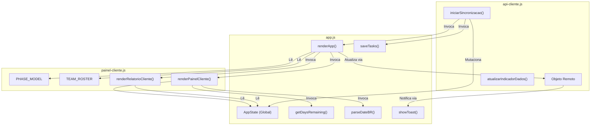

# MAPA DE DEPENDÊNCIAS DO SISTEMA
## ARQVERTICE STUDIO — ACOPLAMENTOS E MATRIZ DE DEPENDÊNCIAS
**Data:** 21 de Setembro de 2026  
**Documento:** MAPA_DEPENDENCIAS.md  

---

### 1. DEPENDÊNCIAS DE PACOTES (NPM / RUNTIME)

No arquivo `cronograma-residencia-praia/package.json`, há apenas uma dependência registrada:

```json
{
  "name": "cronograma-arqvertice",
  "version": "2.0.0",
  "private": true,
  "engines": {
    "node": ">=20"
  },
  "dependencies": {
    "pg": "^8.13.1"
  }
}
```

- **`pg` (v8.13.1)**: Driver oficial do PostgreSQL para Node.js.
  - **Papel:** Utilizado em `api/_db.js` para conexão com o banco de dados via TCP/SSL, pooling de conexões e execução de queries parametrizadas.
  - **Avaliação:** Extremamente estável, seguro e bem mantido pela comunidade open-source.

---

### 2. DEPENDÊNCIAS EXTERNAS DE FRONTEND (CDN)

O frontend carrega bibliotecas e assets diretamente de servidores de terceiros no `<head>` do `index.html`:

| Biblioteca / Recurso | Origem / CDN | Versão | Impacto de Falha / Risco |
| :--- | :--- | :--- | :--- |
| **Lucide Icons** | `https://unpkg.com/lucide@latest` | Flutuante (`latest`) | **Alto Risco:** Carregar `@latest` expõe a aplicação a quebras silenciosas caso a biblioteca altere o nome de algum ícone ou sua API de inicialização (`lucide.createIcons()`). |
| **html2pdf.js** | `https://cdnjs.cloudflare.com/ajax/libs/html2pdf.js/0.10.1/html2pdf.bundle.min.js` | `0.10.1` | **Médio Risco:** CDN confiável, porém a biblioteca é antiga e embute versões desatualizadas do `html2canvas` e `jspdf`, apresentando bugs conhecidos de quebra de página em CSS moderno. |
| **Google Fonts** | `https://fonts.googleapis.com` | — | **Baixo Risco:** Carrega as famílias `Montserrat` (300 a 900) e `JetBrains Mono` (400 a 800). Se falhar, o navegador faz fallback para `sans-serif` e `monospace`. |

---

### 3. GRAFO DE DEPENDÊNCIAS CIRCULARES NO FRONTEND

Um dos diagnósticos mais importantes desta auditoria é o **forte acoplamento bidirecional** entre os scripts do frontend. 

A ordem de importação no `index.html` é:
```html
<script src="painel-cliente.js"></script>
<script src="api-cliente.js"></script>
<script src="app.js"></script>
```

No entanto, as funções dentro desses arquivos chamam variáveis e métodos definidos nos outros arquivos antes e depois de sua execução, dependendo do atraso no disparo de eventos (`DOMContentLoaded`):



#### Riscos desse acoplamento:
1. **Ordem Frágil:** Se qualquer script for carregado com atributo `defer` ou `async`, ou se a ordem no HTML for invertida, a aplicação falhará imediatamente com erros de `ReferenceError: AppState is not defined` ou `renderPainelCliente is not a function`.
2. **Dificuldade de Testes Unitários:** Não é possível testar as regras de negócio de `computePhases()` ou `buildResumoExecutivo()` de forma isolada no Jest/Vitest sem mockar todo o objeto global `window.AppState` e o DOM.

---

### 4. CONTRATOS DE DADOS ENTRE FRONTEND E BACKEND

A comunicação entre o navegador e a API serverless baseia-se em dois contratos JSON principais:

#### 4.1. Contrato da Tarefa (`/api/tarefas`)
```typescript
interface TarefaPayload {
  id?: string;               // UUID v4
  descricao_etapa: string;   // max 255 chars
  disciplina_projeto: 'Arquitetura' | '3D' | 'Estrutura' | 'Complementares' | 'Obras';
  projetista: string;        // max 100 chars
  data_conclusao: string;    // Formato "DD-MM-YYYY" no front <-> convertido para "YYYY-MM-DD" no Postgres
  porcentagem: number;       // Inteiro entre 0 e 100
  ordem?: number;            // Inteiro de sequência
}
```

#### 4.2. Contrato da Ficha Técnica (`/api/projeto`)
```typescript
interface ProjetoPayload {
  nomeObra: string;
  cliente: string;
  localizacao: string;
  loteQuadra: string;
  zona: string;
  areaConstruida: string;
  areaTerreno: string;
  tipologia: string;
  dataInicio: string;
  previsaoConclusao: string;
  prazoTotal: string;
  empresa: string;
}
```

---

### 5. RELAÇÃO COM AS DEMAIS APLICAÇÕES DO ECOSSISTEMA

- **Briefing (`briefing-arqvertice`)**: Atualmente tem **zero dependência técnica** com o cronograma. Compartilha a mesma paleta de cores e o mesmo componente de logomarca, mas os dados do cliente e as necessidades do projeto não são enviados para o cronograma.
- **Site Institucional (`arqvertice-site`)**: Possui apenas vínculos textuais e conceituais (identidade visual, nomes de sócios, portfólio de obras).
