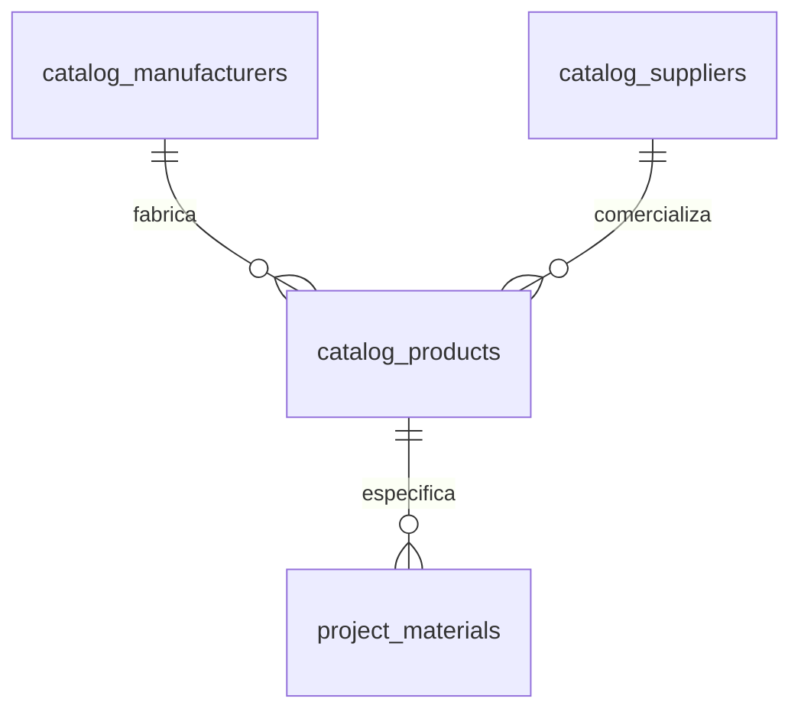

# Modelo de Produtos, Fabricantes e Fornecedores Regionais (MATERIAL_PRODUCT_MODEL.md)

## 1. Estrutura do Catálogo Comercial

Para garantir precisão orçamentária e detalhamento executivo sem misturar com a fase conceitual de concepção, o catálogo comercial é modelado em 3 tabelas complementares:

---

## 2. Fabricantes (`catalog_manufacturers`)

Representa as indústrias e marcas fabricantes de revestimentos e insumos (ex: Portobello, Biancogres, Eliane, Decortiles).

Campos principais:
- `id`: Identificador único (`mfr-...`)
- `name`: Razão social ou nome de mercado
- `brand`: Marca comercial
- `website`: URL do portal oficial
- `country`: País de origem

---

## 3. Fornecedores Regionais (`catalog_suppliers`)

Permite cadastrar lojas, distribuidoras, marmorarias e parceiros locais com rastreabilidade de **regionalidade**:
- `name`: Nome da loja / parceiro
- `city`: Cidade (ex: Fortaleza, Eusébio, São Paulo)
- `state`: UF (ex: CE, SP, RJ)
- `region`: Macrorregião (ex: Nordeste, Sudeste, Litoral Sul)
- `contact_person`, `contact_phone`, `contact_email`
- `website`

---

## 4. Produtos de Catálogo (`catalog_products`)

Representa o item industrializado com dados de compra:
- `name`: Nome comercial completo
- `collection`: Linha ou coleção
- `sku_code`: Código do fabricante / SKU
- `finish`: Acabamento de fábrica (Polido, Natural, Acetinado, EXT)
- **Dimensões:**
  * `width` (Largura)
  * `length` (Comprimento)
  * `thickness` (Espessura em mm)
  * `dimension_unit` (Unidade de medida: CM, MM)
  * `sales_unit` (Unidade comercial: M², CAIXA, PEÇA)
- **Preços e Rastreabilidade Temporal:**
  * `price`: Valor monetário unitário
  * `currency`: Moeda (Padrão: BRL)
  * `consulted_at`: Data e hora da cotação
  * `price_origin`: Origem da informação (tabela oficial, cotação por e-mail, etc.)

> [!CAUTION]
> Preços e estoques oscilam no mercado. O sistema registra explicitamente o campo `consulted_at` e nunca trata valores defasados como preços vigentes sem aviso visual ao especificador.
