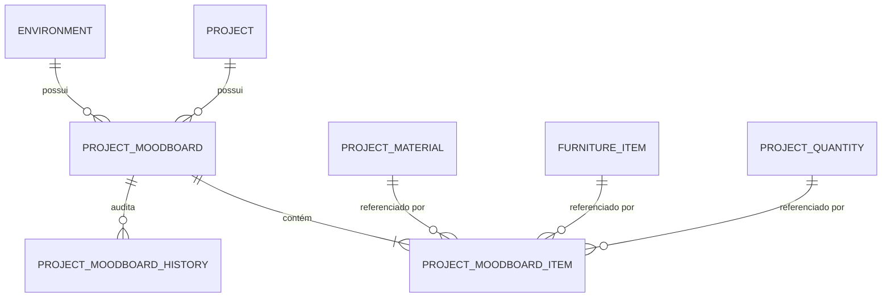

# ArqVértice Studio — Modelo de Dados do Moodboard (E04)

## 1. Estrutura de Entidades e Relacionamentos

O sistema de Moodboards é persistido em 3 tabelas principais no banco relacional (`database/schema/26_moodboard_system.sql`) e espelhado com reatividade no `StudioState.data`:

---

## 2. Entidade: `project_moodboards` (`StudioState.data.projectMoodboards`)

| Campo | Tipo | Descrição |
|---|---|---|
| `id` | VARCHAR(64) PRIMARY KEY | Identificador único (ex: `mb-living-v01`). |
| `project_id` | VARCHAR(64) NOT NULL | Chave estrangeira para o projeto pai. |
| `environment_id` | VARCHAR(64) NULL | Chave estrangeira para o ambiente (nulo em moodboards globais). |
| `type` | VARCHAR(32) NOT NULL | `MOODBOARD_ENVIRONMENT`, `MOODBOARD_PROJECT`, `MOODBOARD_MATERIAL`, `MOODBOARD_FURNITURE`, `MOODBOARD_CONCEPT`, `MOODBOARD_CUSTOM`. |
| `layout_variant` | VARCHAR(32) NOT NULL | `HYBRID` (Apresentação), `TECHNICAL` (Ficha Técnica). |
| `title` | VARCHAR(255) NOT NULL | Título da prancha. |
| `subtitle` | VARCHAR(255) | Subtítulo ou linha de apoio. |
| `description` | TEXT | Texto descritivo geral. |
| `concept_statement` | TEXT | Declaração de intenções conceituais e poéticas do projeto. |
| `page_format` | VARCHAR(16) NOT NULL | `A4`, `A3`, `A2`, `A1`. |
| `orientation` | VARCHAR(16) NOT NULL | `LANDSCAPE` (Paisagem), `PORTRAIT` (Retrato). |
| `margins` | VARCHAR(16) NOT NULL | `COMPACT`, `NORMAL`, `WIDE`. |
| `grid_columns` | INT DEFAULT 12 | Número de colunas da malha CSS. |
| `typography_theme` | VARCHAR(32) NOT NULL | `MODERN_SANS`, `ELEGANT_SERIF`, `TECHNICAL_MONO`. |
| `background_color` | VARCHAR(32) DEFAULT '#FDFDFD' | Cor de fundo da prancha. |
| `show_logo` | BOOLEAN DEFAULT TRUE | Exibir logotipo e identidade visual ArqVértice. |
| `show_footer` | BOOLEAN DEFAULT TRUE | Exibir rodapé com metadados e escala gráfica. |
| `show_header` | BOOLEAN DEFAULT TRUE | Exibir cabeçalho completo. |
| `show_quantities_summary` | BOOLEAN DEFAULT TRUE | Exibir quadro de quantitativos consolidados. |
| `show_furniture_summary` | BOOLEAN DEFAULT TRUE | Exibir tabela resumida de mobiliário especificado. |
| `hero_render_url` | TEXT | URL da perspectiva principal aprovada. |
| `color_palette` | JSONB / ARRAY | Array de objetos `{ name, hex, code, usage, materialRefId }`. |
| `status` | VARCHAR(32) NOT NULL | `DRAFT`, `IN_REVIEW`, `APPROVED`, `REJECTED`, `SUPERSEDED`. |
| `version` | VARCHAR(16) NOT NULL | `V01`, `V02`, `V03`, etc. |
| `version_number` | INT NOT NULL | Sequencial numérico da versão. |
| `is_approved` | BOOLEAN DEFAULT FALSE | Flag rápida de aprovação formal. |
| `approved_at` | TIMESTAMPTZ | Data e hora da homologação. |
| `approved_by` | VARCHAR(128) | Nome do arquiteto ou cliente que homologou. |

---

## 3. Entidade: `project_moodboard_items` (`StudioState.data.moodboardItems`)

| Campo | Tipo | Descrição |
|---|---|---|
| `id` | VARCHAR(64) PRIMARY KEY | Identificador único do item. |
| `moodboard_id` | VARCHAR(64) NOT NULL | FK para a prancha do moodboard. |
| `item_type` | VARCHAR(32) NOT NULL | 12 tipos canônicos de blocos. |
| `material_id` | VARCHAR(64) NULL | Referência direta ao material do projeto (E02). |
| `furniture_id` | VARCHAR(64) NULL | Referência direta ao móvel do projeto (E01). |
| `quantity_id` | VARCHAR(64) NULL | Referência direta ao quantitativo do projeto (E03). |
| `title` | VARCHAR(255) | Título exibido no cartão. |
| `subtitle` | VARCHAR(255) | Subtítulo do item. |
| `category` | VARCHAR(64) | Categoria do material ou móvel. |
| `image_url` | TEXT | URL da foto/render/amostra. |
| `color_hex` | VARCHAR(16) | Código hexadecimal da cor. |
| `color_code` | VARCHAR(64) | Código comercial (Pantone, RAL, Suvinil). |
| `product` | VARCHAR(128) | Nome comercial do produto. |
| `manufacturer` | VARCHAR(128) | Fabricante da peça ou revestimento. |
| `commercial_code` | VARCHAR(128) | Código de referência ou SKU. |
| `finish` | VARCHAR(128) | Acabamento da superfície. |
| `dimensions` | VARCHAR(128) | Medidas formatadas (L x P x A). |
| `quantity` | NUMERIC(12, 3) | Quantidade requerida. |
| `unit` | VARCHAR(16) | Unidade de medida (m², m, un, kg). |
| `supplier` | VARCHAR(128) | Nome do fornecedor ou revenda. |
| `external_link` | TEXT | Link direto para ficha técnica do fabricante. |
| `notes` | TEXT | Observações técnicas ou especificações especiais. |
| `grid_width` | VARCHAR(16) | Largura no grid: `FULL`, `HALF`, `THIRD`, `QUARTER`, `TWO_THIRDS`. |
| `card_size` | VARCHAR(16) | Altura do cartão: `HERO`, `LARGE`, `MEDIUM`, `SMALL`. |
| `is_featured` | BOOLEAN DEFAULT FALSE | Destaque visual com borda nobre. |
| `sort_order` | INT DEFAULT 0 | Ordem sequencial de renderização na prancha. |

---

## 4. Regra de Não-Alucinação nos Cartões de Material e Móvel

Para manter estrita fidelidade técnica:
- Os cartões só exibem atributos que possuem valor definido.
- Não são gerados placeholders ou dados inventados (ex: se o material não tiver código de fornecedor, o campo não é exibido).
