# DECISÃO E RECOMENDAÇÃO TÉCNICA DE ARQUITETURA
## ARQVERTICE STUDIO — ANÁLISE COMPARATIVA DE FRAMEWORKS
**Data:** 21 de Setembro de 2026  
**Documento:** RECOMENDACAO_ARQUITETURA.md  

---

### 1. MOTIVAÇÃO E ESCOPO DA AVALIAÇÃO

O sistema atual da **ArqVértice** atende com excelência o controle de prazos e o acompanhamento de uma obra isolada. No entanto, o objetivo estratégico estabelecido no **Bloco 00** exige que o sistema se transforme no **núcleo operacional completo do escritório**, suportando:

- Múltiplos clientes e múltiplos projetos simultâneos;
- Estrutura hierárquica por **Ambientes** (Sala, Cozinha, Suíte, Deck...);
- Memória contextual multicamada para Inteligência Artificial (Projeto, Ambiente, Imagem, Versão, Locks e Decisões);
- Ingestão de materiais gráficos do **Revit** (plantas técnicas, vistas, perspectivas);
- Criação e aprovação de pranchas de apresentação (A4, A3, A2, A1);
- Briefing do cliente via links públicos com consolidação técnica em briefing interno;
- Catálogo de materiais, fornecedores e mobiliário vinculado aos ambientes;
- Geração de storyboards e sequências para ferramentas externas de vídeo.

Para sustentar essa carga funcional sem criar uma colcha de retalhos instável, foram avaliadas **5 abordagens arquiteturais**.

---

### 2. COMPARAÇÃO DETALHADA ENTRE AS 5 ABORDAGENS

#### Abordagem 1: Manter HTML/CSS/JavaScript Puro (Status Quo)
- **Descrição:** Continuar desenvolvendo sem build, adicionando novos arquivos `.js` e telas `.html` no mesmo padrão atual.
- **Vantagens:** Nenhuma curva de aprendizado inicial; deploy instantâneo sem processo de compilação; roda em qualquer servidor estático.
- **Desvantagens:** Invólucro de manutenção insustentável para a escala do ARQVERTICE STUDIO. Gerenciar estado reativo, uploads multipart, autenticação segura, links dinâmicos e árvores de ambientes em Vanilla JS resultará em dezenas de milhares de linhas de código espaguete com manipulação direta de DOM suscetível a bugs de estado e memory leaks.

#### Abordagem 2: Evoluir Progressivamente a Estrutura Atual (Vanilla Modular)
- **Descrição:** Adicionar ES Modules nativos (`import`/`export`), separar o código em pequenos arquivos `.js` e organizar classes de serviços sem adotar frameworks.
- **Vantagens:** Preserva a ausência de build tooling enquanto melhora a organização de arquivos.
- **Desvantagens:** Não resolve o problema central da reatividade do DOM. O desenvolvedor terá que reinventar manualmente um motor de reconciliação de estado, um roteador de páginas para URLs dinâmicas (`/projeto/123/ambiente/sala`) e gerenciar manualmente o ciclo de vida dos componentes.

#### Abordagem 3: Migrar para SPA React com Vite
- **Descrição:** Aplicação Single Page Application (SPA) em React com TypeScript, empacotada com Vite, mantendo o backend nas Vercel Serverless Functions ou migrando para uma API Express/Fastify separada.
- **Vantagens:** Ecossistema gigantesco de componentes (Lucide, Tailwind, Radix UI, Dnd-Kit); reatividade limpa e tipagem estática rigorosa; excelente experiência de desenvolvimento (HMR ultra-rápido).
- **Desvantagens:** Requer manutenção de dois contextos separados (frontend SPA + backend de APIs). Para o briefing público acessado por clientes via celular, o carregamento inicial de um bundle SPA pesado pode ser mais lento do que páginas pré-renderizadas no servidor.

#### Abordagem 4: Migrar para Next.js (React / TypeScript / App Router) — **RECOMENDADA**
- **Descrição:** Plataforma Full-stack moderna integrada nativamente à infraestrutura da Vercel. Utiliza React Server Components (RSC), Server Actions / Route Handlers, TypeScript estrito e banco PostgreSQL gerenciado com ORM (Prisma ou Drizzle).
- **Vantagens:**
  - **Full-stack Unificado:** Frontend, backend, rotas de API e conexões de banco residem no mesmo projeto tipado de ponta a ponta.
  - **Renderização Híbrida:** Páginas públicas (briefing para cliente, portfólio de obras) são servidas via Server-Side Rendering (SSR) ultrarrápido; áreas interativas internas (Kanban, pranchas, visualizador de ambientes) utilizam componentes interativos de cliente (`'use client'`).
  - **Links Privados e Rotas Dinâmicas:** Implementação nativa de rotas como `/projetos/[id]`, `/projetos/[id]/ambientes/[slug]` e `/briefing/[hash]`.
  - **Segurança de Servidor:** Chaves de API de IA (Gemini, Claude, OpenAI) e tokens de storage nunca tocam o navegador, sendo executadas com segurança dentro das Server Actions.
  - **Integração Perfeita com a Vercel:** Deploy sem configuração, suporte a Vercel Blob (para plantas e renders) e zero atrito de infraestrutura.
- **Desvantagens:** Requer processo de compilação (build) e curva de adaptação ao modelo mental de Server Components vs. Client Components.

#### Abordagem 5: Outra Arquitetura (Astro + Svelte/React)
- **Descrição:** Meta-framework focado em sites orientados a conteúdo com arquitetura de ilhas (Islands Architecture).
- **Vantagens:** Desempenho excelente para páginas de leitura e portfólio.
- **Desvantagens:** Menos ergonômico para aplicações fortemente orientadas a dashboards operacionais complexos, drag-and-drop denso e manipulação de fluxos de trabalho internos interativos.

---

### 3. TABELA COMPARATIVA DE CRITÉRIOS (16 DIMENSÕES)

| Critério de Avaliação | 1. Vanilla Puro | 2. Vanilla Modular | 3. React + Vite SPA | 4. Next.js + TS (Recomendada) | 5. Astro |
| :--- | :---: | :---: | :---: | :---: | :---: |
| **1. Complexidade Inicial** | Muito Baixa | Baixa | Média | Moderada | Baixa |
| **2. Manutenibilidade em Escala**| Péssima | Regular | Alta | **Excelente** | Boa |
| **3. Produtividade de Desenvolvimento** | Baixa | Baixa | Alta | **Altíssima** | Alta |
| **4. Curva de Aprendizado** | Zero | Baixa | Média | Moderada | Baixa |
| **5. Integração com Vercel** | Básica | Básica | Boa | **Nativa / Perfeita** | Muito Boa |
| **6. Integração do Backend** | Desacoplado | Desacoplado | Desacoplado | **Unificado no mesmo repo** | Misto |
| **7. Integração com Banco (Postgres)**| Manual (`pg`) | Manual (`pg`) | Manual (`api/`) | **Nativa via ORM (Prisma/Drizzle)** | Manual/ORM |
| **8. Autenticação e RBAC** | Frágil (Chave) | Frágil (Chave) | Média (Tokens) | **Robusta (Auth.js / Supabase)** | Média |
| **9. Upload e Gestão de Arquivos** | Difícil | Difícil | Boa | **Excelente (S3 / Vercel Blob)** | Regular |
| **10. Camada de IA (Gemini)** | Insegura no front| Insegura | Exige API externa| **Nativa via Server Actions** | Boa |
| **11. Escalabilidade de Negócio** | Inviável | Fraca | Boa | **Excelente (Multi-tenant)** | Boa |
| **12. Cobertura de Testes** | Muito Difícil | Difícil | Excelente | **Excelente (Vitest + Playwright)**| Boa |
| **13. Performance de Carregamento**| Rápida (sem build)| Rápida | Média (Bundle) | **Instantânea (RSC / Cache)** | Instantânea |
| **14. Custo de Hospedagem** | Gratuito | Gratuito | Gratuito/Baixo | **Gratuito / Baixo (Vercel Hobby)**| Gratuito |
| **15. Facilidade de Manutenção** | Complexa (código longo)| Média | Boa | **Alta (Componentizada e Tipada)** | Boa |
| **16. Alinhamento com a Visão ARQVERTICE** | 15% | 30% | 75% | **100% (Ambientes, Memória, Revit)**| 55% |

---

### 4. RECOMENDAÇÃO TÉCNICA FUNDAMENTADA

Com base na auditoria exaustiva do código e nas metas estratégicas da ArqVértice, a recomendação formal é a **Adoção da Abordagem 4: Next.js (App Router) com React, TypeScript, Tailwind CSS e Drizzle/Prisma ORM sobre o PostgreSQL existente**.

#### Por que esta é a melhor decisão para a ArqVértice?
1. **O Revit produz arquivos pesados e dados estruturados:** O ARQVERTICE STUDIO precisará receber plantas, imagens, metadados de ambientes e renderizações. Next.js fornece uma camada segura de APIs server-side para upload direto e processamento assíncrono com URLs assinadas.
2. **A IA precisa de contexto seguro:** A memória multicamada (Projeto, Ambiente, Imagem, Versão, Locks) não pode ter suas chaves de API expostas no navegador. As Server Actions do Next.js garantem que as chamadas aos modelos de IA ocorram no servidor, protegendo o orçamento e as credenciais do escritório.
3. **Multi-inquilino e Links Públicos:** Next.js resolve naturalmente a necessidade de ter uma área restrita e autenticada para os sócios da ArqVértice (`/dashboard/...`) e, simultaneamente, páginas públicas protegidas por link seguro para o cliente responder ao briefing ou acompanhar sua obra (`/obra/[slug]` ou `/briefing/[token]`).
4. **Preservação das Regras de Negócio Existentes:** Toda a inteligência contida em `painel-cliente.js` (faixa de fases, algoritmo do gargalo atual, cálculo de carga da equipe) e no `schema.sql` (regras de porcentagem, status gerado e disciplinas) pode ser traduzida diretamente para funções TypeScript puras e componentes React, sem perder um único detalhe da lógica original.

---

### 5. CAMINHO DE EVOLUÇÃO PLANEJADO (SEM IMPLEMENTAÇÃO NESTE MOMENTO)

A transição deve ser conduzida em fases rigorosas, respeitando as ordens dos blocos futuros:

```mermaid
graph LR
    subgraph Bloco_A["BLOCO A — Auditoria & Fundação"]
        A1["Auditoria Técnica (A01 - Atual)"]
        A2["Ajuste de Schema do Banco (A02)"]
    end

    subgraph Bloco_B["BLOCO B — Migração do Cronograma"]
        B1["Setup Next.js & Design System"]
        B2["Componentização do Painel & Kanban"]
        B3["Testes de Paridade Funcional"]
    end

    subgraph Bloco_C["BLOCO C — Integração do Briefing"]
        C1["Módulo de Briefing Público"]
        C2["Painel de Briefing Técnico Interno"]
    end

    subgraph Bloco_D["BLOCO D — Ambientes & IA"]
        D1["Gestão por Ambientes & Renders"]
        D2["Memória Contextual & Locks de IA"]
        D3["Pranchas e Apresentações"]
    end

    A1 --> A2
    A2 --> B1
    B1 --> B2
    B2 --> B3
    B3 --> C1
    C1 --> C2
    C2 --> D1
    D1 --> D2
    D2 --> D3
```

> **IMPORTANTE:** Nenhuma migração ou alteração de código é autorizada neste momento. Este documento serve como fundamento técnico e decisório para os próximos passos planejados.
