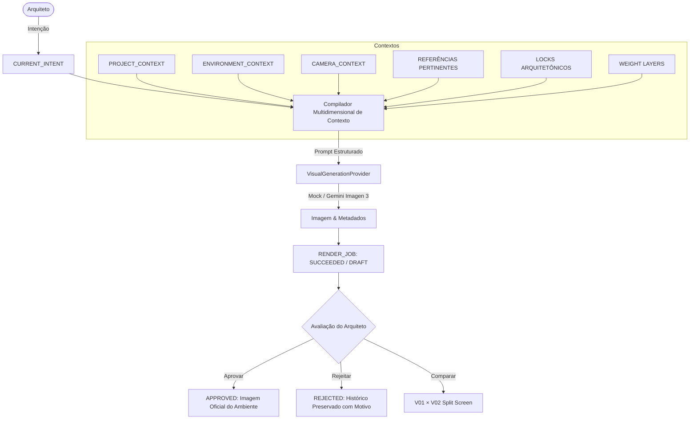

# ArqVértice Studio — Pipeline de Renderização Ponta a Ponta

## 0. Visão Geral do Pipeline

O pipeline de renderização traduz a visão arquitetônica concebida pela ArqVértice em imagens de apresentação sem alucinação, respeitando geometria de projeto, esquadrias e materiais reais.

---

## 1. Etapas Sequenciais do Pipeline

### Etapa 1: Captura da Intenção do Usuário
O arquiteto insere uma instrução em linguagem natural (ex: *"Troque o sofá por um modelo mais leve."*, *"Quero uma iluminação mais aconchegante."*). A aplicação não envia essa frase isolada.

### Etapa 2: Resolução de Contextos (C06 / D01)
O compilador busca:
- `getProjectContext(projectId)`: Nome, atmosfera e diretrizes mestras;
- `getEnvironmentContext(environmentId)`: Tipologia, área, pé-direito e restrições homologadas;
- Decisões aprovadas e memórias ativas de materiais e mobiliário.

### Etapa 3: Seleção de Câmera e Enquadramento (D05)
A câmera selecionada injeta a distância focal exata (ex: 24mm, 35mm), enquadramento (plano médio, amplo geral, detalhe) e direção visual.

### Etapa 4: Filtragem Pertinente de Referências (D02 / D06)
Em vez de enviar a totalidade das referências do projeto (o que polui e confunde a IA), o pipeline seleciona estritamente:
- A base volumétrica da câmera (Revit export);
- A referência fotográfica de enquadramento da câmera;
- Até 3 referências de prioridade `PRIMARY` específicas daquele ambiente.

### Etapa 5: Injeção de Travas Rígidas (Locks)
Esquadrias, alvenarias estruturais e pé-direito são expressamente travados no compilador para impedir que a IA invente janelas ou mude a estrutura da edificação.

### Etapa 6: Ponderação de Pesos (Weight Layers)
Permite ao arquiteto calibrar o equilíbrio de fidelidade:
- `geometry`: 1.0 (máxima aderência)
- `camera`: 0.95 (enquadramento)
- `style`: 0.85 (conceito de design)
- `material`: 0.80 (texturas e acabamentos)
- `lighting`: 0.75 (atmosfera e luz)
- `furniture`: 0.70 (adaptação da intenção)

### Etapa 7: Disparo ao Provider Agnóstico
O job é enfileirado (`QUEUED`) e transmitido de forma assíncrona ao provider (`GENERATING`). As credenciais residem exclusivamente no backend.

### Etapa 8: Validação & Auditoria de Saída
O provider devolve a imagem gerada, semente utilizada, contagem de tokens e custo estimado. A imagem é registrada como candidato em `environment_renders` com status `DRAFT`.

### Etapa 9: Controle de Qualidade e Aprovação Humana (QA)
O arquiteto inspeciona o render, compara com versões anteriores (`V01 × V02`) e decide:
- **`APPROVED`**: Homologa como imagem oficial do ambiente;
- **`REJECTED`**: Rejeita com registro de motivo formal;
- **`RETRY`**: Reinicia com ajuste em caso de anomalia técnica.

---

## 2. Diagrama de Fluxo

