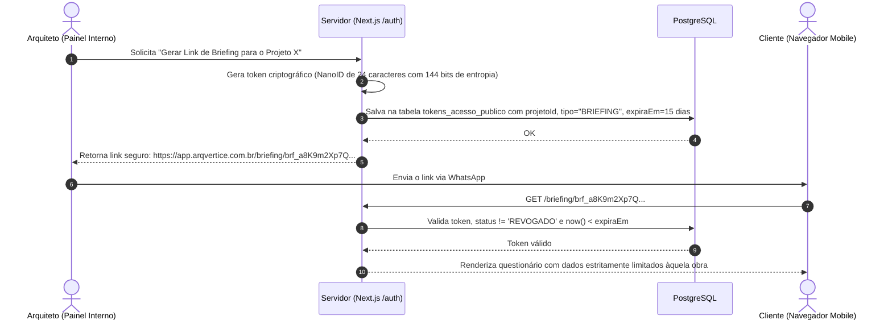

# MODELO DE SEGURANÇA E GOVERNANÇA DE ACESSO
## ARQVERTICE STUDIO — POLÍTICA DE PROTEÇÃO DE DADOS E AUTENTICAÇÃO
**Versão:** 1.0.0  
**Data:** 21 de Setembro de 2026  
**Documento:** SECURITY_MODEL.md  

---

### 1. PRINCÍPIOS FUNDAMENTAIS DE SEGURANÇA

1. **Eliminação de Senhas em Texto Claro:** A prática identificada na auditoria de salvar a `ADMIN_KEY` em texto claro no `localStorage` é expressamente extinta.
2. **Defesa em Profundidade:** A segurança opera em múltiplas camadas:
   - Camada de Borda (Headers de segurança na Vercel);
   - Camada de Roteamento (Middlewares de autenticação Next.js);
   - Camada de Aplicação (RBAC e validação por Zod);
   - Camada de Banco (Consultas com tenant scope e row-level security quando aplicável);
   - Camada de Storage (Buckets estritamente privados com URLs assinadas temporárias).
3. **Privilégio Mínimo (Principle of Least Privilege):** O cliente final recebe acesso apenas aos artefatos expressamente compartilhados pelo escritório, sem visibilidade da infraestrutura interna.

---

### 2. MATRIZ DE PAPÉIS E PERMISSÕES (RBAC)

A plataforma define 4 papéis canônicos de acesso:

| Papel (Role) | Descrição e Escopo | Permissões no Sistema |
| :--- | :--- | :--- |
| **ADMINISTRADOR** | Sócios-diretores da ArqVértice. | Acesso irrestrito a todos os clientes, projetos, cronogramas, custos, configurações de IA, logs de auditoria e exclusão de dados. |
| **ARQUITETO** | Equipe de arquitetura e interiores. | Criação e edição de projetos, ambientes, moodboards, solicitação de renders por IA, briefings e pranchas de apresentação. |
| **ENGENHEIRO** | Equipe de estruturas, complementares e obra. | Edição do cronograma, atualização de porcentagens de obras, inserção de fotos de canteiro, emissão de relatórios executivos. |
| **CLIENTE (PÚBLICO)** | Contratante da obra (acesso sem login via link). | Preenchimento de questionário de briefing ou visualização em modo somente leitura do painel "Estamos Aqui" de sua obra. |

---

### 3. ARQUITETURA DE LINKS PÚBLICOS EFÊMEROS (ÁREA DO CLIENTE)

Para permitir que o cliente responda ao briefing ou acompanhe o avanço da obra pelo smartphone sem atrito de senhas:



#### Regras de Isolamento da Rota Pública:
- O token público não concede permissão a nenhum endpoint administrativo `/api/*`.
- Toda mutação vinda do cliente passa pela rota `/api/publico/briefing/[token]/responder`, que confere o token a cada submissão.
- Se o link for comprometido ou a etapa for concluída, o arquiteto pode **revogar o token instantaneamente** no painel da obra com um clique.

---

### 4. GOVERNANÇA DE ARQUIVOS E STORAGE PRIVADO

Ao contrário do modelo ingênuo de "buckets públicos" onde qualquer pessoa com o link baixa arquivos confidenciais do cliente:
- **Bucket 100% Privado:** Nenhuma leitura anônima direta é permitida na raiz do storage.
- **Upload via Presigned URL:**
  1. O navegador solicita permissão ao servidor informando tipo, tamanho e hash do arquivo;
  2. O servidor valida se o usuário tem permissão para editar aquele projeto;
  3. O servidor emite uma URL temporária de PUT com assinatura HMAC válida por **15 minutos**;
  4. O navegador envia os bytes diretamente ao bucket.
- **Download / Visualização:** Todas as tags `` e links de download utilizam URLs assinadas temporárias geradas no servidor com validade de **1 hora** (`expiresIn: 3600`).

---

### 5. PROTEÇÃO DE SEGREDOS E VARIÁVEIS DE AMBIENTE

As credenciais sensíveis são estritamente isoladas no runtime do servidor:

```
# Variáveis Estritamente Privadas (Server-Only - Vercel Environment Variables)
DATABASE_URL=postgresql://...
STORAGE_ACCESS_KEY_ID=...
STORAGE_SECRET_ACCESS_KEY=...
STORAGE_BUCKET_NAME=arqvertice-studio-media
STORAGE_ENDPOINT=...
GEMINI_API_KEY=AIzaSy...
NEXTAUTH_SECRET=...
HMAC_TOKEN_SECRET=...

# Variáveis Públicas Permitidas no Navegador (Prefixo Obrigatório NEXT_PUBLIC_)
NEXT_PUBLIC_APP_URL=https://app.arqvertice.com.br
```

> **Garantia Arquitetural:** Nenhuma biblioteca ou componente com diretiva `'use client'` pode importar variáveis que não possuam o prefixo `NEXT_PUBLIC_`. O Next.js bloqueia em tempo de build qualquer vazamento acidental de chaves de API para o código cliente.
