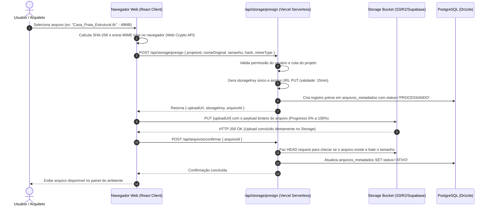

# MODELO DE ARMAZENAMENTO E GESTÃO DE ARQUIVOS
## ARQVERTICE STUDIO — STORAGE DE OBJETOS & METADADOS CAD/BIM/IA
**Versão:** 1.0.0  
**Data:** 21 de Setembro de 2026  
**Documento:** STORAGE_MODEL.md  

---

### 1. SEPARAÇÃO FUNDAMENTAL: METADADOS vs. BINÁRIOS

O **ARQVERTICE STUDIO** processa artefatos que variam de pequenos arquivos JSON de configuração até modelos volumétricos do Revit (`.rvt`) e exportações IFC de centenas de megabytes.

A arquitetura adota separação estrita de responsabilidades:
- **No Banco de Dados Relacional (PostgreSQL):** Residem exclusivamente os **metadados descritivos**, vínculos relacionais com projetos e ambientes, hashes de integridade, histórico de versões e status de aprovação.
- **No Bucket de Objetos (S3 / Cloudflare R2 / Supabase Storage):** Residem exclusivamente os **arquivos binários brutos e suas miniaturas**, organizados em uma estrutura hierárquica imutável.

---

### 2. MATRIZ DE FORMATOS E EXTENSÕES SUPORTADAS

| Categoria do Arquivo | Extensões | Tipos MIME | Finalidade no Fluxo ArqVértice |
| :--- | :--- | :--- | :--- |
| **Imagens e Renders** | `.jpg`, `.jpeg`, `.png`, `.webp` | `image/jpeg`, `image/png`, `image/webp` | Perspectivas humanizadas, renders gerados por IA, fotos de vistoria em canteiro, textura de materiais. |
| **Documentação Técnica & Pranchas**| `.pdf` | `application/pdf` | Pranchas de prefeitura (A1/A2), relatórios executivos de cronograma, pareceres técnicos, memoriais descritivos. |
| **Desenho Técnico 2D (CAD)** | `.dwg`, `.dxf` | `application/acad`, `image/vnd.dwg`, `application/dxf` | Plantas baixas cotadas, cortes e detalhes estruturais provenientes do Revit/AutoCAD. |
| **Modelagem BIM Paramétrica** | `.rvt`, `.ifc` | `application/octet-stream`, `application/x-step` | Modelos completos de arquitetura originados no Revit; arquivos IFC para compatibilização de projetos complementares. |
| **Modelos 3D e Geometrias** | `.skp`, `.obj`, `.fbx` | `application/octet-stream`, `model/obj`, `application/x-fbx` | Blocos de mobiliário de fornecedores, malhas tridimensionais para renderização, exportações de interiores. |
| **Composições e Vetores** | `.svg`, `.zip` | `image/svg+xml`, `application/zip` | Diagramas conceituais, ícones de briefing, pacotes de entrega final compactados. |

---

### 3. ESQUEMA RELACIONAL DE METADADOS (`tabela: arquivos_metadados`)

```sql
CREATE TABLE IF NOT EXISTS arquivos_metadados (
    id                  UUID PRIMARY KEY DEFAULT gen_random_uuid(),
    projeto_id          UUID NOT NULL REFERENCES projetos(id) ON DELETE CASCADE,
    ambiente_id         UUID REFERENCES ambientes(id) ON DELETE SET NULL,
    categoria           TEXT NOT NULL CHECK (categoria IN (
                          'PLANTA_TECNICA', 'PERSPECTIVA_REVIT', 'RENDER_FINAL', 
                          'FOTO_OBRA', 'MODELO_BIM', 'BLOCO_3D', 'MOODBOARD', 
                          'PRANCHA_APRESENTACAO', 'DOCUMENTO_LEGAL', 'BRIEFING_ANEXO'
                        )),
    origem              TEXT NOT NULL CHECK (origem IN ('REVIT', 'UPLOAD_EQUIPE', 'GERACAO_IA', 'CLIENTE')),
    nome_original       TEXT NOT NULL,
    nome_armazenado     TEXT NOT NULL, -- UUID-sanitizado
    extensao            TEXT NOT NULL, -- ex: ".rvt", ".png"
    mime_type           TEXT NOT NULL,
    tamanho_bytes       BIGINT NOT NULL CHECK (tamanho_bytes > 0),
    storage_path        TEXT NOT NULL UNIQUE, -- Caminho completo no bucket
    thumbnail_path      TEXT,                 -- Caminho da miniatura leve (quando imagem)
    hash_sha256         VARCHAR(64) NOT NULL, -- Checksum para deduplicação e integridade
    versao              INTEGER NOT NULL DEFAULT 1,
    status              TEXT NOT NULL DEFAULT 'PROCESSANDO' CHECK (status IN ('PROCESSANDO', 'ATIVO', 'SUBSTITUIDO', 'ARQUIVADO')),
    criado_por          UUID REFERENCES usuarios(id) ON DELETE SET NULL,
    criado_em           TIMESTAMPTZ NOT NULL DEFAULT now(),
    atualizado_em       TIMESTAMPTZ NOT NULL DEFAULT now()
);

CREATE INDEX IF NOT EXISTS idx_arquivos_projeto   ON arquivos_metadados (projeto_id);
CREATE INDEX IF NOT EXISTS idx_arquivos_ambiente  ON arquivos_metadados (ambiente_id);
CREATE INDEX IF NOT EXISTS idx_arquivos_categoria ON arquivos_metadados (categoria);
CREATE INDEX IF NOT EXISTS idx_arquivos_hash      ON arquivos_metadados (hash_sha256);
```

---

### 4. ESTRUTURA DE NAMESPACING NO BUCKET DE OBJETOS

Para evitar colisões e permitir backup seletivo, o bucket é organizado com nomes limpos e previsíveis:

```
arqvertice-studio-media/
└── projetos/
    └── {projetoId}/
        ├── documentos/
        │   └── pranchas/
        │       └── {arquivoId}_Prancha_Executiva_A1.pdf
        ├── cronograma/
        │   └── {arquivoId}_Relatorio_Executivo_{data}.pdf
        └── ambientes/
            └── {ambienteId}/
                ├── revit/
                │   ├── {arquivoId}_Planta_Sala_V01.dwg
                │   └── {arquivoId}_Perspectiva_Tecnica.png
                ├── renders/
                │   ├── {arquivoId}_Render_Final_V01.webp
                │   └── {arquivoId}_Render_Final_V02.webp
                ├── miniaturas/
                │   ├── {arquivoId}_thumb_300x200.webp
                │   └── {arquivoId}_thumb_800x600.webp
                └── referencias/
                    └── {arquivoId}_Foto_Referencia_Sofa.jpg
```

---

### 5. FLUXO DE UPLOAD DIRETO VIA PRESIGNED URL

O tráfego de arquivos pesados (como modelos RVT de 150MB ou pranchas em alta definição) **nunca passa pelas funções serverless da Vercel** (cujo limite de body payload é de 4.5MB).



---

### 6. GERAÇÃO DE MINIATURAS E TRANSCODIFICAÇÃO

Para manter a interface rápida e fluida sem consumir planos de dados dos smartphones dos clientes:
- Toda imagem enviada (`PNG`, `JPG`) com resolução acima de 1920x1080 tem uma versão miniatura (`_thumb_800x600.webp`) gerada automaticamente para exibição nas galerias de ambientes.
- Renders em 4K ficam reservados para o botão de "Download em Alta Resolução" e para a montagem de pranchas em formato A1/A2.
