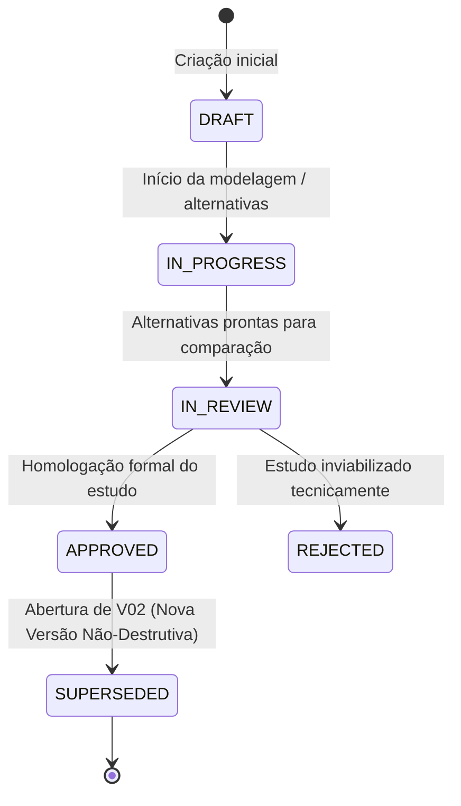

# ArqVértice Studio — Versionamento de Estudos Preliminares (Bloco C03)

## 1. Princípio do Versionamento Não-Destrutivo

No desenvolvimento arquitetônico do ArqVértice Studio, **nenhum estudo aprovado pode ser editado silenciosamente**. 

Se uma proposta aprovada precisar sofrer qualquer modificação — seja por alinhamento com o cliente, nova restrição técnica ou ajuste estrutural —, uma nova versão é obrigatoriamente instanciada:
- A versão original (ex: `V01`) é preservada intacta em status `SUPERSEDED` (Substituída).
- A nova versão (ex: `V02`) é criada em status `IN_REVIEW`, com o histórico e as alternativas clonadas da versão base.
- O campo `supersededBy` aponta para a nova versão, e o campo `previousVersionId` aponta para a versão de origem, estabelecendo uma árvore de linhagem histórica.

---

## 2. Máquina de Estados do Ciclo de Vida

### Definição dos Estados:
- **`DRAFT` (Rascunho):** Estudo recém-criado, premissas ainda em levantamento.
- **`IN_PROGRESS` (Em Progresso):** Alternativas em desenvolvimento, plantas e perspectivas sendo anexadas.
- **`IN_REVIEW` (Em Revisão / Análise):** Alternativas consolidadas, prontas para avaliação técnica no comparador lado a lado.
- **`APPROVED` (Aprovado):** Estudo homologado com decisão formal registrada. Gera o artefato `APPROVED_STUDY_VERSION`.
- **`REJECTED` (Rejeitado):** Estudo descartado por incompatibilidade de custo, legislação ou recusa do cliente (o motivo da rejeição é registrado).
- **`SUPERSEDED` (Histórico Substituído):** Versão anterior que foi arquivada no momento em que uma nova iteração (ex: V02) foi gerada. Imutável para fins de auditoria.

---

## 3. Diferença Crítica: Progresso vs. Aprovação

Um equívoco comum em sistemas de gestão é atrelar o progresso percentual à aprovação do estudo. No ArqVértice Studio:
- **Progresso Físico (0%, 25%, 50%, 75%, 100%):** Mede o grau de esforço e detalhamento já executado pela equipe de arquitetura na exploração daquele estudo.
- **Aprovação (`APPROVED`):** É um ato formal de governança, independente do progresso. Um estudo pode estar com 100% das alternativas modeladas, mas permanecer em `IN_REVIEW` até a decisão do arquiteto e do cliente.

---

## 4. Auditoria e Rastreabilidade

Todas as operações de versionamento registram:
- Identificador da versão de origem (`parentStudyId`);
- Data e hora da transição;
- Responsável pela abertura da nova iteração;
- Justificativa técnica informada no momento da revisão.
