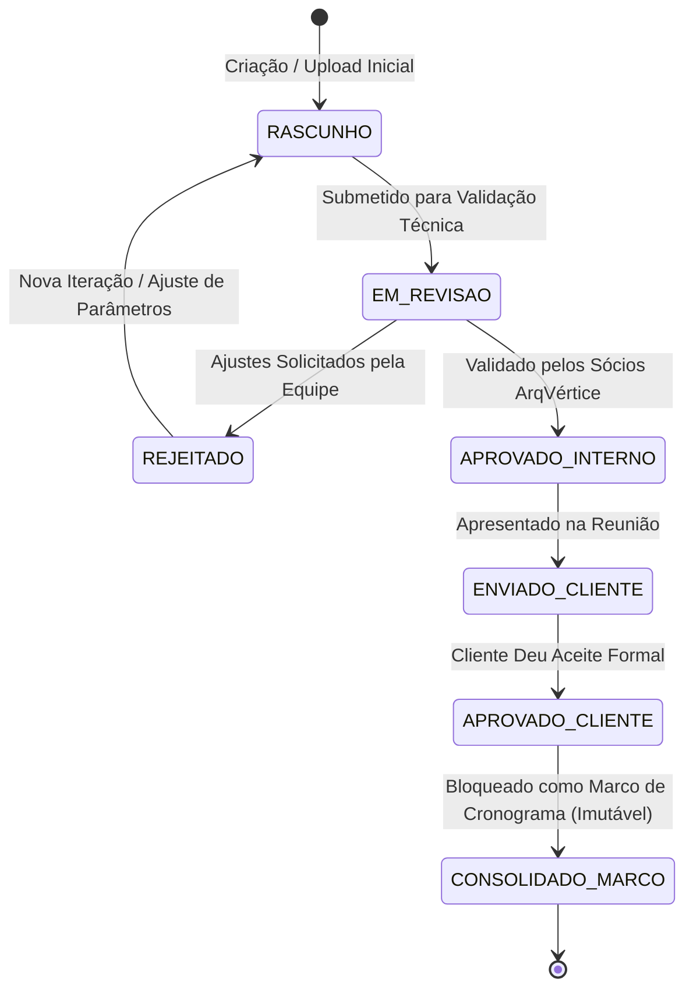

# MODELO DE VERSIONAMENTO E IMUTABILIDADE HISTÓRICA
## ARQVERTICE STUDIO — GOVERNANÇA DE VERSÕES & SNAPSHOTS DE PROJETO
**Versão:** 1.0.0  
**Data:** 21 de Setembro de 2026  
**Documento:** VERSIONING_MODEL.md  

---

### 1. PRINCÍPIO DA IMUTABILIDADE HISTÓRICA

Em projetos de arquitetura e engenharia, o histórico de decisões é o maior ativo contra retrabalho e litígios contratuais. Se um cliente aprovou uma proposta na semana passada e solicitou alterações hoje, o sistema **não pode apagar nem sobrescrever a versão anterior**.

> **Regra de Ouro do ArqVertice Studio:** Registros aprovados ou consolidados são **estritamente somente-leitura (append-only)**. Toda modificação relevante produz uma nova versão (`Vxx`), mantendo o ponteiro para a versão ancestral (`parent_id`).

---

### 2. HIERARQUIA DE VERSIONAMENTO POR ENTIDADE

O versionamento é estruturado em cinco níveis operacionais:

```
PROJETO V01 (Estudo Preliminar)
├── BRIEFING V01 (Respostas Consolidadas do Cliente)
│   └── BRIEFING V02 (Ajuste de Orçamento Máximo Solicitado)
├── AMBIENTE: Sala de Estar V01
│   ├── RENDER V01 (Perspectiva Inicial - Sofá Cinza)
│   ├── RENDER V02 (Estudo com Sofá em Linho Claro - APROVADO)
│   └── MOODBOARD V01 (Paleta de Cores e Fornecedores)
└── APRESENTAÇÃO V01 (Prancha A3 de Conceito para Reunião)
    └── APRESENTAÇÃO V02 (Prancha A1 Executiva de Detalhamento)
```

---

### 3. CICLO DE VIDA E MÁQUINA DE ESTADOS DE APROVAÇÃO

Todo item versionado percorre uma máquina de estados com transições auditadas:



#### Regras das Transições:
- Quando um render atinge o estado `APROVADO_CLIENTE`, ele é automaticamente travado contra edição ou exclusão.
- Se o cliente solicitar nova alteração posterior, o sistema instancia uma ação `Criar Nova Versão a partir desta`, gerando o `Render V03` com `parent_id = V02`.
- O histórico completo de comparações (slider de comparação visual lado a lado / antes e depois) fica preservado na interface.

---

### 4. VERSIONAMENTO E SNAPSHOTS DA MEMÓRIA DE IA

Para que a Inteligência Artificial mantenha consistência ao longo do tempo, cada geração armazena um **Snapshot Criptográfico de Contexto** na tabela `memoria_versoes_ia`:

```sql
CREATE TABLE IF NOT EXISTS memoria_versoes_ia (
    id                      UUID PRIMARY KEY DEFAULT gen_random_uuid(),
    ambiente_id             UUID NOT NULL REFERENCES ambientes(id) ON DELETE CASCADE,
    render_resultado_id     UUID NOT NULL REFERENCES arquivos_metadados(id),
    versao_numero           INTEGER NOT NULL, -- 1, 2, 3...
    imagem_base_id          UUID REFERENCES arquivos_metadados(id), -- Imagem ancestral
    prompt_usuario_original TEXT NOT NULL,
    prompt_compilado_final  TEXT NOT NULL,
    locks_ativos_snapshot   JSONB NOT NULL, -- Ex: {"piso": "travertino", "geometria": "bloqueada"}
    parametros_ia           JSONB NOT NULL, -- Ex: {"seed": 429182, "aspectRatio": "16:9", "temperatura": 0.2}
    modelo_utilizado        TEXT NOT NULL,  -- Ex: "gemini-1.5-pro"
    criado_por              UUID REFERENCES usuarios(id),
    criado_em               TIMESTAMPTZ NOT NULL DEFAULT now()
);

CREATE INDEX IF NOT EXISTS idx_memoria_ambiente ON memoria_versoes_ia (ambiente_id, versao_numero);
```

#### Benefícios Práticos:
- **Reprodutibilidade:** Se o cliente disser 3 semanas depois "gostei muito daquela primeira iluminação que você testou no render 2", o arquiteto pode inspecionar o snapshot do `Render V02`, recuperar os locks exatos daquele momento e restabelecer aquela linha criativa sem adivinhações.
- **Auditoria de Decisões:** Registra quem solicitou cada alteração visual e em qual reunião ela foi decidida.

---

### 5. RAMIFICAÇÃO CRIATIVA (BRANCHING DE AMBIENTES)

O ArqVertice Studio suporta o conceito de **Estudos Alternativos (Branches)**:
- O arquiteto pode criar duas propostas concorrentes para o mesmo ambiente:
  - *Opção A (Contemporânea / Madeira e Tons Claros)*
  - *Opção B (Industrial / Concreto Aparente e Metais Escuros)*
- Cada branch possui sua própria árvore de versões de renders e moodboards.
- Quando o cliente escolhe a Opção A, ela é promovida a `VERSAO_MESTRA (MAIN)`, e a Opção B é arquivada no histórico para consulta futura.
