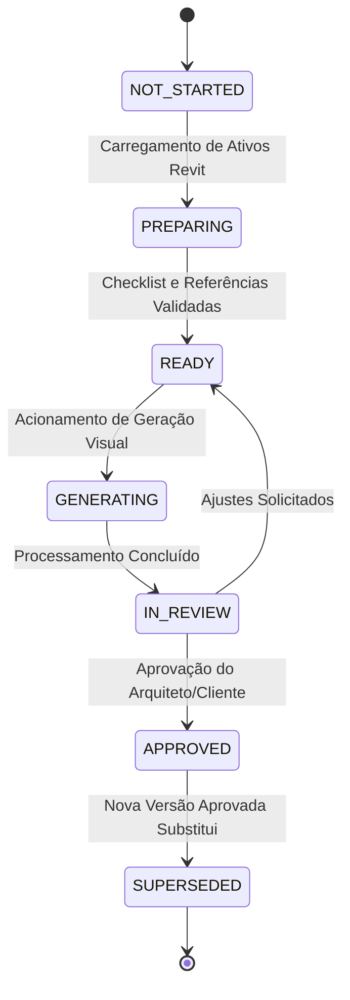

# ARQVERTICE STUDIO — D01: WORKSPACE DE VISUALIZAÇÃO DOS AMBIENTES
## Especificação Arquitetural e Operacional do Workspace de Visualização

---

### 1. Objetivo e Princípio de Funcionamento
O **Workspace de Visualização dos Ambientes (D01)** é o ponto central no ArqVertice Studio onde arquitetos, projetistas e clientes trabalham as imagens de apresentação de cada ambiente a partir das referências homologadas e das exportações técnicas provenientes do **Autodesk Revit**.

> [!IMPORTANT]
> **O ArqVertice Studio não substitui o Revit.**
> O Revit permanece como fonte primária da modelagem BIM e geometria construtiva. O workspace organiza, contextualiza e unifica os ativos visuais para gerar e refinar imagens fotorrealistas e plantas humanizadas.

O workspace organiza de forma coordenada:
1. **Planta:** Planta técnica oficial do Revit e planta humanizada de apresentação.
2. **Perspectivas:** Vistas 3D oficiais exportadas do Revit vinculadas ao ambiente.
3. **Vistas:** Elevações e cortes informativos.
4. **Referências:** Referências estéticas e técnicas com prioridade (`PRIMARY` / `SECONDARY`) e categorias estritas.
5. **Estilo:** Linguagem consolidada no Bloco C04.
6. **Materiais:** Paletas e especificações confirmadas.
7. **Mobiliário:** Peças e layouts homologados.
8. **Câmeras:** Enquadramentos, distâncias focais, alturas de olho e proporções.
9. **Gerações:** Ciclos de processamento visual com proteção anti-duplicação.
10. **Versões:** Ciclo de vida das revisões (`V01`, `V02`, `V03`...).
11. **Aprovações:** Chancelas formais de clientes e arquitetos titulares.
12. **Locks Futuros:** Congelamentos de geometria, layout, câmera, vãos e materiais.
13. **Memória Visual:** Contexto estruturado persistido (C06) para direcionar as IAs.

---

### 2. Localização e Hierarquia de Acesso
O acesso dentro do sistema obedece à hierarquia canônica:

```
PROJETO
└── AMBIENTES
    └── [AMBIENTE]
        └── VISUALIZAÇÃO
```

*Exemplo Prático:*
`Residência Pedro` → `Sala de Estar e Jantar Integrada` → `Visualização`

---

### 3. Cabeçalho de Controle (8 Indicadores Canônicos)
O topo da visualização apresenta os 8 elementos obrigatórios:

| # | Elemento | Descrição / Regra |
|---|---|---|
| 1 | **Nome do Projeto** | Breadcrumb ativo com navegação para a pasta do projeto. |
| 2 | **Nome do Ambiente** | Identificador espacial em destaque (ex: *Sala de Estar e Jantar*). |
| 3 | **Área** | Área útil computada em m² (ex: *54.50 m²*). |
| 4 | **Versão do Ambiente** | Versão ativa em trabalho (ex: `V01`, `V02`). |
| 5 | **Status da Visualização** | Status do fluxo de produção (7 estados). |
| 6 | **Última Atualização** | Timestamp relativo/formatado da última alteração de dados ou render. |
| 7 | **Referência Principal** | Card com thumbnail e link direto para a referência marcada como `PRIMARY`. |
| 8 | **Render Aprovado** | Thumbnail do render oficial chancelado ou indicação de "Em Estudos". |

---

### 4. Ciclo de Estados do Ambiente (Status Workflow)
O ambiente transita exclusivamente entre os 7 estados normatizados:



1. **`NOT_STARTED`:** Ambiente recém-criado sem referências ou arquivos 3D associados.
2. **`PREPARING`:** Levantamento de plantas, referências e arquivos do Revit em andamento.
3. **`READY`:** Diretrizes consolidadas e referências completas; pronto para geração.
4. **`GENERATING`:** Processamento visual em andamento (interface em estado bloqueado para evitar múltiplos cliques).
5. **`IN_REVIEW`:** Renders e plantas humanizadas geradas aguardando revisão e parecer da equipe.
6. **`APPROVED`:** Imagem oficial aprovada pelo cliente ou arquiteto titular.
7. **`SUPERSEDED`:** Versão anterior superada por nova revisão aprovada.

---

### 5. Os 8 Painéis da Estrutura Principal

```
┌───────────────────────────────────────────────────────────────┐
│ 1. BASE DO AMBIENTE (Planta Revit, Perspectivas, RVT, Diretrizes)
├───────────────────────────────────────────────────────────────┤
│ 2. REFERÊNCIAS (PRIMARY primeiro, depois SECONDARY)            │
├───────────────────────────────────────────────────────────────┤
│ 3. PLANTA HUMANIZADA (Apresentação, layout e cotas)           │
├───────────────────────────────────────────────────────────────┤
│ 4. PERSPECTIVAS (Vistas 3D oficiais do Revit)                 │
├───────────────────────────────────────────────────────────────┤
│ 5. CÂMERAS (Enquadramentos, distâncias focais, alturas)       │
├───────────────────────────────────────────────────────────────┤
│ 6. RENDERS (Galeria de gerações, aprovação e comparação)      │
├───────────────────────────────────────────────────────────────┤
│ 7. VERSÕES (Histórico de revisões e versão ativa)             │
├───────────────────────────────────────────────────────────────┤
│ 8. MEMÓRIA VISUAL (Estilo, Paleta, Preservados, Evitar)       │
└───────────────────────────────────────────────────────────────┘
```

#### 5.1. Base do Ambiente
- Exibição da planta principal com escala e orientação.
- Vistas das perspectivas principais exportadas do Revit.
- Listagem dos arquivos `.rvt` e `.nwc` vinculados com caminho de projeto.
- Conceito geral, diretrizes consolidadas e restrições não negociáveis (C04/C06).

#### 5.2. Referências Homologadas
- Exibição mandatória das referências de prioridade `PRIMARY` primeiro, seguidas pelas `SECONDARY`.
- Classificação categórica obrigatória: `ARQUITETURA`, `MATERIAL`, `MOBILIARIO`, `ESTILO`, `ILUMINACAO`. Nenhuma referência é exibida sem indicação clara de sua categoria.

#### 5.3. Planta Humanizada
- Renderização gráfica da planta para apresentação estética ao cliente, preservando alinhamentos e aberturas da planta técnica oficial.

#### 5.4. Perspectivas Oficiais do Revit
- Vistas 3D renderizadas ou axonométricas exportadas da ferramenta BIM com identificação de fase e status de aprovação técnica.

#### 5.5. Câmeras & Enquadramentos
- Registro de câmeras físicas: nome, distância focal (ex: 24mm, 35mm), altura do olho (ex: 1.55m), altura do alvo (ex: 1.20m), proporção de aspecto (ex: 16:9, 4:3) e notas de enquadramento.

#### 5.6. Renders & Gerações
- Galeria visual dos renders produzidos.
- Botão "Aprovar como Final" que eleva o render ao cabeçalho oficial do ambiente e atualiza o estado para `APPROVED`.
- Seletor "Comparar" para visualização lado a lado de duas alternativas.

#### 5.7. Versões do Ambiente
- Timeline de evolução entre revisões (`V01`, `V02`, `V03`), notas de mudança e seletor para alternar a versão ativa.

#### 5.8. Contexto Visual & Memória do Ambiente
- Resumo estruturado extraído diretamente das decisões (C06) e conceito (C04):
  - **ESTILO**
  - **PALETA**
  - **MATERIAIS**
  - **MOBILIÁRIO**
  - **ILUMINAÇÃO**
  - **ELEMENTOS PRESERVADOS**
  - **ELEMENTOS A EVITAR**
- *Diretriz Antialucinação:* Não são inventados valores; campos não atestados recebem marcações canônicas de advertência (`NOT_CONFIRMED` / `UNKNOWN`).

---

### 6. Proteção do Estado de Geração (`GENERATING`)
- Durante o estado de geração, o botão de disparo recebe a classe `.btn-generating`, é desabilitado visual e funcionalmente (`disabled`) e exibe spinner de carregamento.
- Um banner animado de operação ativa é apresentado alertando que novas operações estão temporariamente bloqueadas.
- Qualquer clique subsequente é ignorado pelo controlador de estado (`isGenerating = true`), prevenindo execuções duplicadas acidentais.

---

### 7. Isolamento Rígido Multi-Tenant / Multi-Projeto
- Todas as consultas ao banco de dados e ao `StudioState` filtram obrigatoriamente por `projectId` e `environmentId`.
- Nenhuma referência, perspectiva, câmera ou render de outro projeto ou ambiente é carregada no workspace.

---

### 8. Diretrizes de Responsividade
- **Desktop:** Experiência completa com grids multi-coluna, comparação lado a lado em tela cheia e lightbox de alta resolução.
- **Tablet:** Navegação facilitada com visualização em 2 colunas, inspeção de renders e aprovação com um toque.
- **Mobile:** Layout em coluna única priorizando visualização de imagens, consulta de status e botão de aprovação rápida.
