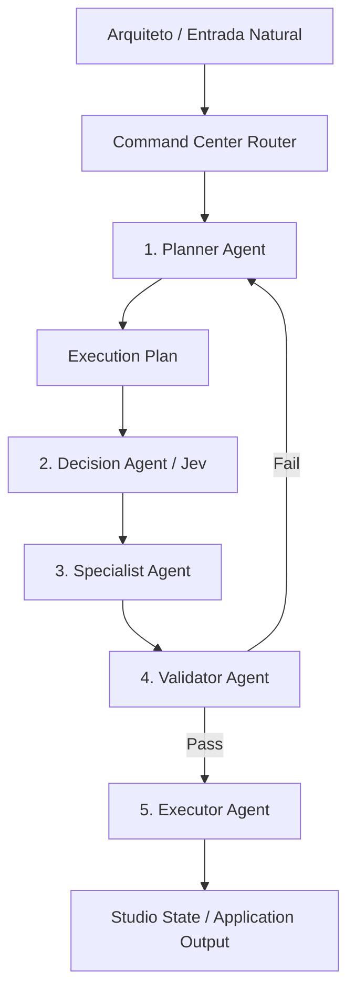

# ARQVERTICE STUDIO — ORQUESTRAÇÃO DE AGENTES & COMMAND CENTER (I14)
**Documento:** `docs/ai/agent-orchestration.md`  
**Versão:** 1.0.0 — Bloco I14  
**Status:** HOMOLOGADO  
**Premissa Central:** O Command Center não é uma caixa de chat genérica. É um painel de controle operacional do estúdio, orientado a contexto, permissões estritas e execução determinística.

---

## 1. Tipologia Canônica de Comandos

O Command Center classifica as entradas do arquiteto em 9 tipos operacionais formais:

| Tipo | Finalidade | Exemplo de Comando | Agente Responsável |
| :--- | :--- | :--- | :--- |
| **`QUERY`** | Consulta determinística de dados no modelo ou projeto | *"Quais ambientes existem no pavimento térreo?"* | `specialist` (BIM) |
| **`ANALYZE`** | Diagnóstico técnico de conformidade ou volumetria | *"Analise a iluminação natural da suíte master"* | `specialist` (Vision / BIM) |
| **`CREATE`** | Instanciação de novos artefatos ou briefs | *"Criar novo projeto para Residência Alphaville"* | `executor` + `planner` |
| **`TRANSFORM`** | Alteração ou ajuste estruturado de parâmetros | *"Atualizar pé-direito do living para 3.20m"* | `executor` (Requer Confirmação) |
| **`COMPARE`** | Avaliação comparativa entre opções ou versões | *"Compare o Estudo Preliminar V01 com a V02"* | `decision` (Jev) |
| **`VALIDATE`** | Auditoria de integridade ou conformidade de normas | *"Validar prancha executiva contra NBR 6492"* | `validator` |
| **`NAVIGATE`** | Mudança rápida de tela, aba ou seleção no estúdio | *"Ir para o cronograma de obras"* | `executor` (UI) |
| **`AUTOMATE`** | Disparo de workflow composto multi-etapas | *"Executar pipeline de fechamento de entrega"* | `planner` + Orquestrador |
| **`EXPORT`** | Geração e download de relatórios ou pranchas | *"Exportar Relatório Executivo em PDF"* | `specialist` (Export) |

---

## 2. Os 5 Papéis Canônicos de Agentes

Em vez de criar dezenas de micro-agentes redundantes, o ArqVértice Studio adota **5 funções especializadas**:



### Contratos dos Agentes

#### 1. `planner`
* **Purpose:** Analisar a solicitação do usuário, verificar o contexto ativo e decompor tarefas complexas em um `ExecutionPlan` ordenado.
* **Allowed Tools:** `ContextBuilder`, `TaskDecomposer`, `DependencyResolver`.
* **Forbidden Tools:** `DirectStateMutator`, `FileDeleter`, `NetworkRequester`.
* **Permissions:** Read-Only.

#### 2. `decision`
* **Purpose:** Avaliar bifurcações lógicas, escolha de templates, severidade de pendências e roteamento via motor heurístico Jev.
* **Allowed Tools:** `JevDecisionEngine`, `PolicyResolver`, `ThresholdEvaluator`.
* **Forbidden Tools:** `DOMMutator`, `StateMutator`.
* **Permissions:** Read-Only / Decisório.

#### 3. `specialist`
* **Purpose:** Executar tarefas de alta especialidade técnica de domínio (BIM, Materiais, Audiovisual, Documentação).
* **Allowed Tools:** `BIMQueryEngine`, `MaterialsCatalog`, `NarrativeSynthesizer`, `SheetRenderer`.
* **Forbidden Tools:** `DatabaseDrop`, `ProjectArchiver`.
* **Permissions:** Domain Processing.

#### 4. `executor`
* **Purpose:** Aplicar alterações autorizadas no estado da aplicação (`StudioState.data`), persistir memórias aprovadas e atualizar a UI.
* **Allowed Tools:** `StudioState.save`, `ModalController`, `NavigationRouter`.
* **Forbidden Tools:** `BypassValidation`, `SilentOverride`.
* **Permissions:** Write (após validação prévia).

#### 5. `validator`
* **Purpose:** Auditar cada saída antes de ser aplicada, verificando conformidade com NBR 6492, NBR 9050, `DESIGN.md` e ausência de dados corrompidos.
* **Allowed Tools:** `SchemaValidator`, `DimensionChecker`, `DesignSystemLinter`.
* **Forbidden Tools:** `DataModifier`.
* **Permissions:** Audit / Gatekeeper.

---

## 3. Ciclo de Vida do Plano de Execução (`ExecutionPlan`)

```text
USER REQUEST
    ↓
PLANNER gera ExecutionPlan (Passos ordenados com ferramenta, reversibilidade e validação)
    ↓
DISPLAY / AUDIT PLAN (Exibição transparente do que será executado)
    ↓
STEP EXECUTION (Execução individual sob controle do Orquestrador)
    ↓
STEP VALIDATION (Validator confere saída de cada passo)
    ↓
COMPLETION & REPORT (Resumo de métricas, duração e dados persistidos)
```

---

## 4. Política de Human Override

O usuário mantém controle absoluto em todas as etapas:
* **Interrupção Imediata (*Stop/Cancel*):** Workflows assíncronos ou geradores podem ser cancelados a qualquer instante com retorno ao estado seguro anterior.
* **Revisão Obrigatória (*Human Gate*):** Etapas classificadas como `irreversible` ou de alto impacto exigem aprovação explícita antes de serem despachadas ao `executor`.
