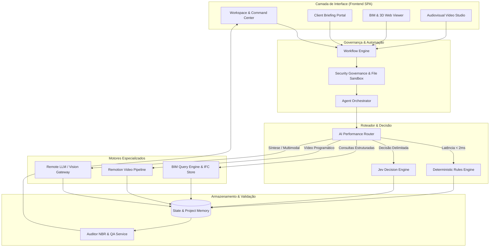

# ARQVERTICE STUDIO — ESPECIFICAÇÃO DE ARQUITETURA DE IA & SISTEMA (I19)

> **Versão:** 2.0.0 (Bloco I Completo)  
> **Camada:** Core Application Infrastructure (`js/ai-foundation.js`, `js/ai-performance-router.js`, `js/agent-orchestrator.js`)

---

## 1. Visão Geral do Ecossistema

A arquitetura do **ArqVértice Studio** organiza-se como uma federação modular e fortemente tipada de subsistemas especializados, mantendo fronteiras estritas entre apresentação, negócio, raciocínio delimitado, síntese generativa e dados estruturados.

```text
UI (Frontend SPA / Portal)
  ↓
Application State & Context Builder
  ↓
Workflow Engine (Automação, Idempotência & Rollback)
  ↓
Agent Orchestrator (5 Papéis com Contratos)
  ↓
AI Router & Performance Tiered Dispatcher
  ↓
Executores Especializados:
  [Regra Determinística] | [Jev Decision Engine] | [BIM Query Engine] | [LLM / Vision] | [Remotion Video]
  ↓
Storage & Integridade (Local Database, JSON, Cache LRU & File Sandbox)
  ↓
Validation & QA (NBR 6492, NBR 15575, Design Tokens & Schema Check)
```

---

## 2. Diagrama de Arquitetura Unificada (Mermaid)



---

## 3. Matriz de Responsabilidades dos Subsistemas

| Subsistema | Responsabilidade | Implementação Primária |
| :--- | :--- | :--- |
| **Frontend** | Interface de alta densidade informativa, receded chrome, visual feedback e 3D canvas. | `index.html`, `js/app.js`, `styles.css` |
| **AI Router** | Resolução agnóstica de tarefas, orçamentos de latência e fallbacks automáticos. | `js/ai-foundation.js`, `js/ai-performance-router.js` |
| **Jev Engine** | Decisão ponderada multi-critério entre opções fechadas e resolução de conflitos sem custo de LLM. | `js/jev-decision-engine.js` |
| **BIM 3D** | Inspeção geométrica, propriedades IFC e queries relacionais determinísticas. | `js/bim-viewer-module.js` |
| **Video Engine** | Composição audiovisual determinística frame a frame com física de molas Remotion. | `video/render/audiovisual-pipeline.js`, `video/templates/template-registry.js` |
| **Agent Orchestrator** | Gestão dos 5 agentes canônicos (`planner`, `decision`, `specialist`, `executor`, `validator`). | `js/agent-orchestrator.js` |
| **Workflow Engine** | Execução segura de pipelines com suporte a dry-run, idempotência e rollback. | `js/workflow-engine.js` |
| **Security** | Zero secrets, proteção contra injection, sandbox de arquivos e confirmação de ações destrutivas. | `js/security-governance.js` |
| **Validation & QA** | Verificação automática de conformidade NBR 6492, NBR 15575 e integridade de pranchas. | `js/visual-qa-module.js`, `js/presentation-qa-module.js` |

---

## 4. Fronteiras de Autoridade

1. **Revit é a autoridade de autoria arquitetônica;** o ArqVértice é a camada de apresentação, inteligência e validação.
2. **Dados estruturados superam inferência probabilística:** perguntas como áreas, contagem de peças e materiais são resolvidas pelo `BIMQueryEngine`, nunca por LLM.
3. **Nenhum secret no cliente:** todo tráfego com APIs remotas é restrito a rotas protegidas em `server.js`.
4. **Human-in-the-loop obrigatório:** ações destrutivas (`delete`, `overwrite`, `publish`, `export`) exigem confirmação explícita do arquiteto.
