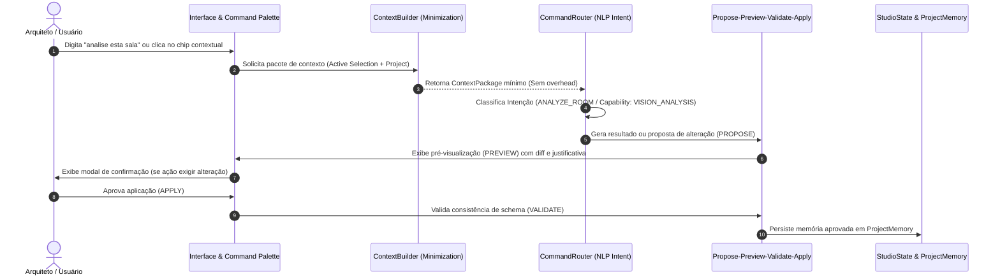

# ARQVERTICE STUDIO — IA CONTEXTUAL & INTENT ROUTER (I10)
**Documento:** `docs/ai/contextual-ai.md`  
**Versão:** 1.0.0 — Bloco I10  
**Status:** IMPLEMENTADO & HOMOLOGADO  
**Código Fonte:** `js/contextual-ai-module.js`

---

## 1. Princípio Fundamental de Arquitetura

O usuário nunca deve precisar reexplicar o contexto de um projeto, sala, prancha ou cliente a cada ação com a Inteligência Artificial. A interface e a camada cognitiva do ArqVértice Studio conhecem a posição do usuário, o elemento ativo, o histórico de decisões e as normas vigentes.

Ao mesmo tempo, adota-se o princípio da **Minimização de Contexto (Context Minimization)**:
* NUNCA trafegar o dump completo do banco ou arquivos irrelevantes.
* Enviar exclusivamente o recorte de dados estritamente necessário para a capability solicitada.

---

## 2. Diagrama de Fluxo: Context Builder & Safe Mutation

---

## 3. Modelo de Contexto Estruturado

O `ContextBuilder` empacota a requisição nos seguintes pilares canônicos:

| Bloco de Contexto | Descrição | Conteúdo Selecionado |
| :--- | :--- | :--- |
| **`PROJECT_CONTEXT`** | Metadados essenciais do empreendimento | ID, código (`PRJ-01`), tipologia, área construída, status e fase atual. |
| **`SCREEN_CONTEXT`** | Estado da navegação do estúdio | Visão ativa (`workspace`, `environment`, `dashboard`), aba selecionada. |
| **`USER_INTENT`** | Intenção extraída da linguagem natural | Comando original, intent identificada (`ANALYZE_ROOM`, `VIDEO_SCRIPT`, etc.). |
| **`TASK_CONTEXT`** | Definição da tarefa de IA | Capability canônica (`VISION_ANALYSIS`, `PRESENTATION_SYNTHESIS`), nível de execução. |
| **`SELECTION_CONTEXT`** | Foco de interesse imediato do arquiteto | Tipo (`ENVIRONMENT`, `BIM`, `IMAGE`, `DOCUMENT`), identificador e atributos essenciais. |
| **`BIM_CONTEXT`** | Dados geométricos (quando aplicável) | Eixos, espessuras de parede, cotas de vão livre e áreas úteis. |
| **`MEDIA_CONTEXT`** | Dados audiovisuais (quando aplicável) | Aspect ratio, lente/câmera, iluminação e perfil de movimento. |
| **`DOCUMENT_CONTEXT`** | Dados de pranchas (quando aplicável) | Formato (A0–A3), escala (1:50, 1:100), carimbo e disciplina. |

---

## 4. Comandos em Linguagem Natural Homologados

O `CommandRouter` interpreta nativamente comandos em português com tolerância sintática:

1. **"analise esta sala"** ➔ `ANALYZE_ROOM` (`VISION_ANALYSIS`):
   - Avalia ventilação, iluminação natural, eixos de circulação ($\ge 0.80\text{m}$) e volumetria.
2. **"gere uma narrativa para esta apresentação"** ➔ `PRESENTATION_NARRATIVE` (`PRESENTATION_SYNTHESIS`):
   - Constrói o roteiro conceitual e editorial em três atos para o cliente.
3. **"prepare o roteiro do vídeo"** ➔ `VIDEO_SCRIPT` (`VIDEO_PROMPT_GENERATION`):
   - Estrutura tomadas cinemáticas com durações, lentes e perfis de câmera.
4. **"verifique os materiais"** ➔ `CHECK_MATERIALS` (`STRUCTURED_DATA_EXTRACTION`):
   - Checa paginação de pisos, resistência ao tráfego, reflexão e compatibilidade técnica.
5. **"compare estas duas opções"** ➔ `COMPARE_OPTIONS` (`ARCHITECTURAL_DECISION`):
   - Realiza análise comparativa de estudos preliminares com recomendação fundamentada.
6. **"mostre problemas nesta planta"** ➔ `INSPECT_PLAN` (`BIM_STRUCTURAL_ANALYSIS`):
   - Audita vãos mínimos, espessuras de paredes hidráulicas e interferências de circulação.

---

## 5. Ciclo Seguro: PROPOSE ➔ PREVIEW ➔ VALIDATE ➔ APPLY

Nenhuma IA tem autorização para mutar diretamente o estado do projeto sem supervisão:
* **PROPOSE:** A IA formula a recomendação acompanhada de um ID de proposta e resumo do impacto.
* **PREVIEW:** A interface exibe a diferença visual ou textual clara antes da confirmação.
* **VALIDATE:** Checagem determinística de regras (áreas não negativas, conformidade com NBR, ausência de dados nulos).
* **APPLY:** Apenas após a confirmação do usuário ou se enquadrada como análise segura de leitura.

---

## 6. Política de Confirmação (Confirmation Policy)

* **Execuções Automáticas (Leitura / Reversível):**
  - Diagnósticos arquitetônicos, sugestões de paleta, análises de iluminação, cálculos de escala e listagem de pendências.
* **Confirmação Explícita Obrigatória (Destrutiva / Irreversível):**
  - Exclusão de ambientes, sobreposição de pranchas já aprovadas, publicação de pranchas no Portal do Cliente e alteração de travas (*locks*).

---

## 7. Segregação de Camadas de Memória

Para evitar contaminação de contexto e alucinações cruzadas:
1. **`Project Memory`:** Armazenada no banco de dados do projeto. Contém decisões aprovadas, memoriais técnicos e restrições formais.
2. **`Task Memory`:** Memória efêmera da tarefa ativa; descartada após a finalização do processamento.
3. **`Session Memory`:** Histórico de comandos recentes do usuário e seleção ativa na tela.
4. **`User Preferences`:** Configurações de tema (Dark/Light), densidade de interface e política de IA preferencial (`BALANCED`, `QUALITY`).
5. **`System Knowledge`:** Normas técnicas imutáveis (NBR 6492, NBR 9050, Apple Design System v2.1.0).
