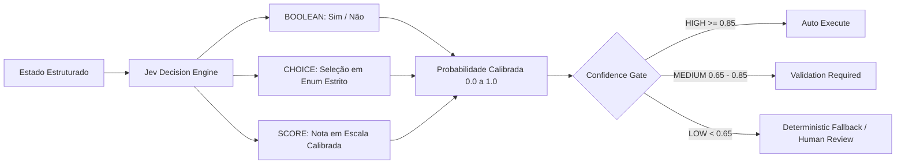

# ARQVERTICE STUDIO — JEV DECISION LAYER SPECIFICATION

> **Versão:** 1.0.0  
> **Status:** Ativo (I03)  
> **Camada:** Structured Decision Engine (`js/jev-decision-engine.js`)  
> **Integração:** TypeSafe AI / Vercel AI Gateway / Local Calibrated Evaluator

---

## 1. O que é o Jev?

O **Jev** (desenvolvido pela TypeSafe AI) é um modelo de decisão probabilística especializada, desenhado para avaliar estados complexos e responder a perguntas com espaço de resposta formalmente tipado e delimitado.

Ao contrário de Modelos de Linguagem Generativos (LLMs), o Jev não foi concebido para conversar, redigir artigos, produzir código ou gerar mídia visual. Sua função primordial na arquitetura do ArqVértice Studio é atuar como um **árbitro probabilístico**, determinando caminhos, escolhas e pontuações com base em dados estruturados.

---

## 2. Onde o Jev DEVE ser Utilizado

O Jev é empregado exclusivamente onde existe uma pergunta estruturada com alternativas ou escala fechada:

1. **Seleção de Templates Audiovisuais (`CHOICE`):**
   * Avalia o perfil do cliente, objetivo da apresentação, ambientes em destaque e dados BIM para decidir o formato cinematográfico Remotion ideal (`ARCHITECTURAL_CINEMATIC`, `ARCHITECTURAL_WALKTHROUGH`, `INTERIOR_PRESENTATION`, `FACADE_PRESENTATION`, etc.).
2. **Roteamento de Workflows (`CHOICE`):**
   * Decisão de qual módulo da aplicação deve processar uma nova solicitação técnica (`ARCHITECTURE_BRIEF`, `VISION_ANALYSIS`, `BIM_ANALYSIS`, `VIDEO_DIRECTION`, `DOCUMENTATION`).
3. **Triagem de Revisões e Human-in-the-Loop (`BOOLEAN`):**
   * Determina se uma alteração solicitada pelo cliente impacta alvenaria, pilares e vãos (`requiresHumanReview: true`), exigindo validação sênior do arquiteto, ou se é restrita a acabamentos estéticos.
4. **Verificação de Prontidão da Apresentação (`SCORE`):**
   * Avalia uma escala de 0 a 100 baseada na completude de pranchas técnicas, renders aprovados e confirmação de briefing.

---

## 3. O que o Jev NUNCA deve fazer (Anti-Padrões Proibidos)

1. **NÃO é Chatbot:** Não gera conversas ou respostas de suporte em texto corrido.
2. **NÃO Gera Imagens ou Vídeos:** A geração visual permanece sob responsabilidade do Imagen 3 (`render-providers.js`) e a renderização de vídeo permanece sob o motor Remotion (`video/`).
3. **NÃO Substitui Regras Determinísticas:** Cálculos métricos de áreas (m²), conversão de escalas (1:50, 1:100), normas ABNT NBR 6492, quantitativos de materiais e orçamentos continuam sendo calculados estritamente por código determinístico.
4. **Decisão NÃO é Autorização:** O Jev nunca executa mutações irreversíveis, exclusões no banco de dados ou publicação para o cliente de forma autônoma. O resultado é sempre submetido à política do sistema (`Application Policy`).

---

## 4. Primitivas de Decisão do Jev

### 4.1. `BOOLEAN`
Avalia uma premissa binária:
* **Exemplo:** `requiresHumanStructuralReview`
* **Retorno:** `{ decision: true, probability: 0.96 }`

### 4.2. `CHOICE`
Seleciona o elemento ideal em um conjunto pré-definido com no mínimo 2 opções:
* **Exemplo:** `videoTemplate: ['ARCHITECTURAL_CINEMATIC', 'INTERIOR_PRESENTATION', 'FACADE_PRESENTATION']`
* **Retorno:** `{ decision: 'INTERIOR_PRESENTATION', probability: 0.94 }`

### 4.3. `SCORE`
Avalia a aderência de um estado contra uma rubrica definida:
* **Exemplo:** `presentationReadiness` (escala 0 a 100)
* **Retorno:** `{ decision: 90, probability: 0.92 }`

---

## 5. Dual-Mode: Operação Remota e Local Calibrada

* **Modo Conectado (Nuvem / Gateway):** Quando as variáveis `JEV_ENDPOINT` e `JEV_API_KEY` estão presentes no ambiente do servidor, o motor despacha chamadas seguras via HTTP com timeout controlado e tratamento para `AUTH_ERROR`, `RATE_LIMIT` e `JEV_UNAVAILABLE`.
* **Modo Local Calibrado (Offline / Testes / Zero Custo):** Na ausência de conexão ou chaves, opera através do motor determinístico calibrado embutido em `js/jev-decision-engine.js`, garantindo que toda a suíte de testes de integração e o desenvolvimento local rodem instantaneamente com custo zero e sem quebras.
