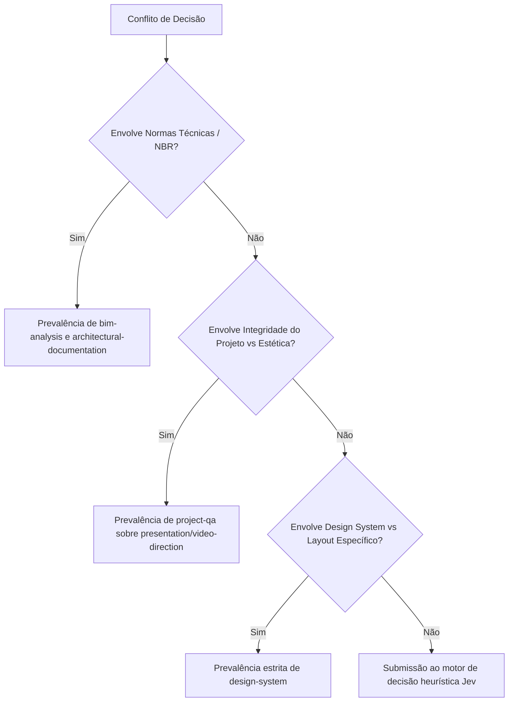

# ARQVERTICE STUDIO — REGISTRO CANÔNICO DE AGENT SKILLS (SKILLS REGISTRY)
**Documento:** `docs/ai/skills-registry.md`  
**Versão:** 1.0.0 — Bloco I07 / I11  
**Status:** ATIVO E HOMOLOGADO  
**Localização das Skills:** `.agents/skills/<skill-name>/SKILL.md`

---

## 1. Visão Geral e Princípios Operacionais

As **Agent Skills** do ArqVértice Studio transformam o conhecimento prático acumulado de arquitetura, renderização, modelagem, vídeo e governança de software em módulos de procedimento para agentes autônomos.

### Regras de ouro:
1. **Uma Skill não é um prompt gigante:** É um contrato de conhecimento, restrições e etapas de workflow executáveis.
2. **Desacoplamento:** Nenhuma skill assume o controle direto e cego do banco de dados ou da renderização; ela opera via camadas canônicas (`PROPOSE` ➔ `PREVIEW` ➔ `VALIDATE` ➔ `APPLY`).
3. **Determinismo:** Cálculos de escala, quantitativos e cotas NBR são determinísticos e validados por código, nunca gerados por pura estimativa probabilística.
4. **Isolamento de Erro:** Falhas na execução de uma skill ativam o fallback especificado no registro sem interromper o restante do pipeline.

---

## 2. Tabela de Registro de Skills Especializadas

| Skill | Objetivo | Trigger / Gatilho | Escopo | Entradas Principais | Saídas Principais | Dependências | Ordem de Precedência |
| :--- | :--- | :--- | :--- | :--- | :--- | :--- | :--- |
| **`architecture-brief`** | Estruturação e refinamento de briefing técnico | Novo briefing recebido ou solicitação de refinamento de programa de necessidades | Dados de cliente, estilo de vida, orçamento, programa de necessidades | Respostas do cliente, formulários de briefing, fotos de referências | `TechnicalBrief` estruturado com zonas funcionais, restrições e programa | Schema do briefing, `state.js` | 1 (Fase Inicial) |
| **`bim-analysis`** | Auditoria de modelos e elementos construtivos | Upload de IFC, alteração de alvenarias ou medição técnica | Geometrias 3D, elementos construtivos, espessuras de parede, cotas | IFC fragments, dados de survey, plantas baixas | Relatório de interferências, validação de vãos e conformidade geométrica | Motor geométrico, NBR 6492 | 2 (Modelagem) |
| **`architectural-documentation`** | Geração e validação de pranchas técnicas A0–A3 | Emissão de pranchas executivas, geração de carimbos e cotas | Pranchas técnicas, memoriais descritivos, carimbos | Plantas vetorizadas, dados do projeto, escalas (1:50, 1:100) | Pranchas em SVG/PDF conformes com NBR 6492 e carimbo oficial | `sheet-engine-module.js` | 3 (Documentação) |
| **`material-analysis`** | Compatibilização de acabamentos e paginação | Seleção de ambiente, alteração de pisos ou solicitação de memorial | Revestimentos, tintas, marcenaria, pedras naturais | Texturas, especificações de fornecedores, dimensões de ambientes | Fichas técnicas de materiais, mapa de paginação e índices de reflexão | `materials-system-module.js` | 3 (Especificação) |
| **`presentation-direction`** | Direção de arte para apresentação ao cliente | Criação de prancha executiva ou preparação de reunião | Pranchas conceituais, moodboards, slides executivos | Conceito do projeto, renders finalizados, paleta de cores | Deck de apresentação harmônico com hierarquia visual e narrativa | `presentation-engine-module.js` | 4 (Apresentação) |
| **`video-direction`** | Direção cinematográfica e roteirização | Solicitação de teaser ou vídeo de apresentação do projeto | Roteiro audiovisual, storyboard, transições e cortes | Ambientes prioritários, renders estáticos, conceito formal | Roteiro técnico com durações, movimentos de câmera e beats sonoros | `video-narrative-engine-module.js` | 4 (Audiovisual) |
| **`remotion`** | Renderização programática determinística de frames | Compilação de vídeo do projeto em MP4/WebM | Composição React/Remotion, timing de frames, interpolações | Cenas, durações em frames, fps, assets de mídia e tipografia | Vídeo renderizado em alta definição ou pacote de render local | `video/render/remotion-engine.js` | 5 (Renderização Vídeo) |
| **`project-qa`** | Verificação de integridade entre disciplinas | Fechamento de ciclo de entrega ou revisão pré-publicação | Coerência entre Arquitetura, Interiores, 3D e Cronograma | Estado global do projeto (`StudioState.data`), entregáveis | Relatório com matriz de pendências, status de locks e prontidão | `revision-system-module.js` | 5 (Controle de Qualidade) |
| **`visual-qa`** | Auditoria visual heurística de UI e renders | Atualização de telas, modais ou renders preliminares | Layout de telas, contraste de cores, hierarquia visual | Screenshots de interface, renders gerados, tokens de design | Relatório de conformidade visual com métricas objetivas de desvios | `tests/audit-design.js`, `DESIGN.md` | Contínuo |
| **`responsive-qa`** | Auditoria de responsividade e viewport | Alteração de estilos ou verificação de compatibilidade mobile | Breakpoints 375px a 1440px, safe areas, touch targets | DOM da aplicação, regras CSS de media queries | Lista de violações de overflow, clipping e touch targets < 44px | `css/responsive-a11y.css` | Contínuo |
| **`design-system`** | Governança de tokens e componentes de UI | Criação ou refatoração de elementos visuais do estúdio | Tokens CSS, tipografia SF/Montserrat, espaçamentos, elevações | Folhas de estilo, componentes de interface | Código CSS aderente ao `DESIGN.md` v2.1.0 sem inline-styles arbitrários | `DESIGN.md` | Transversal |
| **`image-analysis`** | Inspeção visual multimodal de renders e fotos | Upload de referência ou análise de render recém-gerado | Imagens de arquitetura, renders 3D, fotos de terreno | Buffer ou URL da imagem, tags de controle de ambiente | Descrição técnica de iluminação, ruído, coerência de materiais | Provedor Vision / `ai-foundation.js` | Sob Demanda |
| **`project-context`** | Construção do pacote de contexto mínimo para IA | Qualquer interação com agentes ou comandos em linguagem natural | Contexto ativo do estúdio (projeto, tela, seleção, tarefa) | Estado da tela, ID do projeto selecionado, elemento em foco | Pacote JSON contextual compacto sem dados supérfluos | `js/contextual-ai-module.js` | Pré-requisito de toda IA |

---

## 3. Matriz de Resolução de Conflitos e Precedência

Caso duas skills sugiram diretrizes conflitantes durante a execução:

---

## 4. Ordem de Execução do Pipeline Arquitetônico

1. **`architecture-brief`** ➔ Gera a fundação de requisitos.
2. **`project-context`** ➔ Carrega o pacote de dados estritamente necessários.
3. **`bim-analysis`** + **`material-analysis`** ➔ Estruturam a geometria e especificações.
4. **`architectural-documentation`** ➔ Emite documentação e pranchas executivas.
5. **`presentation-direction`** + **`video-direction`** ➔ Geram materiais de comunicação com o cliente.
6. **`remotion`** ➔ Renderiza as composições audiovisuais cinematográficas.
7. **`project-qa`** + **`visual-qa`** + **`responsive-qa`** ➔ Realizam a checagem final antes da publicação.
