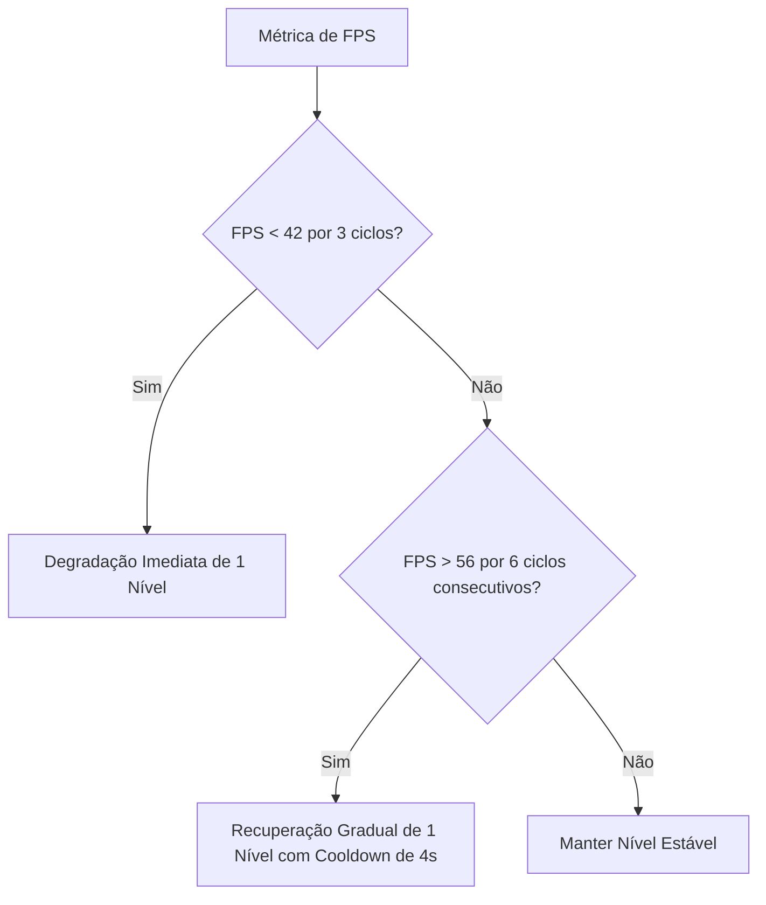

# J35 — ARQVERTICE PERFORMANCE & QUALITY GOVERNANCE

## 1. Visão Geral

O módulo **J35 Performance & Quality Governance** assegura que o renderizador 3D opere sem stutters, com resposta imediata aos controles do usuário e sem travar a interface web, gerenciando recursos da GPU de forma inteligente.

---

## 2. Quality Governor (Governador com Histerese e Anti-Oscilação)

Para evitar que a taxa de quadros oscile bruscamente entre alta e baixa qualidade (efeito *flapping*), o **Quality Governor** emprega regras estritas de histerese:

### Escadinha de Ajuste de Níveis:
1. **Redução de Render Scale (DPR)**: de 2.0x ➔ 1.5x ➔ 1.25x ➔ 1.0x ➔ 0.8x.
2. **Redução de Sombras**: Resolução do mapa de 4096 ➔ 2048 ➔ 1024 ➔ 512 ➔ Desligado.
3. **Redução de Reflexos**: SSR ➔ Planar ➔ Ambiente HDRI ➔ Desligado.
4. **Desativação de Pós-Processamento**: Bloom, Vinheta e Oclusão de Ambiente.
5. **Transição de LOD**: Mudança para malha de geometria simplificada.
6. **Downsampling de Texturas**: Uso de mipmaps menores.

---

## 3. Shadow Caching & Selective Atlas Update

O recálculo de sombras é uma das operações mais pesadas na GPU:
- **Sombra Estática**: Quando nenhuma luz ou objeto se move, `shadowMap.needsUpdate` é mantido como `false`.
- **Dirty Tracking**: Quando uma luz tem sua temperatura, intensidade ou posição alterada (`markLightDirty`), apenas o mapa afetado é recalculado no frame seguinte.

---

## 4. Progressive Path Tracing & Anti-Stutter

Durante o modo **Tier 4 (Cinematic Progressive Path Tracing)**:
- **Movimento de Câmera**: Reduz imediatamente para modo *draft* (1 amostra por frame), garantindo 60 FPS e resposta fluida ao toque/mouse.
- **Câmera Estabilizada**: Inicia suavemente a acumulação multi-frame até atingir a convergência (ex: 64 a 256 amostras).

---

## 5. Telemetria e Diagnóstico em Tempo Real

Métricas coletadas a cada 500ms:
- **FPS Real & Frame Time (ms)**
- **Draw Calls & Contagem de Triângulos**
- **Contagem de Texturas & Memória de Assets (MB)**
- **Tempo de GPU & Backend Ativo (WebGPU / WebGL2 / WebGL1)**
- **Nível do Quality Governor (0 a 4)**
- **Amostra Atual de Path Tracing & Status de Convergência**
