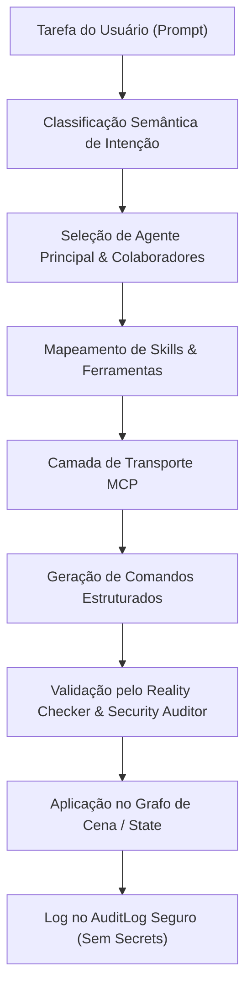

# J41 — ArqVértice Multi-Agent 3D Workflow

## 1. Visão Geral
O subsistema **J41** estabelece a arquitetura multi-agente especializada para o ecossistema 3D do ArqVértice Studio. Em vez de utilizar um agente generalista ou importar toda a biblioteca de agentes de forma indiscriminada, o ArqVértice mapeia cirurgicamente **17 especialistas** inspirados no catálogo *The Agency*, garantindo precisão, velocidade e limites de responsabilidade determinísticos.

---

## 2. Catálogo de Especialistas (The Agency Selection)

| Especialista | Categoria | Competências Principais |
| :--- | :--- | :--- |
| **3D & Scene Developer** | 3D Engineering | Grafo de cena, hierarquias, posicionamento espacial e adaptadores Three.js. |
| **Technical Artist** | Materials & Shaders | Materiais PBR físicos, balanço de iluminação, texturas e fidelidade visual. |
| **BIM/GIS Specialist** | BIM & Geospatial | Esquema IFC, mapeamento de famílias Revit, georreferenciamento SIRGAS/UTM. |
| **AI Engineer** | AI Core | Seleção de modelos, execução de tool calling e otimização de latência. |
| **Prompt Engineer** | Prompt Systems | Formatação de JSON estrito determinístico e prevenção de ambiguidades. |
| **Software Architect** | Architecture | Desacoplamento entre LLM, renderizador 3D e banco de dados relacional. |
| **Frontend Developer** | UI/UX | HUDs flutuantes, visualizador do cliente e gestos responsivos. |
| **Backend Architect** | Backend | Rotas de visualização, storage 3-tier e pacotes otimizados. |
| **MCP Builder** | Tooling | Protocolo MCP, definição de schemas e canais de transporte. |
| **Agents Orchestrator** | Orchestration | Decomposição de tarefas complexas e consenso multi-agente. |
| **Workflow Architect** | Workflows | Gates de aprovação e etapas de projeto arquitetônico. |
| **Research Synthesist** | Intelligence | Consulta de normas NBR e catálogos de fornecedores de materiais. |
| **Reality Checker** | Validation | Plausibilidade física, limites geométricos e prevenção de colisões. |
| **Evidence Collector** | Audit & Telemetry | Captura de snapshots antes/depois e telemetria de mudanças. |
| **Performance Benchmarker** | Performance | Controle de draw calls, FPS e orçamentos poligonais. |
| **Code Reviewer** | Quality Assurance | Revisão estrita de código gerado e prevenção de regressões. |
| **AI-Generated Code Security Auditor**| Security | Sanitização contra injeções, isolamento em sandbox e mascaramento de secrets. |

---

## 3. Fluxo de Execução Multi-Agente

---

## 4. Exemplos de Workflows Cooperativos

### Exemplo 1: "Analise meu modelo 3D"
- **Agentes Engajados**: `3D & Scene Developer` + `Technical Artist` + `Reality Checker` + `Performance Benchmarker`
- **Ações**:
  1. O *3D Developer* percorre o grafo de cena e avalia hierarquias e instâncias.
  2. O *Performance Benchmarker* audita o orçamento de triângulos e draw calls.
  3. O *Technical Artist* valida os mapas de rugosidade, metalicidade e normais.
  4. O *Reality Checker* emite parecer de conformidade física.

### Exemplo 2: "Encontre todos os materiais de madeira"
- **Agentes Engajados**: `Research Synthesist` + `Technical Artist` + `Reality Checker`
- **Ações**:
  1. O *Research Synthesist* consulta o `3D Semantic Index` com filtro de categoria.
  2. O *Technical Artist* valida as propriedades PBR e shaders associados.
  3. O *Reality Checker* confirma a existência dos IDs espaciais nos ambientes.

### Exemplo 3: "Substitua o piso da sala"
- **Agentes Engajados**: `3D Scene Developer` + `Technical Artist` + `Reality Checker` + `Evidence Collector`
- **Ações**:
  1. O *3D Scene Developer* isola o elemento de piso do ambiente "Sala".
  2. O *Technical Artist* resolve o novo material físico compatível (`WOOD_PARQUET_OAK`).
  3. O *Reality Checker* valida a plausibilidade da substituição.
  4. O *Evidence Collector* gera snapshot de transação reversível (Undo/Redo).
