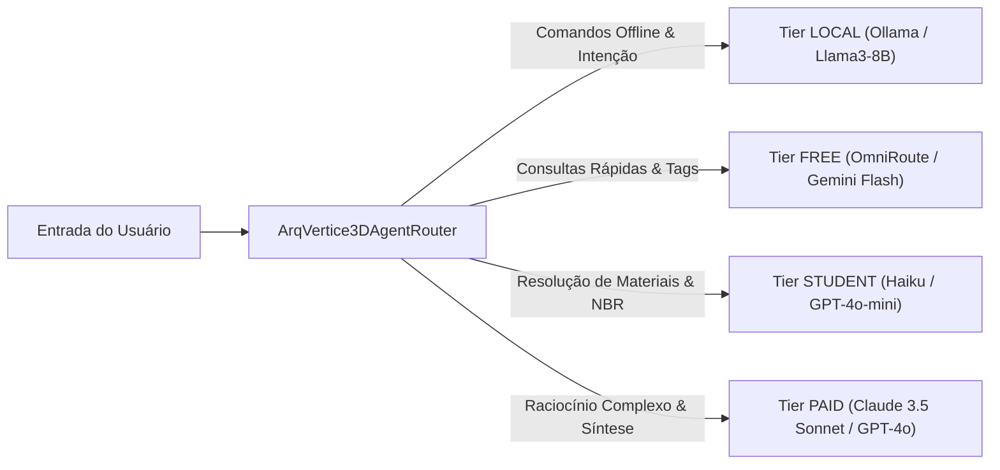

# J42 — ArqVértice MCP Integration & AI Routing Architecture

## 1. Visão Geral
O subsistema **J42** padroniza a camada de ferramentas e contextos através do **Model Context Protocol (MCP)** e define a política de **Roteamento de Modelos de IA**, estabelecendo barreiras arquiteturais estritas entre LLMs, renderizadores WebGPU/WebGL e bancos de dados BIM.

---

## 2. Servidores MCP Integrados

O ArqVértice conecta apenas os servidores MCP estritamente necessários para a operação arquitetônica:

| Servidor MCP | Descrição | Ferramentas Expostas |
| :--- | :--- | :--- |
| `filesystem` | Acesso seguro e isolado ao diretório do projeto | `read_file`, `write_file`, `list_dir` |
| `github` | Controle de versão de pranchas e especificações | `get_commit`, `push_branch`, `create_issue` |
| `browser` | Automação e verificação visual do Client Viewer | `navigate`, `click`, `evaluate_js` |
| `bim` | Conector semântico ThatOpen / IFC | `parse_ifc`, `query_express_id`, `get_bim_properties` |
| `revit` | Conector local Revit (pyRevit / MCP local) | `get_element_parameters`, `sync_view`, `stage_transaction` |
| `asset_processing` | Pipeline de compressão e LODs 3D | `gltfpack_optimize`, `generate_lods`, `quantize_splat` |
| `documentation` | Especificações de fornecedores e normas NBR | `search_nbr`, `fetch_product_spec`, `export_pdf_draft` |

---

## 3. Matriz de Roteamento de Modelos de IA

Para otimizar custos, privacidade e latência, as tarefas de IA são distribuídas em 4 níveis (Tiers):

### Modelos 3D Especializados
- **TRELLIS.2**: Usado estritamente em pipelines dedicados de geração de modelos 3D a partir de rascunhos conceituais.
- **SAM 3D**: Usado exclusivamente para segmentação volumétrica em nuvens de pontos e malhas.

---

## 4. Separação Estrita de Domínios
O sistema mantém isolamento absoluto entre componentes:
1. **LLM**: Não executa shaders nem manipula matrizes de transformação de baixo nível diretamente.
2. **Renderizador 3D**: Não depende de chamadas síncronas de IA para manter taxas de 60 FPS.
3. **BIM Engine**: Preserva as propriedades paramétricas dos elementos sem mutações arbitrárias.

---

## 5. Auditoria de Segurança (`AuditLog`)
Todo comando emitido por um agente é registrado contendo:
- `task`: Enunciado da tarefa solicitada.
- `agents`: Lista de especialistas acionados.
- `modelTier`: Nível de modelo selecionado (`LOCAL`, `FREE`, `STUDENT`, `PAID`).
- `tools`: Ferramentas MCP invocadas.
- `commands`: Ações determinísticas propostas.
- `result`: Resposta e status de execução.
- `validation`: Parecer de segurança e conformidade física.
- **Regra de Sigilo**: Tokens, chaves de API, senhas e credenciais são mascarados automaticamente (`[REDACTED]`).
