# J43 — 3D QA Gate & Reality Checker Architecture

## 1. Visão Geral
O subsistema **J43** estabelece a certificação contínua e determinística para toda a infraestrutura 3D do ArqVértice Studio. O sucesso de uma alteração ou modelo não é medido apenas pela ausência de erros no build, mas por uma auditoria em 5 camadas físicas e de runtime.

---

## 2. As 5 Camadas do Reality Checker

| Camada | Validação | Critérios de Sucesso |
| :--- | :--- | :--- |
| **1. Arquivo (File)** | Integridade e extensão | Formato reconhecido (`.glb`, `.ifc`, `.sog`, `.ply`, `.ksplat`), integridade binária. |
| **2. Código (Code)** | Segurança estrita | Ausência de `eval()`, injeção arbitrária de scripts e execução em Strict Mode. |
| **3. Grafo de Cena (Scene)** | Estrutura 3D | Nós com `BoundingBox` válido, matriz de transformação presente e sem nós órfãos. |
| **4. Runtime** | Performance em tempo real | $\ge 28$ FPS em dispositivos móveis, $\le 250$ draw calls e consumo de memória $\le 512$ MB. |
| **5. Resultado Visual** | Artefatos e Shading | Ausência de coordenadas `NaN`, sem flickering de clipping e materiais PBR atribuídos. |

---

## 3. Os 15 Gates de QA 3D

```mermaid
graph TD
    A["3D QA Gate"] --> G1["1. Asset Loading"]
    A --> G2["2. Scene Loading"]
    A --> G3["3. Camera & Frustum"]
    A --> G4["4. Selection & Raycasting"]
    A --> G5["5. Transforms (Pos/Rot/Scale)"]
    A --> G6["6. PBR Materials Catalog"]
    A --> G7["7. Lights & Shadow Caching"]
    A --> G8["8. Progressive LOD"]
    A --> G9["9. Client Viewer Sandbox"]
    A --> G10["10. Mobile Adaptive Engine"]
    A --> G11["11. WebGPU / NodeMaterials"]
    A --> G12["12. WebGL2 Fallback"]
    A --> G13["13. Deterministic AI Commands"]
    A --> G14["14. 3D Semantic Index BVH"]
    A --> G15["15. Reality Checker 5-Layers"]
```

Uma release só é promovida a produção com score $\ge 95\%$ de conformidade.
