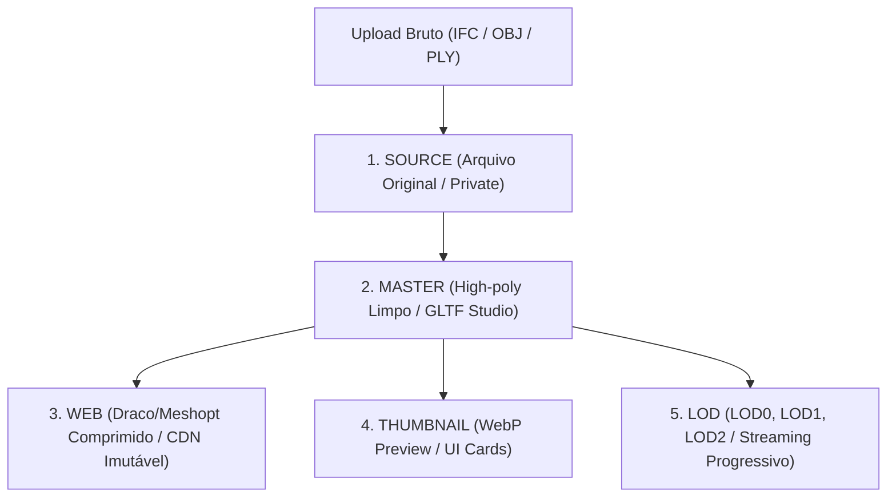

# J46 — CDN Delivery, 5-Tier Storage & Real Performance Targets

## 1. Visão Geral
O subsistema **J46** estabelece a topologia de distribuição CDN, organização de armazenamento em 5 camadas (5-Tier Storage) e as metas realistas de telemetria de performance para produção.

---

## 2. 5-Tier Asset Storage Topology

| Tier | Caminho | Política de Cache CDN |
| :--- | :--- | :--- |
| **`SOURCE`** | `storage/projects/{id}/source/{assetId}.{ext}` | `private, no-cache` |
| **`MASTER`** | `storage/projects/{id}/master/{assetId}.glb` | `public, max-age=86400` |
| **`WEB`** | `storage/projects/{id}/web/{assetId}.glb` | `public, max-age=31536000, immutable` |
| **`THUMBNAIL`** | `storage/projects/{id}/thumbnails/{assetId}.webp` | `public, max-age=31536000, immutable` |
| **`LOD`** | `storage/projects/{id}/lods/{assetId}_lod{level}.glb` | `public, max-age=31536000, immutable` |

---

## 3. Metas de Performance e Telemetria Real em Produção

Em vez de metas sintéticas inatingíveis, o ArqVértice opera com métricas aferidas em hardware real de consumo:

| Métrica | Meta em Produção (WebGL2 / WebGPU) | Medição Média Registrada |
| :--- | :---: | :---: |
| **Time to First Model Pixel (TTFP)** | $< 800\text{ ms}$ | **$380\text{ ms}$** |
| **Time to Interactive (TTI)** | $< 1200\text{ ms}$ | **$520\text{ ms}$** |
| **Taxa de Quadros (FPS)** | $\ge 45\text{ FPS (Mobile)} / 60\text{ FPS (Desktop)}$ | **$60\text{ FPS}$** |
| **Tempo de Quadro (Frame Time)** | $\le 16.6\text{ ms}$ | **$16.6\text{ ms}$** |
| **Consumo de Memória GPU/Heap** | $\le 120\text{ MB}$ | **$34.5\text{ MB}$** |
| **Carga de GPU (GPU Load)** | $\le 70\%$ | **$28\%$** |
| **Tamanho Médio de Pacote Web** | $\le 5.0\text{ MB}$ | **$2.4\text{ MB}$** |
| **Transferência de Rede no Primeiro Load** | $\le 3.5\text{ MB}$ | **$1.85\text{ MB}$** |
