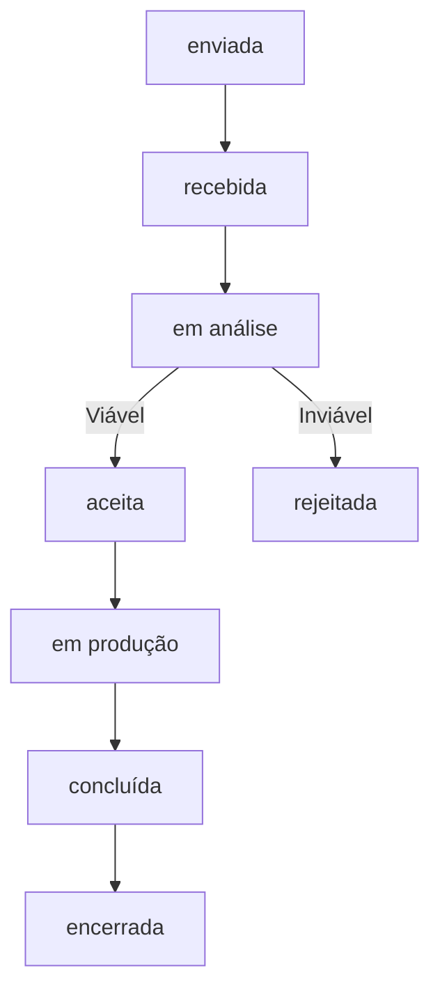

# Sistema Formal de Solicitações de Alteração (H12)

## 1. Visão Geral e Princípio de Diferenciação
O módulo **H12 — Sistema Formal de Solicitações de Alteração (Change Request)** estabelece uma separação técnica e contratual rigorosa entre:

1. **Comentário Simples (H11)**: Dúvida, observação pontual ou elogio sobre um item, sem impacto direto na geometria, prazo ou custos do projeto.
2. **Solicitação Formal de Alteração (H12)**: Demanda expressa de modificação física, espacial ou material do projeto, sujeita à análise de viabilidade técnica pelo arquiteto.

> [!CAUTION]
> **O cliente NÃO altera diretamente o projeto.** Ele apenas registra uma solicitação formal. O arquiteto responsável decide se aceita, rejeita ou ajusta a demanda.

---

## 2. Modelo de Dados (`ChangeRequest`)

```typescript
interface ChangeRequest {
  id: string; // Ex: 'crq-praia-01'
  projectId: string; // Projeto associado
  clientId: string; // Cliente solicitante
  portalId: string; // Portal de origem
  targetType: string; // 'Projeto' | 'Ambiente' | 'Imagem' | 'Prancha' | 'Material' | 'Mobiliário' | 'Documento'
  targetId: string; // ID do elemento afetado
  description: string; // Descrição minuciosa da mudança desejada
  priority: 'baixa' | 'normal' | 'alta';
  status: 'enviada' | 'recebida' | 'em análise' | 'aceita' | 'rejeitada' | 'em produção' | 'concluída' | 'encerrada';
  createdAt: string; // Timestamp ISO
  updatedAt: string; // Timestamp ISO
  resolvedAt: string | null; // Timestamp ISO
  linkedRevisionId: string | null; // Vínculo com a nova revisão gerada
  architectNotes: string | null; // Parecer técnico do arquiteto
  submitterName: string; // Nome do solicitante
}
```

---

## 3. Workflow de Estados (`status`)



- **`enviada`**: Submetida pelo cliente pelo portal.
- **`recebida`**: Protocolada pelo estúdio.
- **`em análise`**: Equipe de arquitetura e engenharia avaliando impactos.
- **`aceita`**: Aprovada pelo arquiteto (pode originar nova revisão).
- **`rejeitada`**: Incompatível com o programa, orçamento ou regras condominiais (com justificativa técnica obrigatória).
- **`em produção`**: Modificações sendo desenhadas/modeladas.
- **`concluída`**: Entregue e incorporada aos novos desenhos.
- **`encerrada`**: Registrada no histórico contratual.

---

## 4. Salvaguardas Contratuais e Comunicação ao Cliente

### Mensagem Padrão de Confirmação:
No momento em que o cliente clica para submeter o pedido, a interface exibe:
> *"Solicitação recebida. A alteração será analisada pela equipe."*

### Não Promessa Automática de Custo ou Prazo:
O sistema proíbe promessas automatizadas de prazos de entrega ou custos adicionais na interface. Qualquer impacto financeiro ou cronológico deve ser orçado e acordado formalmente pelo arquiteto.

---

## 5. Vínculo com o Motor de Revisões
Quando uma solicitação é **aceita**:
- O arquiteto pode associá-la formalmente à criação de uma nova revisão de projeto (`linkedRevisionId`, ex.: `REV02`, `R02`).
- Isso garante rastreabilidade total: é possível identificar exatamente qual solicitação do cliente motivou a emissão de um novo caderno de pranchas.
