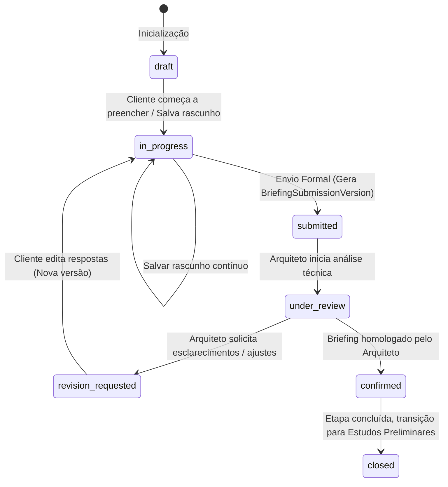

# ArqVértice Studio — Briefing Externo Integrado ao Portal do Cliente

**Data de Emissão:** 22/09/2026  
**Status:** Vigente e Homologado  
**Subsistema:** Portal do Cliente / Briefing Externo e Versionamento Imutável (Bloco H05)

---

## 1. Visão Geral e Experiência do Cliente

O **Briefing Externo do ArqVértice Studio** é a interface primária através da qual o cliente compartilha sua rotina, preferências estéticas, prioridades programáticas e restrições com a equipe de arquitetura.

Para maximizar a clareza e a taxa de conclusão, a experiência foi projetada sobre os seguintes pilares:
- **Visual e Intuitivo:** Design minimalista, elegante, com cartões temáticos e tipografia legível;
- **Responsivo e Simples:** Compatibilidade total com dispositivos móveis (smartphones e tablets) e desktops;
- **Progressivo:** Organizado em etapas lógicas (Moradores & Rotina, Integração Espacial & Ambientes, Estética & Investimento);
- **Perguntas Condicionais:** Perguntas específicas só são exibidas caso as escolhas preliminares exijam detalhamento (evitando sobrecarregar o cliente com perguntas irrelevantes).

### Fluxo de Trabalho do Cliente:
1. **Iniciar:** Acesso autenticado seguro via Portal do Cliente;
2. **Salvar Parcialmente:** Capacidade de preencher campos e acionar "Salvar Rascunho";
3. **Continuar Depois:** Retomar o preenchimento de qualquer dispositivo a qualquer momento;
4. **Revisar:** Visualização consolidada dos dados antes do envio;
5. **Enviar:** Submissão formal com confirmação, número de protocolo e emissão de snapshot imutável.

---

## 2. Máquina de Estados do Briefing (`BRIEFING_STATUSES`)

O ciclo de vida do briefing externo opera através de 7 estados canônicos:



- `draft`: Criado no sistema, pronto para ser iniciado;
- `in_progress`: Cliente já preencheu campos parciais e salvou rascunho;
- `submitted`: Submetido oficialmente pelo cliente, aguardando análise;
- `under_review`: Em análise pelos arquitetos e coordenadores de projeto;
- `confirmed`: Respostas validadas e formalmente aceitas como premissas de projeto;
- `revision_requested`: Necessidade de complemento ou detalhamento adicional;
- `closed`: Ciclo de briefing finalizado com entrega do programa de necessidades.

---

## 3. Tipos de Resposta Suportados

O módulo suporta variados mecanismos de entrada de dados:
- **Texto e Área de Texto:** Para descrições detalhadas da rotina e desejos específicos;
- **Múltipla Escolha e Seleção Exclusiva:** Para graus de integração espacial e estilos construtivos;
- **Seleção de Imagens:** Painéis comparativos para escolha de atmosfera visual;
- **Escala de Preferência:** Avaliação de níveis de prioridade ou conforto térmico/acústico;
- **Seleção de Ambientes:** Definição dos cômodos da residência (suítes, home office, adega, etc.);
- **Upload Quando Autorizado:** Envio de fotos do terreno, escrituras ou referências do cliente;
- **Expectativa de Orçamento:** Faixas de investimento global configuradas.

---

## 4. Motor de Perguntas Condicionais

Para manter a interface limpa e focada, perguntas complexas utilizam o avaliador condicional (`evaluateBriefingCondition(question, answers)`):

```javascript
// Exemplo canônico de condição implementado:
// Se o cliente escolhe cozinha integrada, surge a pergunta específica de ilha/bancada gourmet:
const question = {
  id: 'cond_ilha',
  label: 'Configuração desejada para a Ilha e Bancada Gourmet:',
  condition: {
    dependsOn: 'p8_integracao',
    expected: 'Integrado' // Dispara se contiver 'Integrado'
  }
};

const isVisible = StudioState.evaluateBriefingCondition(question, answers);
```

- **Comportamento Dinâmico:** No frontend (`js/client-portal-module.js`), a alteração do seletor social dispara `toggleKitchenConditional()`, revelando ou ocultando instantaneamente o cartão destacado de especificações da ilha sem recarregar a tela.

---

## 5. Salvaguarda Inegociável: Versionamento Imutável (`BriefingSubmissionVersion`)

> [!CAUTION]
> **Proibição de Alteração Silenciosa:**  
> Após a submissão formal de um briefing, o cliente **NÃO pode alterar silenciosamente** respostas já enviadas. Todas as decisões e parâmetros acordados devem ser rastreáveis e verificáveis.

Quando o cliente submete ou edita um briefing já enviado:
1. Uma nova instância imutável de `BriefingSubmissionVersion` é criada;
2. O número da versão (`versionNumber`) é incrementado progressivamente (`v1`, `v2`, etc.);
3. O payload completo de respostas e anexos é copiado em um snapshot imutável em profundidade (`deep clone`);
4. A versão anterior permanece **completamente intacta** no banco de dados para comparação e auditoria;
5. Um protocolo formal de recebimento é gerado e exibido ao cliente (ex: `ARQ-BRF-1-K9X2A`).

### Estrutura da Entidade `BriefingSubmissionVersion`:
```javascript
{
  id: "bsv-prj-praia-01-v1-k9x2a",
  briefingId: "brf-prj-praia-01",
  projectId: "prj-praia-01",
  portalId: "cport-praia-01",
  clientId: "cli-pedro-01",
  versionNumber: 1,
  status: "submitted",
  answers: {
    p1_quem: "Casal e 2 filhos adolescentes...",
    p8_integracao: "100% Integrado (Cozinha gourmet, sala e varanda em espaço contínuo)",
    cond_ilha: "Ilha central em granito com cooktop de indução.",
    p7_paleta: "Madeira natural, mármore travertino e linho.",
    p7_detesta: "Porcelanatos polidos espelhados e tons amarelos.",
    p10_orcamento: "R$ 200.000 a R$ 350.000"
  },
  attachments: [],
  submittedAt: "2026-09-22T17:00:00.000Z",
  submittedByName: "Pedro Albuquerque",
  submittedByEmail: "pedro.albuquerque@email.com",
  reviewNotes: null
}
```

---

## 6. Integração com o Briefing Interno do Estúdio

O Briefing Externo não cria tabelas duplicadas ou desconexas. Ele atualiza diretamente o registro central de briefing do projeto (`StudioState.data.briefings`), sincronizando:
- As respostas homologadas no objeto `briefing.answers`;
- O snapshot da submissão em `briefing.submissionSnapshot`;
- O histórico de versões correlacionado em `StudioState.data.briefingSubmissionVersions`.

Desta forma, os arquitetos trabalhando no workspace interno têm acesso imediato e transparente às respostas fornecidas pelo cliente para alimentar os modelos conceituais, 3D e pranchas executivas.
