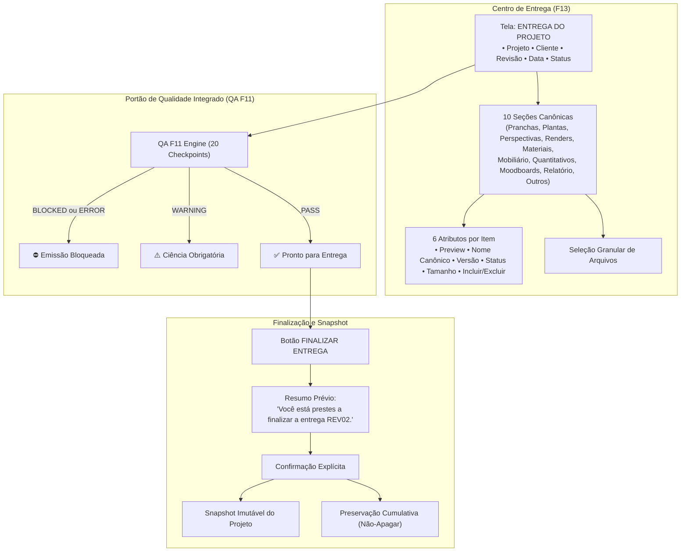

# ArqVértice Studio — Bloco F13: Centro de Entrega do Studio (Delivery Center)

## 1. Visão Geral e Objetivo

O **Centro de Entrega do ArqVértice Studio (Bloco F13)** é o painel unificado de consolidação, conferência visual e emissão formal do pacote final de projeto.

Antes de qualquer pacote de entrega ser gerado e transmitido ao cliente ou canteiro de obras, o arquiteto precisa inspecionar e validar exatamente o que compõe o dossiê. O Centro de Entrega assegura que nada seja esquecido, nada saia despadronizado e que nenhuma versão desatualizada ou com pendências técnicas de qualidade chegue ao destinatário.



---

## 2. A Tela "ENTREGA DO PROJETO" e o Cabeçalho Canônico

A tela de entrega apresenta no topo o cabeçalho canônico com os 5 metadados fundamentais:

| Metadado | Descrição e Comportamento |
| :--- | :--- |
| **Projeto** | Nome oficial e código identificador do projeto (ex.: *Residência de Praia - PRJ-PRAIA-01*). |
| **Cliente** | Nome do cliente contratante e dados de contato associados. |
| **Revisão** | Código de revisão canônico normalizado (ex.: `REV00`, `REV01`, `REV02`). |
| **Data** | Data de emissão formal no padrão pt-BR (`DD/MM/AAAA`). |
| **Status** | Status do portão de validação (`PRONTO PARA ENTREGA`, `AVISOS PENDENTES`, `ERROS PENDENTES` ou `BLOQUEADO`). |

---

## 3. As 10 Seções Canônicas de Entrega

O pacote de entrega agrupa os arquivos rigorosamente nas **10 seções canônicas**:

```text
┌────┬──────────────────┬────────────────────────────────────────────────────────┐
│ #  │ SEÇÃO            │ CONTEÚDO TÉCNICO ENTREGÁVEL                            │
├────┼──────────────────┼────────────────────────────────────────────────────────┤
│ 01 │ PRANCHAS         │ Pranchas executivas e arquitetônicas diagramadas (PDF) │
│ 02 │ PLANTAS          │ Plantas baixas técnicas, layouts e levantamentos       │
│ 03 │ PERSPECTIVAS     │ Estudos volumétricos e perspectivas axonométricas/3D   │
│ 04 │ RENDERS          │ Imagens foto-realistas homologadas dos ambientes       │
│ 05 │ MATERIAIS        │ Pranchas e especificações técnicas de materiais (F08)  │
│ 06 │ MOBILIÁRIO       │ Pranchas e relação de mobiliário solto e marcenaria    │
│ 07 │ QUANTITATIVOS    │ Quadros de quantitativos, insumos e custos             │
│ 08 │ MOODBOARDS       │ Painéis conceituais de estilo, paletas e sensações     │
│ 09 │ RELATÓRIO        │ Dossiê técnico encadernado da apresentação (PDF) (F09) │
│ 10 │ OUTROS ARQUIVOS  │ Memoriais descritivos, licenças e arquivos extras      │
└────┴──────────────────┴────────────────────────────────────────────────────────┘
```

---

## 4. Os 6 Atributos Obrigatórios por Item

Cada arquivo ou elemento listado nas 10 seções do Centro de Entrega expõe obrigatoriamente:

1. **`preview`**: Miniatura visual do arquivo (render, thumbnail de prancha ou ícone técnico representativo).
2. **`nome`**: Nome canônico padronizado seguindo o padrão institucional (`ARQV_{PROJETO}_{TIPO}_{REVISAO}.ext`).
3. **`versão`**: Código de versão ou revisão associada ao documento (ex.: `REV02`, `V01`).
4. **`status`**: Situação do item (`PRONTO`, `HOMOLOGADO`, `EM REVISÃO`, `APROVADO`).
5. **`tamanho`**: Peso do arquivo formatado em bytes legíveis (`KB`, `MB`, `GB`).
6. **`incluir/excluir`**: Controle booleano (`true`/`false`) que permite ao usuário compor o pacote final marcando ou desmarcando itens específicos.

---

## 5. Seleção de Arquivos (Composição Flexível)

O Centro de Entrega oferece controles granulares de seleção:
- **Checkbox individual** por card de arquivo para inclusão ou exclusão pontual.
- **Botões de lote** por seção ("Marcar Todos" / "Desmarcar Todos").
- **Contador dinâmico** no sumário e cabeçalho indicando a quantidade de arquivos selecionados e o tamanho total do pacote em tempo real (ex.: `12 de 12 arquivos selecionados (18.4 MB)`).

---

## 6. Integração Estrita com o Checklist QA F11

A entrega final está protegida pelo motor de controle de qualidade do Bloco F11:
- O Centro de Entrega executa os **20 checkpoints de qualidade** do projeto.
- **`BLOCKED` ou `ERROR`**: Se houver qualquer falha impeditiva (ex.: prancha sem escala, imagem ausente, responsável técnico não cadastrado, mistura de revisões `REV01 + REV03`), o botão "FINALIZAR ENTREGA" exibe o alerta e o backend rejeita categoricamente a emissão via exceção descritiva.
- **`WARNING`**: Se houver avisos não impeditivos (ex.: material sem fornecedor), o sistema exibe badge amarelo e exige confirmação explícita de ciência antes de autorizar a finalização.

---

## 7. Padrão de Nomenclatura e Pacote Organizado

Todo pacote de entrega final é batizado automaticamente seguindo a sintaxe canônica:
```text
PACOTE_ARQV_{PROJETO}_{AMBIENTE}_ENTREGA_{REVISAO}.zip
```
Exemplo: `PACOTE_ARQV_RESIDENCIA_DE_PRAIA_GERAL_ENTREGA_REV02.zip`.

Dentro do manifesto do pacote, os arquivos são distribuídos nas pastas de suas respectivas seções:
- `01_PRANCHAS/`
- `02_PLANTAS/`
- `03_PERSPECTIVAS/`
- `04_RENDERS/`
- `05_MATERIAIS/`
- `06_MOBILIARIO/`
- `07_QUANTITATIVOS/`
- `08_MOODBOARDS/`
- `09_RELATORIO/`
- `10_OUTROS_ARQUIVOS/`

---

## 8. Finalização da Entrega com Resumo Prévio e Confirmação

Ao clicar no botão **"FINALIZAR ENTREGA"**:

1. **Resumo Prévio**: O sistema abre um modal de confirmação institucional destacando:
   > *"Você está prestes a finalizar a entrega REV02."*
   Apresenta os totais de pranchas, renders, especificações, tamanho consolidado e parecer do QA.
2. **Confirmação Explícita**: O botão "Confirmar e Emitir Pacote" exige que o arquiteto confirme expressamente a operação (impedindo emissões acidentais com um único clique).
3. **Revisão Obrigatória**: A finalização rejeita requisições sem indicação explícita do código de revisão.

---

## 9. Snapshot Imutável da Entrega

No instante exato da finalização, o método `StudioState.finalizeProjectDeliveryPackage()` gera um **snapshot congelado e imutável** do estado do projeto contendo:
- Metadados do projeto e cliente.
- Cópia profunda das pranchas físicas, elementos e pranchas diagramadas.
- Base canônica de materiais, mobiliário e quantitativos.
- Renders e estudos espaciais vinculados.
- Relatório de QA no instante da emissão.
- Manifesto detalhado com hashes, nomes e tamanhos de todos os arquivos incluídos.

---

## 10. Política Rigorosa de Não-Apagar (Preservação Histórica)

> [!IMPORTANT]
> **PRESERVAÇÃO HISTÓRICA CUMULATIVA:**
> A finalização de uma entrega **NUNCA apaga entregas ou arquivos anteriores**.
> O histórico de entregas (`project.deliveries`) opera em regime estritamente **append-only**. Ao emitir `REV02`, o registro de `REV01` permanece integralmente preservado com seu próprio snapshot, permitindo auditorias contratuais e comparações retroativas a qualquer momento.

---

## 11. Arquitetura de Módulos e Cobertura de Testes

### Módulos Implementados
- `js/state.js`:
  - Constante `DELIVERY_SECTIONS` (10 seções canônicas).
  - Método `getDeliveryCenterData(projectId, options)`.
  - Método `finalizeProjectDeliveryPackage(projectId, options)`.
- `js/delivery-center-module.js`:
  - Componente UI completo (`DeliveryCenterModule.open(projectId, options)`).
  - Navegação entre abas das 10 seções, badges de status, contadores de seleção e modal de confirmação prévia.
- `styles.css`:
  - Estilização premium com design tokens do ArqVértice Studio (`.del-badge`, `.del-item-card`, `.del-tab-btn`, `.studio-btn-tiny`).

### Suíte de Testes Automatizados (`tests/delivery-center.test.js`)
Todos os 8 cenários obrigatórios testados e aprovados com 100% de sucesso:
1. `1.1`: Estrutura do cabeçalho com Projeto, Cliente, Revisão, Data e Status.
2. `2.1`: As 10 seções canônicas de entrega definidas e com conteúdo.
3. `3.1`: Os 6 atributos obrigatórios por item (preview, nome canônico, versão, status, tamanho, incluir/excluir).
4. `4.1`: Seleção granular de arquivos e exclusão pontual no manifesto final.
5. `5.1`: Integração com o Checklist QA F11 e bloqueio formal diante de erros/bloqueios.
6. `6.1`: Exigência de confirmação explícita e código de revisão.
7. `7.1`: Geração do snapshot imutável com estado completo do projeto.
8. `8.1`: Política de Não-Apagar com coexistência cumulativa de entregas (`REV02` e `REV03`).
