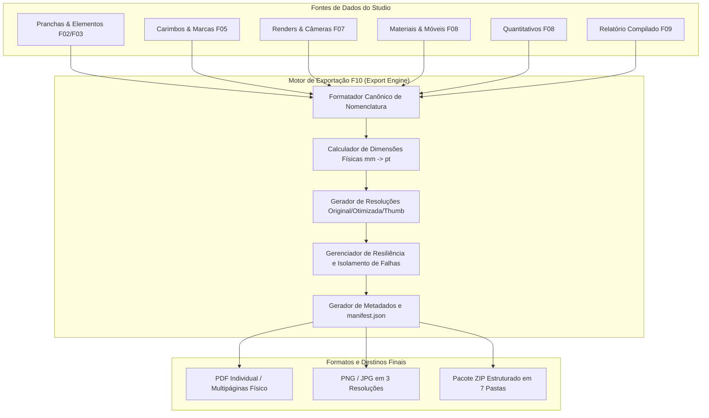

# ArqVértice Studio — Bloco F10: Motor de Geração de Arquivos Finais (Export Engine)

## 1. Visão Geral e Propósito Arquitetônico

O **Motor de Geração de Arquivos Finais (Bloco F10)** é o subsistema responsável por materializar todo o trabalho conceitual, técnico e visual do ArqVértice Studio em arquivos finais de alta fidelidade e em pacotes estruturados de entrega profissional.

Diferente de sistemas convencionais que apenas realizam capturas de tela (screenshots) da visualização do navegador, o F10 adota um pipeline vetorial e tipográfico baseado em **dimensões físicas nominais (NBR)**, garantindo que folhas A4, A3, A2 e A1 possuam milimetragem e escala exatas para impressão e arquivamento perene.



---

## 2. Formatos Suportados e Arquitetura Expansível

O F10 opera com um catálogo unificado de formatos (`EXPORT_SUPPORTED_FORMATS`), desacoplado da lógica de renderização para permitir fácil acoplamento de novos encoders no futuro:

| Formato | Extensão | MIME Type | Resolução / Densidade | Aplicação | Expansão Futura |
| :---: | :---: | :---: | :---: | :--- | :---: |
| **PDF** | `.pdf` | `application/pdf` | Vetorial Nativo (72 pt/in) | Pranchas técnicas, memoriais e dossiês multipáginas | Sim (PDF/A, PDF/X) |
| **PNG** | `.png` | `image/png` | Lossless (Original / 300 DPI) | Plantas humanizadas, esquemas técnicos e pranchas transparentes | Sim |
| **JPG / JPEG** | `.jpg`, `.jpeg` | `image/jpeg` | Fotográfico (Original / Otimizado) | Perspectivas 3D fotorrealistas e catálogos de materiais | Sim (WebP, AVIF) |
| **ZIP** | `.zip` | `application/zip` | Pacote Consolidado | Pacote de entrega técnica e executiva em 7 diretórios canônicos | Sim |

> [!TIP]
> **Preparação para Expansão Futura**:
> O pipeline suporta a inclusão de drivers para exportação vetorial CAD/BIM (`SVG`, `DWG`, `DXF`) e modelos de dados abertos (`IFC 4.3`), bastando registrar o MIME type no catálogo `EXPORT_SUPPORTED_FORMATS` e plugar o serializer correspondente no método `exportIndividual`.

---

## 3. Exportação de Prancha com Fidelidade Geométrica

Ao exportar qualquer prancha (`StudioState.exportSheetToFile`), o motor preserva estritamente:
1. **Formato Físico**: A4, A3, A2 ou A1 rigorosamente em conformidade com as dimensões NBR 10068.
2. **Orientação**: Paisagem (*landscape*) ou Retrato (*portrait*).
3. **Escala Técnica**: Preserva as anotações e proporções métricas (ex.: `1:50`, `1:25`, `1:100`).
4. **Posicionamento Relativo e Absoluto**: Coordenadas e dimensões relativas à área útil (*printable area*).
5. **Hierarquia de Elementos**: Textos, legendas, títulos, cotas, plantas e imagens.
6. **Carimbo F05 Integrado**: Aplicação automática dos 12 campos obrigatórios, ancorado no canto inferior direito da prancha.
7. **Logo Institucional**: Exibição vetorial com cálculo estrito de proporção de aspecto (`preserveAspectRatio`).

---

## 4. PDF com Dimensões Físicas Nominais

> [!IMPORTANT]
> **NÃO É SCREENSHOT**:
> O gerador de PDF não captura pixels da tela. Ele calcula a malha física real da prancha convertendo milímetros diretamente para pontos tipográficos PostScript:
> $$\text{Dimensão em Pontos (pt)} = \text{Dimensão em mm} \times \left(\frac{72}{25.4}\right)$$

### 4.1. Tabela de Dimensões Físicas Nominais (NBR 10068 / ISO 216)

| Formato | Orientação | Largura (mm) | Altura (mm) | Largura (pt) | Altura (pt) |
| :---: | :---: | :---: | :---: | :---: | :---: |
| **A4** | Retrato (*Portrait*) | 210 | 297 | 595.28 | 841.89 |
| **A4** | Paisagem (*Landscape*) | 297 | 210 | 841.89 | 595.28 |
| **A3** | Retrato (*Portrait*) | 297 | 420 | 841.89 | 1190.55 |
| **A3** | Paisagem (*Landscape*) | 420 | 297 | 1190.55 | 841.89 |
| **A2** | Retrato (*Portrait*) | 420 | 594 | 1190.55 | 1683.78 |
| **A2** | Paisagem (*Landscape*) | 594 | 420 | 1683.78 | 1190.55 |
| **A1** | Retrato (*Portrait*) | 594 | 841 | 1683.78 | 2383.94 |
| **A1** | Paisagem (*Landscape*) | 841 | 594 | 2383.94 | 1683.78 |

### 4.2. Suporte a Múltiplas Páginas com Formatos Mistos
O método `StudioState.exportMultiPagePdf([sheetId1, sheetId2, ...])` permite compilar documentos multipáginas onde cada página carrega suas próprias dimensões físicas nominais (por exemplo, Capa em A4 Retrato, Plantas em A1 Paisagem e Pranchas de Renders em A3 Paisagem).

---

## 5. Variantes de Resolução para Imagens

Para Perspectives, Renders e Plantas Humanizadas, o motor gera três níveis de resolução (`EXPORT_IMAGE_RESOLUTIONS`):

| Resolução | Código | Fator de Escala | Resolução Típica (Ultra HD 4K) | Qualidade / Compressão | Finalidade |
| :--- | :---: | :---: | :---: | :---: | :--- |
| **Original** | `ORIGINAL` | 1.0 (100%) | $3840 \times 2160$ px | Sem compressão adicional | Impressão gráfica e arquivo mestre |
| **Otimizada** | `OTIMIZADA` | 0.75 (75%) | $2880 \times 1620$ px | 85% JPEG / PNG balanceado | Visualização em tela, web e envio por e-mail |
| **Thumbnail** | `THUMBNAIL` | 0.25 (25%) | $960 \times 540$ px | 70% JPEG | Pré-visualizações rápidas e índices do relatório |

---

## 6. Padronização Canônica de Nomenclatura

Todos os arquivos gerados seguem o padrão canônico estrito:
$$\mathbf{ARQV\_[PROJETO]\_[AMBIENTE]\_[TIPO]\_[REV].[EXT]}$$

### 6.1. Regras de Sanitização e Formatação
1. **Prefixo**: Sempre `ARQV_`.
2. **Caixa**: Todas as letras são convertidas para **MAIÚSCULAS**.
3. **Caracteres Especiais**: Remoção sistemática de acentos gráficos (`Á` $\to$ `A`, `Ç` $\to$ `C`).
4. **Espaços e Hífens**: Substituídos por sublinhado (`_`).
5. **Revisão**: Normalizada com prefixo `REV` seguido do número com 2 dígitos (ex.: `REV 01` $\to$ `REV01`, `R2` $\to$ `REV02`).
6. **Extensão**: Sempre em letras minúsculas sem ponto duplicado (ex.: `.pdf`, `.png`, `.jpg`).

### 6.2. Exemplos Canônicos
- `ARQV_CASA_PRAIA_SALA_PLANTA_REV01.pdf`
- `ARQV_EDIFICIO_HORIZONTE_SUITE_RENDER_REV00.jpg`
- `ARQV_LOFT_JARDINS_GERAL_RELATORIO_REV02.pdf`

---

## 7. Escopos de Exportação

O sistema provê métodos especializados tanto na API JavaScript quanto no módulo de interface (`ExportEngineModule`):

1. **Exportação de Prancha Individual**: Exporta uma única prancha técnica em PDF, PNG ou JPG.
2. **Exportação de Página Específica**: Extrai uma folha avulsa de um caderno multipáginas.
3. **Exportação de Pacote de Ambiente**: Compila todas as pranchas, renders e plantas vinculadas a um ambiente específico.
4. **Exportação de Conjunto Temático**: Exporta coleções agrupadas (ex.: conjunto de todos os Renders, conjunto de todas as Plantas).
5. **Exportação Completa da Apresentação**: Gera um caderno PDF contínuo com todas as pranchas do projeto.
6. **Exportação Completa do Projeto (ZIP)**: Gera o pacote master estruturado para entrega de encerramento.

---

## 8. Estrutura Canônica do Pacote ZIP (7 Pastas + Manifesto)

Ao disparar a exportação completa via `StudioState.exportProjectZipPackage(projectId, options)`, o motor organiza a entrega em uma árvore de 7 pastas canônicas:

```text
PACOTE_ARQV_[PROJETO]_GERAL_ENTREGA_[REV].zip
├── 01_PRANCHAS/
│   ├── ARQV_[PROJETO]_GERAL_PRANCHA_01_[REV].pdf
│   └── ARQV_[PROJETO]_GERAL_PRANCHA_02_[REV].pdf
├── 02_PLANTAS/
│   ├── ARQV_[PROJETO]_SALA_PLANTA_1_[REV].png
│   └── ARQV_[PROJETO]_COZINHA_PLANTA_2_[REV].png
├── 03_PERSPECTIVAS/
│   ├── ARQV_[PROJETO]_SALA_RENDER_CAM01_[REV].jpg
│   └── ARQV_[PROJETO]_VARANDA_RENDER_CAM02_[REV].jpg
├── 04_MATERIAIS/
│   └── ARQV_[PROJETO]_GERAL_ESPECIFICACAO_MATERIAIS_[REV].json
├── 05_MOBILIARIO/
│   └── ARQV_[PROJETO]_GERAL_RELACAO_MOBILIARIO_[REV].json
├── 06_QUANTITATIVOS/
│   └── ARQV_[PROJETO]_GERAL_QUADRO_QUANTITATIVOS_[REV].json
├── 07_RELATORIO/
│   └── ARQV_[PROJETO]_GERAL_RELATORIO_TECNICO_[REV].pdf
└── manifest.json
```

### 8.1. Estrutura do `manifest.json`
O arquivo `manifest.json` na raiz do pacote garante a integridade e rastreabilidade forense da entrega:
```json
{
  "packageName": "PACOTE_ARQV_CASA_PRAIA_GERAL_ENTREGA_REV01.zip",
  "projectId": "prj-praia-01",
  "projectName": "Residência de Praia",
  "data": "2026-09-22T06:20:00.000Z",
  "formattedDate": "22/09/2026",
  "revisao": "REV01",
  "usuario": "Eduardo Marques",
  "directories": [
    "01_PRANCHAS",
    "02_PLANTAS",
    "03_PERSPECTIVAS",
    "04_MATERIAIS",
    "05_MOBILIARIO",
    "06_QUANTITATIVOS",
    "07_RELATORIO"
  ],
  "filesCount": 12,
  "structureSummary": {
    "01_PRANCHAS": 2,
    "02_PLANTAS": 1,
    "03_PERSPECTIVAS": 1,
    "04_MATERIAIS": 1,
    "05_MOBILIARIO": 1,
    "06_QUANTITATIVOS": 1,
    "07_RELATORIO": 1
  },
  "errorsCount": 0,
  "errors": [],
  "isFullyValid": true
}
```

---

## 9. Metadados e Rastreabilidade Obrigatória

Todo arquivo gerado embute um bloco de metadados em conformidade com as diretrizes do Studio:
- **Data e Hora de Geração**: Registro temporal com timezone ISO e formatação local (`pt-BR`).
- **Revisão Formal**: Código normalizado de revisão do projeto ou prancha.
- **Usuário Responsável**: Nome ou e-mail do operador que solicitou a exportação.
- **Projeto de Origem**: ID, nome, código e cliente associados.

---

## 10. Resiliência a Falhas Parciais

> [!CAUTION]
> **DIRETRIZ DE RESILIÊNCIA:**
> Se um arquivo individual falhar durante a geração de um caderno multipáginas ou do pacote ZIP (ex.: URL de imagem corrompida ou dados ausentes), **o lote não é abortado e os demais arquivos são preservados**.

- O erro específico é registrado com o nome da pasta, nome do arquivo e motivo da falha (`FILE_GENERATION_FAILED`).
- O pacote ZIP é marcado com o status `'PARTIAL_SUCCESS'` em vez de falhar completamente.
- O modal na interface exibe uma lista de advertências e erros detalhados para o usuário, permitindo o download imediato dos arquivos que foram gerados com sucesso.

---

## 11. Cobertura de Testes Automatizados

A suíte de testes `tests/export-engine.test.js` cobre integralmente os 10 requisitos da especificação F10:

1. **Constantes e Formatos**: Validação de `EXPORT_SUPPORTED_FORMATS`, `EXPORT_IMAGE_RESOLUTIONS` e `EXPORT_CANONICAL_DIRECTORIES`.
2. **Nomenclatura Canônica**: Sanitização de acentos, caracteres especiais, maiúsculas e revisão.
3. **Dimensões Físicas NBR**: Testes de A4, A3, A2 e A1 em Paisagem e Retrato com conversão para pontos tipográficos (`pt`).
4. **Fidelidade da Prancha**: Teste de preservação de elementos, escala, textos, carimbo e logo.
5. **PDF Multipáginas**: Teste de encadernação de múltiplas folhas com formatos mistos (A4 + A3).
6. **Variantes de Imagem**: Teste das resoluções Original (100%), Otimizada (75%) e Thumbnail (25%).
7. **Escopos Individuais**: Teste de prancha, ambiente e conjunto.
8. **Pacote ZIP em 7 Pastas**: Validação da árvore de diretórios e presença de `manifest.json`.
9. **Resiliência a Falhas**: Teste com prancha inexistente verificando continuidade do lote e geração do erro específico.

Comando para execução dos testes:
```bash
node tests/export-engine.test.js
```
