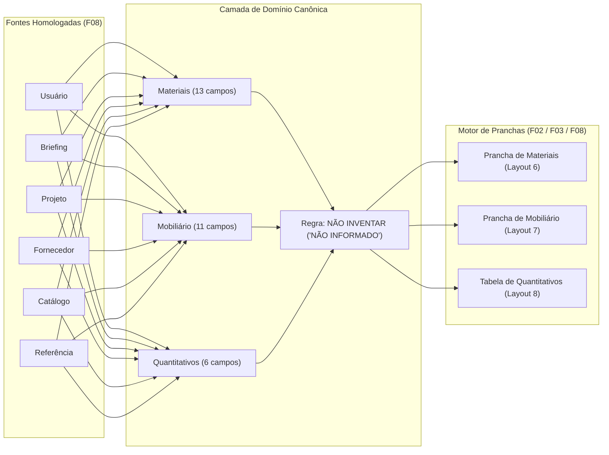

# ArqVértice Studio — Bloco F08: Pranchas Específicas de Materiais, Mobiliário e Quantitativos

## 1. Visão Geral e Propósito Arquitetônico

O Bloco **F08** estabelece o padrão canônico para a criação e diagramação de pranchas técnicas e visuais voltadas para a especificação de **Materiais**, **Mobiliário** e **Quantitativos**.

O objetivo fundamental deste subsistema é **permitir que o projeto de apresentação possua documentação visual altamente organizada e elegante, sem transformar o ArqVértice Studio em um ERP de obras**.



---

## 2. Estrutura Canônica de Dados

### 2.1. Materiais (13 Campos Canônicos + Origem)
Cada material especificado possui estritamente os seguintes atributos:
1. `nome`: Denominação comercial ou técnica do material.
2. `categoria`: Classificação arquitetônica (ex: REVESTIMENTO, PEDRA, MADEIRA, PINTURA).
3. `fabricante`: Empresa fabricante responsável pela produção.
4. `fornecedor`: Representante comercial ou revenda local/nacional.
5. `código`: SKU, código de catálogo ou referência técnica única.
6. `referência`: Coleção, linha comercial ou padrão referenciado.
7. `acabamento`: Tratamento de superfície (ex: Levigado, Polido, Acetinado, Escovado).
8. `cor`: Tonalidade, código RAL, Pantone ou descrição cromática.
9. `imagem`: URL da imagem em alta resolução da amostra/textura.
10. `ambiente`: Ambiente onde o material foi aplicado ou especificado.
11. `observação`: Instruções de assentamento, junta ou particularidades.
12. `link`: Link direto para o produto ou ficha técnica no fabricante.
13. `status`: Estado de homologação (`ESPECIFICADO`, `APPROVED`, `IN_REVIEW`).
- `origem`: Uma das 6 origens canônicas homologadas.

### 2.2. Mobiliário (11 Campos Canônicos + Origem)
Cada item de mobiliário ou peça assinada possui:
1. `nome` (ou `item`): Denominação da peça de design ou marcenaria.
2. `categoria`: Classificação (ex: MOVEL_SOLTO, MARCENARIA, ILUMINACAO, DECORACAO).
3. `fabricante`: Fabricante, marcenaria ou estúdio de produção.
4. `fornecedor`: Loja revendedora ou galpão de design.
5. `referência`: Modelo, assinatura de designer ou linha de produto.
6. `dimensões`: Dimensões nominais (L x P x A) em centímetros ou milímetros.
7. `quantidade`: Quantidade formatada ou `"NÃO INFORMADO"`.
8. `ambiente`: Local de instalação no projeto.
9. `imagem`: Foto da peça ou perspectiva com o móvel em destaque.
10. `link`: Link do catálogo ou produto online.
11. `observação`: Instruções de montagem, tecido ou detalhe de acabamento.
- `origem`: Uma das 6 origens canônicas homologadas.

### 2.3. Quantitativos (6 Campos Canônicos)
Permite a visualização técnica dos insumos:
1. `item`: Nome do item quantificado.
2. `unidade`: Unidade técnica de medida (`m²`, `m`, `UN`, `pçs`, `kg`).
3. `quantidade`: Quantidade calculada ou `"NÃO INFORMADO"`.
4. `ambiente`: Ambiente correspondente ou Geral.
5. `observação`: Observações sobre perda técnica ou condições de cálculo.
6. `fonte`: Origem canônica que embasou o levantamento quantitativo.

---

## 3. Origens Canônicas da Informação

Toda informação exibida nas pranchas deve identificar sua origem inequívoca:
- `usuario`: Informado diretamente pelo cliente ou arquiteto usuário.
- `briefing`: Extraído das respostas homologadas no Briefing Técnico.
- `projeto`: Calculado ou extraído do modelo BIM/Revit/CAD executivo.
- `fornecedor`: Cotado ou informado diretamente pela revenda/fornecedor.
- `catalogo`: Extraído da ficha técnica oficial do catálogo de produtos.
- `referencia`: Baseado em imagens de referência, moodboard ou conceito estético.

---

## 4. A Regra Mandatória: "NÃO INVENTAR"

> [!IMPORTANT]
> **DIRETRIZ DE INTEGRIDADE (REGRA 5):**
> Se a quantidade de qualquer material, mobiliário ou item não tiver sido informada explicitamente pelo usuário, projeto ou fornecedor, o sistema exibirá obrigatoriamente:
>
> **`"NÃO INFORMADO"`**
>
> É expressamente vedado estimar silenciosamente quantidades, gerar números fictícios por IA ou criar suposições de obras.

Implementação no núcleo do Studio (`StudioState.formatQuantityDisplay`):
```javascript
formatQuantityDisplay(value, unit = '') {
  if (value === null || value === undefined || value === '' || Number.isNaN(Number(value))) {
    return 'NÃO INFORMADO';
  }
  // Formatação segura sem estimativas silenciosas
  ...
}
```

---

## 5. Layouts de Prancha Homologados

### 5.1. Prancha de Material (Layout 6)
Apresentação em cards distribuídos proporcionalmente na área útil (`printableArea`), contendo a seguinte hierarquia visual:
```
┌──────────────────────────────────────┐
│ [ IMAGEM ]                           │
│ (Amostra em alta resolução)          │
├──────────────────────────────────────┤
│ Nome do Material                     │
│ Código: [Código]                     │
│ Fabricante: [Fabricante]             │
│ Acabamento: [Acabamento]             │
│ Ambiente: [Ambiente]                 │
│ Obs: [Observação]                    │
└──────────────────────────────────────┘
```

### 5.2. Prancha de Mobiliário (Layout 7)
Apresentação visual com destaque para a peça, autor e dimensões:
```
┌──────────────────────────────────────┐
│ [ IMAGEM ]                           │
│ (Foto da peça / Render com o móvel)  │
├──────────────────────────────────────┤
│ Item: [Nome da Peça]                 │
│ Referência: [Designer / Modelo]      │
│ Dimensão: [L x P x A]                │
│ Quantidade: [Qtd / NÃO INFORMADO]    │
│ Ambiente: [Ambiente]                 │
└──────────────────────────────────────┘
```

### 5.3. Prancha de Quantitativos (Layout 8 — Tabela)
Tabela técnica diagramada ocupando a área útil da prancha, com colunas formatadas:
| Item | Unidade | Quantidade | Ambiente | Observação | Fonte |
| :--- | :---: | :---: | :--- | :--- | :---: |
| Mármore Travertino Navona | m² | 121,00 m² | Sala de Estar | Perda de 10% inclusa | projeto |
| Sofá Living 3 Lugares | UN | 1 UN | Sala de Estar | Acervo existente | usuario |
| Revestimento Decorativo | m² | **NÃO INFORMADO** | Hall | A confirmar | referencia |

---

## 6. Sistema de Filtros

A interface do módulo (`MaterialFurnitureBoardsModule`) e as consultas no `StudioState` suportam filtragem multi-critério combinada por:
- **Ambiente** (`ambiente`): Exibir apenas itens vinculados a uma sala ou área social específica.
- **Categoria** (`categoria`): Filtrar por Revestimento, Marcenaria, Móvel Solto, Eletro, etc.
- **Fabricante** (`fabricante`): Filtrar por marcas específicas (ex: Portobello, Dpot).
- **Fornecedor** (`fornecedor`): Filtrar por revendedor ou parceiro de especificação.
- **Status** (`status`): Filtrar por itens Aprovados, Especificados ou Em Revisão.

---

## 7. Conformidade e Limites com ERP de Obras

O ArqVértice Studio mantém a fronteira clara entre **Apresentação Arquitetônica de Alto Padrão** e **Software de Gestão/ERP de Canteiro**:
1. **Não gerencia cronograma de compras** de insumos nem fluxo de caixa de compras.
2. **Não emite ordens de compra (PO)** ou pedidos de cotação com múltiplos concorrentes.
3. **Não calcula mão de obra**, BDI ou encargos de construção civil.
4. **Foco 100% centrado** em fichas claras, elegantes e diagramadas para aprovação do cliente e orientação da equipe executiva.
