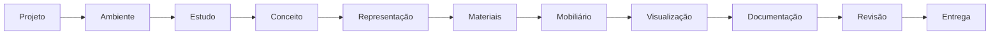

# Motor Central de Apresentação — ArqVértice Studio
**Documento de Arquitetura, Modelagem, Fluxo e Especificações Técnicas (Bloco F01)**

---

## 1. Visão Geral e Princípio Fundamental

O **Motor Central de Apresentação** do ArqVértice Studio é o componente arquitetônico responsável por compilar, estruturar e diagramar todos os resultados parciais e definitivos desenvolvidos ao longo do ciclo de projeto em um documento visual de padrão executivo de alta fidelidade, pronto para revisão de cliente e entrega formal.

A apresentação não atua como uma mera colagem de imagens; ela organiza as informações pelo **Princípio Fundamental de Coerência Projetual**:



---

## 2. Arquitetura do Sistema

A arquitetura do motor é distribuída em três camadas desacopladas com governança centralizada no `StudioState`:

```
+-------------------------------------------------------------------------------+
|                           ARQVERTICE STUDIO UI                               |
|                                                                               |
|   +-------------------+   +-----------------------+   +-------------------+   |
|   |   PAINEL ESQUERDO |   |     ÁREA CENTRAL      |   |   PAINEL DIREITO  |   |
|   |    (Estrutura &   |   |   (Canvas de Prancha  |   |   (Inspetor de    |   |
|   |    Miniaturas)    |   |    A3 com Carimbo)    |   |   Propriedades)   |   |
|   +-------------------+   +-----------------------+   +-------------------+   |
|                                                                               |
|   +-----------------------------------------------------------------------+   |
|   |         TOPO: Seletor / Revisão / Status / Modos de Preview / Autosave|   |
|   +-----------------------------------------------------------------------+   |
+-------------------------------------------------------------------------------+
                                      │
                                      ▼
+-------------------------------------------------------------------------------+
|                      PresentationEngineModule (js/...)                        |
|   - Gestão de visualização e Modos: Edição / Apresentação / Impressão / Expor |
|   - Autosave debounce (600ms) com estados: Salvando... / Salvo / Erro         |
|   - Renderizadores dedicados para as 14 seções lógicas da apresentação       |
+-------------------------------------------------------------------------------+
                                      │
                                      ▼
+-------------------------------------------------------------------------------+
|                      StudioState (Singleton & Persistência)                  |
|   - Entidades: presentations, presentationPages, history, backups            |
|   - Regra de Integridade: Bloqueio de edição em apresentações aprovadas       |
|   - Regra de Entrega: Exclusão de pranchas em rascunho do pacote final       |
|   - Versionamento: R00 -> R01 (revisão) & V01 -> V02 (versão)                 |
|   - Integração com projectMemories                                            |
+-------------------------------------------------------------------------------+
```

---

## 3. Entidades e Modelos de Dados

### 3.1 Entidade `Presentation`
Representa o dossiê mestre de pranchas arquitetônicas de um projeto:

| Campo | Tipo | Descrição |
|---|---|---|
| `id` | `String` | Identificador único (`pres-...`) |
| `projectId` | `String` | ID do projeto vinculado |
| `clientId` | `String` | ID do cliente titular |
| `title` | `String` | Título da apresentação |
| `subtitle` | `String` | Subtítulo / escopo |
| `presentationType` | `Enum` | Um dos 8 tipos canônicos |
| `status` | `Enum` | `rascunho`, `em_revisao`, `aprovado`, `substituido`, `arquivado` |
| `revision` | `String` | Código de revisão (`R00`, `R01`, `R02`...) |
| `version` | `String` | Versão de ciclo (`V01`, `V02`...) |
| `date` | `String` | Data de emissão (ISO / formatada) |
| `author` | `String` | Responsável técnico emissor |
| `sheetFormat` | `Enum` | `A3` (padrão), `A4`, `A2`, `A1` |
| `orientation` | `Enum` | `landscape` (padrão), `portrait` |
| `scale` | `String` | Escala do carimbo (`1:50`, `1:25`, `1:100`, `Indicada`) |
| `stamp` | `Object` | Dados do carimbo institucional ArqVértice |
| `visualIdentity` | `Object` | Cores da marca, fontes Outfit/Inter e logotipo |
| `createdAt` / `updatedAt` | `String` | Timestamps ISO |
| `approvedAt` / `approvedBy`| `String` | Auditoria de homologação formal |

#### Tipos Canônicos de Apresentação (`presentationType`):
1. `estudo_preliminar`: Estudo Preliminar
2. `estudo_interiores`: Estudo de Interiores
3. `apresentacao_ambiente`: Apresentação de Ambiente
4. `apresentacao_geral`: Apresentação Geral
5. `apresentacao_cliente`: Apresentação para Cliente
6. `documentacao_complementar`: Documentação Complementar
7. `apresentacao_final`: Apresentação Final
8. `entrega_final`: Entrega Final

---

### 3.2 Entidade `PresentationPage` (Prancha Arquitetônica)
Representa cada lâmina/prancha integrante do dossiê:

| Campo | Tipo | Descrição |
|---|---|---|
| `id` | `String` | Identificador único (`page-...`) |
| `presentationId` | `String` | ID da apresentação pai |
| `sectionType` | `Enum` | Uma das 14 seções canônicas |
| `title` | `String` | Título da prancha |
| `subtitle` | `String` | Subtítulo descritivo |
| `environmentId` | `String?`| ID do ambiente (quando aplicável) |
| `order` | `Number` | Índice ordinal para ordenação da prancha |
| `isHidden` | `Boolean` | Flag para ocultar da exibição |
| `isDeleted` | `Boolean` | Soft delete para lixeira e restauração |
| `status` | `Enum` | `rascunho`, `em_revisao`, `aprovado`, `substituido`, `arquivado` |
| `notes` | `String` | Observações técnicas do arquiteto |
| `layoutTemplate` | `String` | Template de diagramação da prancha |
| `content` | `Object` | Dados compilados do projeto para esta prancha |

---

## 4. Estrutura Hierárquica em 14 Seções Canônicas

O gerador automático e o compilador do motor estruturam o projeto nas 14 seções lógicas:

```
Projeto
  ├── 01. Capa (Hero Image, Título, Contratante, Logotipo ArqVértice)
  ├── 02. Informações (Quadro de Áreas, Zoneamento, Ficha Cadastral, Prazos)
  ├── 03. Briefing (Diretrizes, Prioridades, Desejos Homologados)
  ├── 04. Conceito (Partido Arquitetônico, Palavras-chave, Paleta Cromática)
  ├── 05. Estudos (Croquis Iniciais, Volumetria, Opção Aprovada)
  ├── 06. Ambientes (Setorização, Áreas, Living e Compartimentos)
  ├── 07. Materiais (Pisos, Revestimentos, Marcenaria e Fornecedores)
  ├── 08. Mobiliário (Design Assinado, Móveis Soltos e Acabamentos)
  ├── 09. Quantitativos (Resumo de Quantidades com Rastreabilidade de Perda)
  ├── 10. Moodboards (Painel Sensorial, Texturas Minerais e Tecidos)
  ├── 11. Plantas (Plantas Humanizadas em Escala com Layout)
  ├── 12. Perspectivas (Renders Fotorrealistas 3D e Câmeras Homologadas)
  ├── 13. Revisões (Histórico Formal de Emissões R00, R01 e Autoria)
  └── 14. Entrega (Dossiê de Homologação, Checklist e Termo Final)
```

---

## 5. Regras de Negócio e Integridade

### 5.1 Bloqueio de Alterações Silenciosas (Integridade Rigorosa)
- Quando uma apresentação atinge o status `aprovado`, o sistema **bloqueia edições diretas** em suas propriedades e em suas pranchas associadas.
- Qualquer alteração exige o acionamento de `StudioState.createPresentationRevision(presentationId, user, changeSummary)`.
- Isso incrementa o índice de revisão (`R00` → `R01`), ajusta o status da apresentação para `em_revisao` e grava uma entrada no histórico com a justificativa, preservando a rastreabilidade legal exigida em projetos de arquitetura.

### 5.2 Filtro de Entrega e Aprovação
- Somente pranchas com status `aprovado` e que não estejam ocultas (`!isHidden`) nem excluídas (`!isDeleted`) são computadas no manifesto de entrega final (`filterPresentationForDelivery`).
- Pranchas em status `rascunho` ou `em_revisao` são automaticamente excluídas do pacote de entrega ao cliente, e o inspetor exibe alertas de pranchas pendentes de homologação.

### 5.3 Persistência, Autosave e Recuperação de Desastres
- As alterações de propriedades no painel direito acionam um timer com debounce de 600ms, exibindo:
  - `Salvando...` (spinner e estado em trânsito)
  - `Salvo` (ícone de confirmação)
  - `Erro ao salvar` (alerta vermelho caso ocorra exceção)
- A cada modificação e antes de operações sensíveis, um snapshot completo da apresentação e de suas pranchas é armazenado em `presentationBackups`.
- Caso ocorra falha ou o usuário decida descartar alterações, a função `StudioState.recoverLastPresentationSaved(presentationId)` restaura imediatamente a apresentação para o snapshot estável mais recente.

---

## 6. Modos de Preview

O motor disponibiliza 5 modos de visualização acessíveis pela barra superior:

1. **Edição (`edicao`)**:
   - Layout completo em 3 painéis (Estrutura à esquerda, Canvas central com carimbo e Inspetor à direita).
2. **Apresentação (`apresentacao`)**:
   - Modo de projeção limpo, ideal para reuniões presenciais e apresentações para o cliente.
   - Oculta menus laterais e exibe barra flutuante de controle de slides (Anterior, Contador e Próximo).
3. **Tela Cheia (`tela_cheia`)**:
   - Dispara a Fullscreen API do navegador para imersão total do cliente.
4. **Impressão (`impressao`)**:
   - Diagramação pronta para plotagem com `@media print`, isolando a prancha arquitetônica no papel com o carimbo ArqVértice.
5. **Entrega (`exportacao`)**:
   - Painel de validação pré-entrega que exibe o checklist de conformidade e o manifesto de pranchas aprovadas vs rascunhos.

---

## 7. APIs Públicas e Contratos

### `StudioState`
- `getProjectPresentations(projectId)`: Retorna apresentações enriquecidas de um projeto.
- `getPresentation(presentationId)`: Retorna apresentação enriquecida com páginas, estatísticas, histórico e cliente.
- `createPresentation(data, user)`: Cria apresentação e registra histórico.
- `generateAutomaticPresentation(projectId, options, user)`: Compila automaticamente os 14 blocos de apresentação a partir dos dados existentes do projeto.
- `updatePresentation(presentationId, updates, user)`: Atualiza propriedades da apresentação (bloqueia se aprovada).
- `approvePresentation(presentationId, user, notes)`: Homologa a apresentação, atualiza pranchas e alimenta a memória do projeto.
- `createPresentationRevision(presentationId, user, changeSummary)`: Gera nova revisão (`R01`, `R02`...) desbloqueando a edição.
- `addPresentationPage(presentationId, pageData, user)`: Adiciona prancha na apresentação.
- `updatePresentationPage(pageId, updates, user)`: Atualiza prancha.
- `reorderPresentationPages(presentationId, orderedPageIds, user)`: Define nova ordem para a lista de pranchas.
- `movePresentationPage(pageId, direction, user)`: Move prancha para cima ou para baixo.
- `duplicatePresentationPage(pageId, user)`: Duplica prancha com status `rascunho`.
- `hidePresentationPage(pageId, isHidden, user)`: Alterna visibilidade da prancha.
- `deletePresentationPage(pageId, user)`: Soft delete (envia para lixeira).
- `restorePresentationPage(pageId, user)`: Restaura prancha da lixeira.
- `filterPresentationForDelivery(presentationId)`: Filtra pranchas aptas para entrega.
- `savePresentationBackup(presentationId)`: Grava snapshot de recuperação.
- `recoverLastPresentationSaved(presentationId)`: Restaura o último snapshot estável.

### `PresentationEngineModule`
- `renderProjectPresentation(project)`: Renderiza interface completa do motor.
- `setActivePresentation(id)`: Alterna apresentação em exibição.
- `setActivePage(id)`: Seleciona prancha para edição no canvas.
- `setPreviewMode(mode)`: Alterna entre Edição, Apresentação, Tela Cheia, Impressão e Entrega.
- `toggleTrashView(showTrash)`: Alterna entre lista de pranchas ativas e lixeira.
- `handlePropertyChange(pageId, field, value)`: Executa alteração de propriedade com autosave.
- `generateAutomatic(projectId)`: Dispara geração automática completa.

---

## 8. Homologação e Testes Automatizados

A suíte `tests/presentation-engine.test.js` cobre 100% dos requisitos de negócio com 27 testes unitários e de integração:
- Criação e validação de campos obrigatórios e tipos canônicos;
- Geração automática das 14 seções lógicas em sequência correta;
- Edição de atributos de apresentação e pranchas;
- Ordenação, movimentação (up/down) e duplicação;
- Ocultação e restauração;
- Exclusão suave e lixeira;
- Homologação e gravação na memória do projeto;
- Bloqueio de edições diretas em apresentações aprovadas (Integridade);
- Geração de novas revisões com histórico e desbloqueio controlado;
- Filtragem rigorosa de pranchas em rascunho na entrega;
- Mecanismo de backup e recuperação de versão salva;
- Renderização de todos os modos de preview e carimbo arquitetônico.
