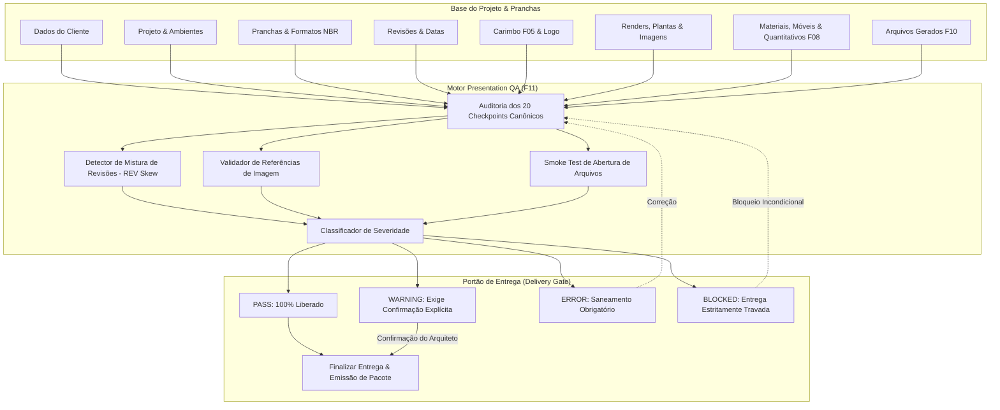

# ArqVértice Studio — Bloco F11: Sistema de Controle de Qualidade da Apresentação (Presentation QA Engine)

## 1. Visão Geral e Propósito Arquitetônico

O **Sistema de Controle de Qualidade da Apresentação (Bloco F11)** atua como a última linha de defesa e homologação técnica antes que qualquer prancha, caderno ou pacote de entrega final seja emitido pelo ArqVértice Studio.

O motor realiza uma auditoria sistemática em **20 dimensões críticas**, categorizando achados em 4 severidades canônicas (`PASS`, `WARNING`, `ERROR`, `BLOCKED`). Seu objetivo primordial é impedir que projetos com dados inconsistentes, versões misturadas, arquivos corrompidos ou carimbos sem responsável técnico sejam entregues ao cliente ou à obra.



---

## 2. Os 20 Checkpoints Canônicos de Validação

O motor inspeciona determinística e exaustivamente as seguintes 20 dimensões da apresentação:

| # | Checkpoint | Dimensão Inspecionada | Critérios de Validação | Severidade Padrão em Não-Conformidade |
| :---: | :--- | :--- | :--- | :---: |
| **1** | `DADOS_CLIENTE` | Dados do Cliente | Nome, documento (CPF/CNPJ), telefone ou e-mail de contato cadastrados no projeto. | `ERROR` se ausente; `WARNING` se parcial. |
| **2** | `NOME_PROJETO` | Nome do Projeto | Título do projeto preenchido, não vazio e código único válido. | `ERROR` se vazio; `WARNING` se muito curto. |
| **3** | `AMBIENTE` | Ambientes | Existência de pelo menos um ambiente cadastrado e vinculado. | `ERROR` se vazio; `WARNING` se identificação incompleta. |
| **4** | `REVISAO` | Revisão & REV Skew | Revisão de entrega definida e **ausência de mistura de revisões** (ex.: `REV01` misturado com `REV03`). | `BLOCKED` se houver mistura; `ERROR` se indefinida. |
| **5** | `DATA` | Data de Emissão | Data de revisão ou entrega informada e com formato ISO/pt-BR válido. | `WARNING` se ausente ou inválida. |
| **6** | `LOGO` | Logotipo da Marca | Logotipo institucional ativo no perfil de marca com proporção preservada. | `WARNING` se logo ausente. |
| **7** | `CARIMBO` | Carimbo Técnico F05 | 12 campos canônicos ABNT preenchidos; **presença obrigatória do Responsável Técnico / CAU**. | `BLOCKED` se sem Responsável Técnico; `ERROR` se sem carimbo. |
| **8** | `ESCALA` | Escala Técnica | Escala nominal configurada em todas as folhas (ex.: `1:50`, `1:25`, `1:100`). | `ERROR` se indefinida ou `1:0`. |
| **9** | `FORMATO` | Formato Físico | Dimensões nominais NBR 10068 (A4, A3, A2, A1) sem extrapolação de área útil. | `BLOCKED` se formato desconhecido; `ERROR` se extrapolação. |
| **10** | `ORIENTACAO` | Orientação Física | Consistência entre orientação declarada (paisagem/retrato) e dimensões físicas. | `WARNING` se divergente. |
| **11** | `IMAGENS` | Imagens da Prancha | Todas as tags de imagem com URLs válidas, íntegras e sem referências nulas. | `ERROR` se imagem ausente. |
| **12** | `PLANTAS` | Plantas Técnicas | Plantas baixas arquitetônicas vinculadas ao projeto com origem declarada. | `WARNING` se sem plantas. |
| **13** | `PERSPECTIVAS` | Perspectivas & Renders | **Verificação de referências**: render inserido na prancha deve ser a versão atualmente homologada. | `BLOCKED` se render desatualizado (`V01` vs `V03`); `WARNING` se sem aprovação. |
| **14** | `MATERIAIS` | Especificação de Materiais | Especificação técnica completa; **regra de fornecedor obrigatório**. | `WARNING` se material sem fornecedor; `ERROR` se sem nome. |
| **15** | `MOBILIARIO` | Relação de Mobiliário | Relação de mobiliário com identificação, dimensões e quantidades. | `WARNING` se sem dimensões ou quantidade. |
| **16** | `QUANTITATIVOS` | Quadro de Quantitativos | Respeito estrito à regra "NÃO INFORMADO" (não estimar silenciosamente nem inventar valores). | `ERROR` se quantitativo corrompido; `WARNING` se nulo não-declarado. |
| **17** | `LINKS` | Links Externos | URLs de fabricantes, referências e catálogos sintaticamente válidas (`http://` ou `https://`). | `WARNING` se protocolo ausente ou suspeito. |
| **18** | `ARQUIVOS` | Arquivos de Entrega | **Smoke Test de Abertura**: arquivos gerados válidos, legíveis e com tamanho superior a 0 bytes. | `BLOCKED` se arquivo corrompido ou 0 bytes. |
| **19** | `APROVACOES` | Registro de Aprovações | Validação formal de aprovação pelo cliente e equipe técnica registrada no histórico. | `WARNING` se projeto sem homologação formal. |
| **20** | `INTEGRIDADE` | Integridade Global | Integridade relacional de todas as folhas, pranchas e elementos sem ponteiros órfãos. | `BLOCKED` se integridade estrutural corrompida. |

---

## 3. Classificação Canônica de Severidade

O sistema adota 4 níveis de severidade padronizados:

```text
┌──────────────┬──────────────────────────────────────────────────────────────────────────┐
│ SEVERIDADE   │ SIGNIFICADO E COMPORTAMENTO NO PORTÃO DE ENTREGA                         │
├──────────────┼──────────────────────────────────────────────────────────────────────────┤
│ PASS         │ Total conformidade. O item foi auditado e cumpre todos os requisitos.    │
│ WARNING      │ Aviso não-crítico. Permite entrega, mas EXIGE confirmação explícita.    │
│ ERROR        │ Erro técnico sério. A entrega é bloqueada até saneamento da pendência.   │
│ BLOCKED      │ Falha crítica fatal. Impede categoricamente qualquer tentativa de envio. │
└──────────────┴──────────────────────────────────────────────────────────────────────────┘
```

### 3.1. Exemplos Práticos de Classificação
- **`WARNING`**: Material especificado sem fornecedor (`fornecedor: ''` ou `'NÃO INFORMADO'`).
- **`ERROR`**: Elemento de imagem ou render na prancha com URL ausente ou quebrada.
- **`BLOCKED`**: Prancha técnica aprovada com arquivo corrompido (0 bytes), prancha com carimbo sem responsável técnico, render desatualizado em relação à versão homologada ou mistura de revisões no mesmo pacote.

---

## 4. Regras Especiais de Validação

### 4.1. Verificação de Referências de Versão
O motor correlaciona os renders inseridos nas pranchas (`elements[].content.renderId`) com a coleção oficial de renders do projeto (`data.environmentRenders`). Se uma prancha estiver exibindo um render `V01` enquanto a versão atualmente homologada é `V03`, o sistema emite imediatamente um alerta `BLOCKED`:
> *"Prancha PR-01 possui render desatualizado (V01), mas a versão homologada atual é V03."*

### 4.2. Detecção de Mistura de Revisões (REV Skew)
O método `StudioState.checkVersionSkew(projectId, targetRevision)` normaliza todos os códigos de revisão do projeto (`R00` $\to$ `REV00`, `REV 01` $\to$ `REV01`) e verifica se há inconsistência:
- É proibido emitir um caderno de entrega onde a Folha 01 está em `REV01` e a Folha 02 está em `REV03`.
- Se detectado skew, o checkpoint `REVISAO` assume status `BLOCKED`.

### 4.3. Teste de Abertura e Integridade de Arquivos (Smoke Test)
O método `StudioState.testExportFileIntegrity(fileObj)` verifica:
1. Existência e integridade do nome e extensão do arquivo;
2. Tamanho em bytes estritamente maior que 0;
3. No caso de PDFs, validação de cabeçalho e estrutura de dados;
4. No caso de JSONs/manifestos, parseabilidade sintática sem erros.

---

## 5. Portão de Aprovação e Regras de Entrega Final

O método `StudioState.finalizeDelivery(projectId, options)` governa a emissão oficial:

```javascript
// Tentativa de finalização da entrega
try {
  const result = StudioState.finalizeDelivery('prj-praia-01', {
    deliveryRevision: 'REV01',
    confirmWarnings: true, // Obrigatório se houver warnings
    warningNotes: 'Ciente dos materiais sem fornecedor homologado.',
    user: 'Eduardo Marques (Arquiteto Líder)'
  });
  console.log('Entrega concluída:', result.deliveryRecord);
} catch (err) {
  console.error('Falha de QA:', err.message);
}
```

### Regras do Portão:
1. **Zero Bloqueios (`counts.BLOCKED === 0`)**: Se houver qualquer item `BLOCKED`, a entrega é categoricamente abortada.
2. **Zero Erros (`counts.ERROR === 0`)**: Erros exigem correção antes de nova tentativa.
3. **Confirmação Explícita de Avisos (`confirmWarnings === true`)**: Se existirem avisos (`counts.WARNING > 0`), a finalização exige consentimento formal e registra as notas de ciência na auditoria do projeto.

---

## 6. Interface do Usuário: Checklist Interativo

O módulo [`PresentationQAModule`](file:///c:/Users/erick/ARQVERTICE-STUDIO/js/presentation-qa-module.js) disponibiliza:
- **Painel de Indicadores**: Cartões numéricos com contagem em tempo real de `PASS`, `WARNING`, `ERROR` e `BLOCKED`.
- **Filtros Dinâmicos**: Botões para isolar rapidamente pendências por severidade.
- **Checklist dos 20 Itens**: Exibição detalhada de cada ponto, badge de severidade, mensagem descritiva e diagnóstico técnico.
- **Botão Inteligente "Finalizar Entrega"**:
  - Desabilitado dinamicamente com ícone de cadeado se houver itens `BLOCKED` ou `ERROR`.
  - Exibe caixa de marcação obrigatória quando houver `WARNING`s.
  - Habilitado com confirmação visual verde quando a apresentação estiver 100% aprovada.

---

## 7. Cobertura de Testes Automatizados

A suíte [`tests/presentation-qa.test.js`](file:///c:/Users/erick/ARQVERTICE-STUDIO/tests/presentation-qa.test.js) cobre integralmente todos os requisitos:

1. **Constantes e Catálogo**: Validação dos 20 checkpoints e 4 severidades canônicas.
2. **Auditoria Estruturada**: Teste do relatório compilado por `runPresentationQA`.
3. **Regra WARNING**: Teste de material sem fornecedor gerando aviso não-impeditivo.
4. **Regra ERROR**: Teste de elemento de imagem ausente gerando erro de prancha.
5. **Regra BLOCKED**: Teste de arquivo com 0 bytes ou corrompido travando a entrega.
6. **Verificação de Referências**: Detecção de render inserido desatualizado (`V01` vs `V03`).
7. **Detecção de Skew**: Identificação e bloqueio de mistura de revisões (`REV01` + `REV03`).
8. **Escala e Formato**: Rejeição de formatos físicos desconhecidos e escalas inválidas (`1:0`).
9. **Carimbo F05**: Bloqueio de prancha sem Responsável Técnico ou registro profissional.
10. **Portão de Entrega**: Bloqueio incondicional em caso de `BLOCKED` e exigência de consentimento para `WARNING`.

Comando para execução dos testes:
```bash
node tests/presentation-qa.test.js
```
