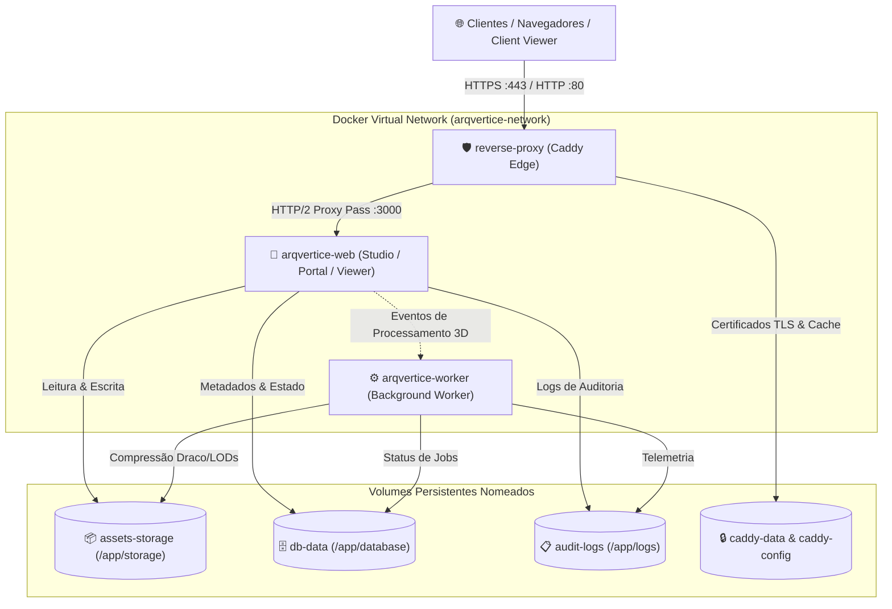

# K03 — ArqVértice Studio: Arquitetura de Containers & Isolamento de Workers

## 1. Visão Geral
Este documento especifica a infraestrutura de empacotamento, containerização e isolamento de serviços em ambiente de produção do **ArqVértice Studio**. A arquitetura é orientada a micro-serviços enxutos e seguros baseados em imagens Docker multi-stage e orquestração via Docker Compose / Kubernetes.

---

## 2. Diagrama de Arquitetura de Containers

---

## 3. Especificação do Dockerfile Multi-Stage

O [`Dockerfile`](file:///c:/Users/erick/ARQVERTICE-STUDIO/Dockerfile) foi estruturado em **4 estágios especializados** para garantir imagens mínimas, sem ferramentas de build desnecessárias e sem vulnerabilidades:

| Estágio | Imagem Base | Responsabilidade |
| :--- | :--- | :--- |
| **`Stage 1: Base`** | `node:22-alpine` | Instalação de utilitários mínimos do SO (`tini`, `curl`, certificados CA). |
| **`Stage 2: Dependencies`** | `base` | Instalação com cache de pacotes congelados (`npm install --omit=dev`). |
| **`Stage 3: Builder`** | `base` | Validação de sintaxe AST, verificação de rotas e build dry-run (`typecheck`, `audit`). |
| **`Stage 4: Runner`** | `base` (Enxuta) | Imagem final de produção executando com usuário não-root `node` e supervisor `tini`. |

---

## 4. Matriz de Alocação e Limites de Recursos

Para prevenir travamento por concorrência e exaustão de memória durante compressão pesada de modelos 3D e renderizações:

| Serviço | CPU Limit | CPU Reservation | Memory Limit | Memory Reservation | Restart Policy |
| :--- | :---: | :---: | :---: | :---: | :---: |
| **`arqvertice-web`** | `2.00 cores` | `0.50 cores` | `2048 MB` | `512 MB` | `unless-stopped` |
| **`arqvertice-worker`**| `2.00 cores` | `0.50 cores` | `3072 MB` | `512 MB` | `unless-stopped` |
| **`reverse-proxy`** | `1.00 core` | `0.25 cores` | `512 MB` | `128 MB` | `unless-stopped` |

---

## 5. Topologia de Volumes Persistentes

1. **`assets-storage` (`/app/storage`)**:
   - Armazena a estrutura do **5-Tier Storage** (`source`, `master`, `web`, `thumbnails`, `lods`).
2. **`db-data` (`/app/database`)**:
   - Persistência dos bancos de dados relacionais e arquivos SQLite com migrações.
3. **`audit-logs` (`/app/logs`)**:
   - Registros de auditoria de comandos de IA e transações do Reality Checker.
4. **`caddy-data` & `caddy-config`**:
   - Armazenamento automático de certificados SSL Let's Encrypt e estado de configuração do proxy.

---

## 6. Políticas de Segurança e Alta Disponibilidade

- **Usuário Não-Root (`USER node`)**: A aplicação e o worker executam sem privilégios de root, mitigando riscos de escape de container.
- **Process Supervisor (`tini`)**: Trata adequadamente sinais `SIGTERM` e `SIGINT`, permitindo encerramento gracioso (Graceful Shutdown) sem corromper transações 3D ou arquivos em processamento.
- **Healthchecks Automáticos**: Sondagem HTTP a cada 30 segundos no endpoint `/` para detecção de containers degradados e reinício automático.
- **Cache Imutável na Borda**: O proxy Caddy adiciona cabeçalhos `Cache-Control: public, max-age=31536000, immutable` para formatos 3D (`.glb`, `.sog`, `.ksplat`, `.webp`).
