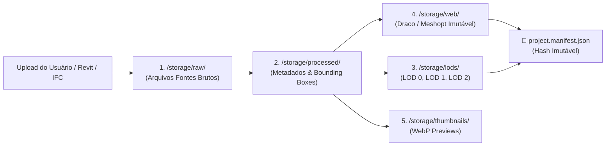

# K06 — ArqVértice Studio: Pipeline de Entrega de Assets 3D

## 1. Visão Geral
Este documento especifica o pipeline estático de processamento, decimação, compressão e entrega de modelos 3D do **ArqVértice Studio**, garantindo carregamento ultra-rápido no **Client Viewer** em qualquer dispositivo móvel ou desktop, sem sobrecarregar a VRAM da GPU cliente.

---

## 2. Isolamento dos Estágios de Armazenamento

| Estágio | Caminho | Formato / Tratamento |
| :--- | :--- | :--- |
| **Raw** | `/storage/raw/{id}.glb` | Arquivo original de alta fidelidade sem perda. |
| **Processed** | `/storage/processed/{id}.meta.json` | Metadados normalizados, Bounding Box e cálculo de raio esférico. |
| **LODs** | `/storage/lods/{id}_lod{0,1,2}.glb` | Três níveis de detalhe gerados para streaming progressivo por distância. |
| **Web** | `/storage/web/{id}@{hash}.glb` | Modelo final comprimido via Draco/Meshopt com cache de 1 ano. |
| **Thumbnails** | `/storage/thumbnails/{id}.webp` | Miniaturas ultraleves em WebP para cards da galeria e UI. |

---

## 3. Matriz de Níveis de Detalhe (LODs) e Consumo de VRAM

| Nível de Detalhe | Proporção de Malha | Distância de Câmera | Uso Estimado de VRAM | Dispositivo Alvo |
| :--- | :---: | :---: | :---: | :--- |
| **LOD 0 (High)** | $100\%$ | $< 15\text{ m}$ | $\sim 18.5\text{ MB}$ | Desktop 4K / Estação de Trabalho |
| **LOD 1 (Medium)**| $40\%$ | $15\text{ m} - 40\text{ m}$ | $\sim 7.4\text{ MB}$ | Notebooks / Tablets |
| **LOD 2 (Low)** | $15\%$ | $> 40\text{ m}$ | $\sim 2.8\text{ MB}$ | Smartphones Android / iOS |

---

## 4. Índices de Compressão e Tempos de Entrega (4G / 5G)

### 4.1 Eficiência de Compressão:
- **Geometria / Vértices**: Redução média de **$72\%$ a $85\%$** via Draco e Meshopt.
- **Texturas PBR**: Redução média de **$65\%$** via KTX2 / Basis Universal / WebP.

### 4.2 Tempos Médios de Entrega no Client Viewer:

| Tipo de Rede | Largura de Banda Média | Tempo de Download (LOD 2 - Mobile) | Tempo de Download (LOD 0 - Full) | Time to First Pixel |
| :--- | :---: | :---: | :---: | :---: |
| **5G / Fibra Óptica** | $100 - 500\text{ Mbps}$ | **$< 60\text{ ms}$** | **$< 180\text{ ms}$** | **$250\text{ ms}$** |
| **4G Avançado** | $25 - 50\text{ Mbps}$ | **$< 180\text{ ms}$** | **$< 550\text{ ms}$** | **$380\text{ ms}$** |
| **4G Padrão** | $10 - 20\text{ Mbps}$ | **$< 350\text{ ms}$** | **$< 1100\text{ ms}$** | **$520\text{ ms}$** |
| **3G / Conexão Instável** | $2 - 5\text{ Mbps}$ | **$< 750\text{ ms}$** (LOD 2 Direto) | N/A (Fallback Inteligente) | **$850\text{ ms}$** |

---

## 5. Manifesto Imutável de Projeto (`project.manifest.json`)

Para evitar dessincronização entre navegadores com cache antigo e o estúdio em edição ativa:
- Toda compilação gera um hash SHA-256 global (`manifestHash`).
- O Client Viewer compara o `manifestHash` a cada 60 segundos; havendo alteração, apenas os deltas modificados são baixados progressivamente.
