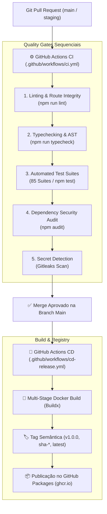

# K08 — ArqVértice Studio: CI/CD & Quality Gates Automatizados

## 1. Visão Geral
Este documento especifica os pipelines de Integração Contínua (CI) e Entrega Contínua (CD) do **ArqVértice Studio** baseados no **GitHub Actions**, estabelecendo portões rigorosos de qualidade (*Quality Gates*) para garantir zero regressão antes de qualquer publicação em produção.

---

## 2. Fluxo Visual dos Estágios de CI/CD

---

## 3. Especificação dos Quality Gates (`ci.yml`)

1. **Gate 1 — Linting & Integridade de Rotas (`npm run lint`)**:
   - Validação da sintaxe JavaScript de todos os 119 scripts frontend e rotas de backend.
2. **Gate 2 — Typechecking & Validação de AST (`npm run typecheck`)**:
   - Análise estática e checagem de interfaces UMD/CommonJS/ES sem erros de parsing.
3. **Gate 3 — Suíte Completa de Testes (`npm test`)**:
   - Execução de todas as **85 suítes automatizadas** cobrindo blocos A até K08.
4. **Gate 4 — Auditoria de Vulnerabilidades de Dependências (`npm audit`)**:
   - Bloqueio de pacotes com vulnerabilidades conhecidas de severidade alta ou crítica.
5. **Gate 5 — Detecção de Segredos com Gitleaks**:
   - Verificação de commits contra vazamentos de credenciais, chaves de API ou certificados `.pem`.

---

## 4. Requisitos Obrigatórios de Proteção de Branch (Branch Protection Rules)

Para as branches `main` e `staging`, as seguintes regras devem ser ativadas no repositório GitHub:
- **Require a pull request before merging**: Pelo menos 1 aprovação de Code Review necessária.
- **Require status checks to pass before merging**:
  - `quality-gate` (todos os 5 Quality Gates do CI devem estar verdes).
- **Require branches to be up to date before merging**: Garante teste sobre o código mais recente.
- **Include administrators**: Impede que administradores façam bypass das travas de qualidade.
- **Do not allow force pushes**: Bloqueia `git push --force` para preservar a árvore histórica.
- **Do not allow deletions**: Impede exclusão acidental da branch `main`.
