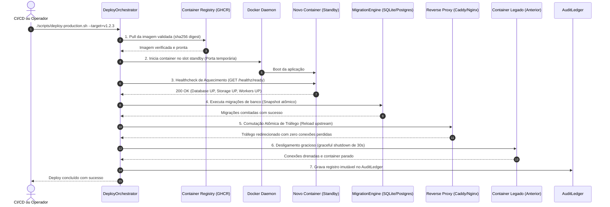

# ARQVERTICE STUDIO — PLAYBOOK DE DEPLOY ZERO-DOWNTIME & ROLLBACK DE EMERGÊNCIA (K09)

> **Documento Operacional de Engenharia de Confiabilidade (SRE) & Infraestrutura de Produção**  
> **Versão:** 1.0.0 | **Classificação:** Crítico (P0) | **Ambientes:** Staging / Produção

---

## 1. Visão Geral & Topologia Blue-Green

O ecossistema ArqVértice Studio adota o modelo de implantação **Blue-Green** com comutação atômica em nível de Reverse Proxy (Caddy / Nginx). Esse padrão garante que:
1. **Zero-Downtime:** Nenhum arquiteto ou cliente conectado ao Client Viewer perde conexões WebSockets ou sofre interrupção na visualização 3D.
2. **Isolamento de Falhas:** Novas versões são inicializadas e submetidas a testes de prontidão (`/healthz/ready`) antes de receber tráfego público.
3. **Rollback Sub-Segundo:** Caso ocorra qualquer anomalia após o deploy, a comutação reversa para o slot estável anterior é executada instantaneamente.

```
                  ┌─────────────────────────────────────────┐
                  │          INTERNET / CLIENT VIEWER       │
                  └────────────────────┬────────────────────┘
                                       │ HTTPS / WSS
                                       ▼
                  ┌─────────────────────────────────────────┐
                  │      REVERSE PROXY (Caddy / Nginx)      │
                  │   Upstream Atômico (Porta 3001 / 3002)  │
                  └────────────┬───────────────┬────────────┘
                               │               │
                 (Slot Blue)   │               │   (Slot Green)
                 Porta 3001    ▼               ▼   Porta 3002
                 ┌──────────────────┐     ┌──────────────────┐
                 │  Container Blue  │     │ Container Green  │
                 │   [ATIVO v1.2.2] │     │  [STANDBY/NOVO]  │
                 └──────────────────┘     └──────────────────┘
                               │                   │
                               └─────────┬─────────┘
                                         ▼
                 ┌──────────────────────────────────────────┐
                 │       BANCO DE DADOS & STORAGE PERSIST.  │
                 │  (/database/arqvertice.db & /storage)    │
                 └──────────────────────────────────────────┘
```

---

## 2. Fluxo Sequencial de Deploy (6 Etapas Obrigatórias)



---

## 3. Checklist de Pré-Deploy (Quality Gate Pré-Voo)

Antes de disparar qualquer deploy para produção, verifique os seguintes itens:

- [ ] **PR Aprovado:** A Pull Request passou por revisão de código obrigatória.
- [ ] **Quality Gates CI/CD Verificados:** `.github/workflows/ci.yml` 100% verde (Lint, Typecheck, Testes, Audit, Gitleaks).
- [ ] **Imagem Docker Imutável:** Imagem publicada no GHCR com tag semântica (`vX.Y.Z`) e SHA do commit.
- [ ] **Snapshot de Banco de Dados:** Executado backup preventivo via `./scripts/backup-database.sh`.
- [ ] **Compatibilidade com Versões Anteriores:** Novas colunas ou esquemas são retrocompatíveis com a versão em execução.

---

## 4. Procedimento Operacional Padrão (SOP) de Deploy

### 4.1 Simulação de Deploy (Dry-Run / Pré-Voo)
Sempre execute o modo de simulação antes de aplicar alterações críticas em ambiente produtivo:
```bash
./scripts/deploy-production.sh --target=v1.2.3 --dry-run
```

### 4.2 Execução de Deploy em Produção
```bash
./scripts/deploy-production.sh --target=v1.2.3 --author="Engenheiro Responsavel"
```

### 4.3 Deploy com Pulo de Migrações (Somente Frontend/Assets 3D)
```bash
./scripts/deploy-production.sh --target=v1.2.3 --skip-migrations
```

---

## 5. Protocolo de Rollback de Emergência

### 5.1 Rollback Automático (Watchdog de 120s)
O `DeployOrchestrator` monitora a saúde da aplicação nos primeiros 120 segundos pós-comutação. Se o endpoint `/healthz/ready` registrar falha ou degradação crítica, o rollback automático é engatilhado:
1. Re-aponta o Reverse Proxy imediatamente para o slot anterior.
2. Isola o novo container com falha para extração de logs e dumps.
3. Registra incidente com severidade P0 no `AuditLedger`.

### 5.2 Rollback Manual Instantâneo via CLI
Para reverter imediatamente uma versão defeituosa para a última versão estável conhecida:
```bash
# Rollback automático para a versão estável anterior
./scripts/rollback-production.sh --reason="Aumento anomalo de WebGPU context loss no Client Viewer"

# Rollback explícito para uma tag ou commit específico
./scripts/rollback-production.sh --target=v1.2.2 --reason="Bug critico na exportacao IFC"
```

### 5.3 Simulação de Rollback (Dry-Run)
```bash
./scripts/rollback-production.sh --target=v1.2.2 --dry-run
```

---

## 6. Procedimento de Restauração de Banco de Dados (Disaster Recovery)

Se a falha de release estiver associada a corrupção ou erro de migração de banco de dados:

1. **Interrompa novos writes:**
   ```bash
   ./scripts/rollback-production.sh --reason="Reversao de schema de banco"
   ```
2. **Restaure o snapshot pré-migração:**
   ```bash
   # Lista os backups e snapshots disponíveis
   ls -la storage/snapshots/
   ls -la storage/backups/

   # Restauração determinística
   ./scripts/restore-database.sh storage/snapshots/pre_migration_YYYY-MM-DD-THH-MM-SS.snapshot
   ```
3. **Valide a integridade do banco:**
   ```bash
   node -e "const DB = require('./scripts/db/migrate'); const e = new DB(); console.log('Pending:', e.getPendingMigrations());"
   ```

---

## 7. Estrutura do AuditLedger de Deploys

Todos os deploys e rollbacks são gravados imutavelmente em `storage/audit/deployments.audit.json`.

```json
{
  "id": "dep_1742841298412_a9f1b2",
  "timestamp": "2026-09-23T19:00:00.000Z",
  "action": "DEPLOY_ZERO_DOWNTIME",
  "author": "erick",
  "version": "v1.2.3",
  "previousVersion": "v1.2.2",
  "targetSlot": "green",
  "previousSlot": "blue",
  "migrationStatus": "APPLIED_2",
  "switchDurationMs": 14,
  "totalDurationMs": 248,
  "status": "SUCCESS",
  "healthcheckVerified": true,
  "dryRun": false
}
```

---

## 8. Matriz de Contatos de Emergência & Escalação

| Papel | Responsável | Canal de Escalação | SLA de Resposta |
| :--- | :--- | :--- | :--- |
| **Engenheiro de Plantão (On-Call)** | Tech Lead / SRE | PagerDuty / Slack #incident-room | 5 minutos |
| **Arquiteto de Software** | Eduardo Marques | Telefone Direto / Discord | 15 minutos |
| **Engenheiro de Infraestrutura** | Erick Santiago | PagerDuty / Celular | 10 minutos |
| **Líder de Dados & BIM** | Luan Almeida | Slack #bim-infrastructure | 15 minutos |
