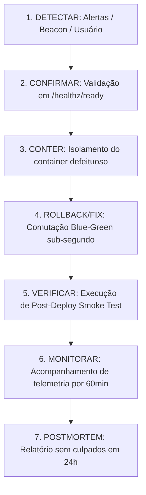

# ARQVERTICE STUDIO — GUIA DE RESPOSTA A INCIDENTES DE PRODUÇÃO (K21)

> **Runbook Operacional de Resposta a Incidentes, Gestão de Crise & SLA**  
> **Versão:** 1.0.0 | **Conformidade:** ITIL / SRE Framework

---

## 1. Níveis de Severidade de Incidentes

| Nível | Impacto no Negócio | Critérios | SLA de Resposta |
| :--- | :--- | :--- | :---: |
| **CRITICAL (P0)** | Indisponibilidade Total / Perda de Dados | Queda do servidor web, corrupção de banco, falha total do Client Viewer. | **5 minutos** |
| **HIGH (P1)** | Degradação Crítica de Funcionalidade | Falha no pipeline de importação IFC, crash repetido de WebGPU, indisponibilidade do motor de IA. | **15 minutos** |
| **MEDIUM (P2)** | Falha Parcial com Workaround | Lentidão transitória de renderização, erro na exportação de prancha específica. | **1 hora** |
| **LOW (P3)** | Ajuste Menor / Bug Estético | Pequena divergência cosmética de tipografia ou log redundante. | **4 horas** |

---

## 2. Fluxo Sequencial de Resposta a Incidentes

