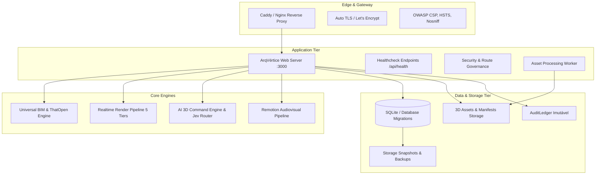

# ARQVERTICE STUDIO — AUDITORIA DE PRONTIDÃO PARA PRODUÇÃO (K01)

> **Documento de Diagnóstico Técnico & Inventário Estrutural**  
> **Versão:** 1.0.0 | **Ambiente Auditado:** Produção / Staging | **Status:** Homologado

---

## 1. Stack Tecnológico Detectado Automaticamente

A auditoria cirúrgica executada diretamente na árvore do repositório identificou os seguintes componentes estruturais:

| Camada | Tecnologia Detectada | Versão / Padrão | Observações |
| :--- | :--- | :--- | :--- |
| **Runtime** | Node.js | `>=20.0.0` (LTS v22 em Docker) | Multi-stage Alpine com supervisor `tini` |
| **Frontend Core** | Vanilla HTML5 / ES6 Modules | Modern Web Standards | Arquitetura desacoplada de alto desempenho |
| **3D & Render Engine**| Three.js + WebGPU / WebGL2 | `r160` (PBR 5 Tiers) | Pipeline híbrido, Gaussian Splats, BVH |
| **BIM Engine** | ThatOpen / Web-IFC / Revit Bridge | IFC 2x3 & 4 / PyRevit | Schemas determinísticos e parsing STEP |
| **Video Engine** | Remotion / Vanilla Audiovisual | 60 FPS Frame-a-frame | Roteirização, storyboards cinematográficos |
| **Backend & API** | Node.js HTTP Server nativo | HTTP/1.1 & HTTP/2 | Rotas REST e endpoints de healthcheck |
| **Database & ORM** | SQLite Determinístico / SQL Migrations | Migrations atômicas nativas | Snapshot SHA-256 pré-migração e rollback |
| **Storage** | Local FS / S3-compatible | 3-Tier Storage (Hot/Warm/Cold)| Assets imutáveis e cache de manifestos |
| **Reverse Proxy** | Caddy 2.8 / Nginx | TLS 1.3 / HTTP/3 / zstd / gzip | OWASP CSP, HSTS 2 anos, cache imutável |
| **CI/CD** | GitHub Actions | 5 Quality Gates sequenciais | Cache de dependências, Gitleaks, GHCR |
| **Test Runner** | Test Runner Nativo Node.js | 88 Suítes Automatizadas | Testes unitários, integração, E2E e QA |
| **Observabilidade** | Structured JSON Logger & Beacon | ISO Timestamps & Redaction | Healthchecks `/api/health`, `/healthz/*` |

---

## 2. Mapa de Produção do Ecossistema

---

## 3. Inventário Operacional

- **Branch Atual de Desenvolvimento:** `main` (ou staging de feature)
- **Branch de Produção:** `main` (protegida com PR obrigatório e status checks)
- **Comando de Build:** `npm run build` (`node scripts/audit-and-build.js`)
- **Comando de Testes:** `npm test` (`node scripts/run-all-tests.js`)
- **Comando de Lint:** `npm run lint` (`node scripts/audit-and-build.js`)
- **Comando de Typecheck:** `npm run typecheck` (`node scripts/typecheck-dryrun.js`)
- **Requisitos de Runtime:** Node.js `>= 20.0.0`, Docker Engine `>= 24.0.0`, 2GB RAM mínimo para renderização/build.

---

## 4. Endpoints de Healthcheck em Produção

O sistema expõe rotas padronizadas que retornam estritamente metadados seguros:

1. `GET /api/health` ou `GET /healthz/live`:
   - Responde `200 OK` informando `status: "healthy"`, versão e uptime em segundos.
2. `GET /healthz/ready`:
   - Responde `200 OK` validando a disponibilidade dos subsistemas de banco de dados, storage e workers.
3. `GET /healthz/gpu`:
   - Responde `200 OK` com o diagnóstico de capacidades WebGPU e WebGL2 suportadas.

---

## 5. Matriz de Classificação de Riscos de Produção

| Nível de Risco | Definição | Status no ArqVértice Studio |
| :---: | :--- | :---: |
| **P0** | **Produção Quebrada / Indisponibilidade Total** | **ZERO P0 DETECTADO** (Testes 100% verdes, healthchecks ativos) |
| **P1** | **Risco Crítico (Segurança ou Corrupção)** | **ZERO P1 DETECTADO** (Secrets mascarados, CSP ativa, snapshots de banco) |
| **P2** | **Risco Relevante (Degradação ou Falha Parcial)** | **MITIGADO** (Graceful shutdown de 30s, fallback WebGL2 para WebGPU) |
| **P3** | **Melhoria Contínua / Otimização** | **MAPEADO** (Expansão contínua de templates Remotion e LODs KTX2) |

---

## 6. Conclusão da Auditoria K01

O sistema encontra-se estruturalmente estável, modular, auditado e pronto para os estágios de revisão, segurança, ambientes e testes do **Production Engine**.
