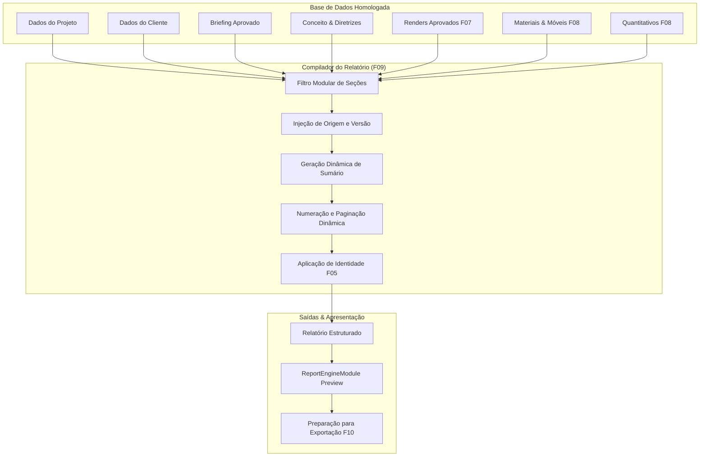

# ArqVértice Studio — Bloco F09: Gerador de Relatório do Studio

## 1. Visão Geral e Propósito Arquitetônico

O **Gerador de Relatório do ArqVértice Studio (Bloco F09)** consolida os dados reais e o acervo visual e técnico homologado do projeto em um dossiê executivo paginado e diagramado.

O motor atua como a espinha dorsal de documentação de apresentação, respeitando os seguintes princípios de projeto:
- **Consumo Direto de Dados Reais**: Elimina duplicação manual de dados, consultando diretamente o banco de dados de projetos, clientes, briefings, estudos preliminares, imagens aprovadas, câmeras, especificações e memórias.
- **Inclusão Modular e Condicional**: Estruturado em até 21 seções canônicas, incluindo estritamente aquelas que possuem conteúdo ou que o arquiteto selecionou deliberadamente.
- **Blindagem de Imagens Aprovadas**: Apenas imagens formalmente homologadas, selecionadas e autorizadas entram na composição do relatório.
- **Rastreabilidade**: Toda imagem ou documento indica sua origem e versão.
- **Automação Editorial**: Sumário gerado dinamicamente, paginação contínua ("Página X de Y"), cabeçalhos e rodapés institucionais e carimbo técnico F05 integrado.

---

## 2. As 21 Seções Canônicas

O relatório é composto por até 21 seções temáticas padronizadas:

| Ordem | Seção Canônica | ID no Sistema | Descrição e Conteúdo Relevante |
| :---: | :--- | :--- | :--- |
| **01** | Capa | `capa` | Título, tipologia, cliente, responsável técnico, data, revisão e render principal. |
| **02** | Dados do Cliente | `dados_cliente` | Nome, CPF/CNPJ, e-mail, telefone, endereço e notas cadastrais. |
| **03** | Dados do Projeto | `dados_projeto` | Código, nome, localização, tipologia, arquiteto líder e status global. |
| **04** | Briefing Aprovado | `briefing_aprovado` | Síntese de estilo de vida, necessidades e diretrizes do cliente. |
| **05** | Conceito | `conceito` | Narrativa conceitual, partido arquitetônico e memórias de estilo. |
| **06** | Diretrizes | `diretrizes` | Linguagem formal, proporções, iluminação e matriz desejado/evitar. |
| **07** | Estudos Preliminares | `estudos_preliminares` | Alternativas de layout e volumetria com justificativa da opção eleita. |
| **08** | Ambientes | `ambientes` | Catálogo de ambientes com metragem quadrada, pé-direito e descritivos. |
| **09** | Plantas | `plantas` | Plantas baixas técnicas e de levantamento do projeto. |
| **10** | Plantas Humanizadas | `plantas_humanizadas` | Plantas com ambientação, iluminação e texturas fotorrealistas. |
| **11** | Perspectivas | `perspectivas` | Renders 3D fotorrealistas aprovados do Bloco F07. |
| **12** | Câmeras | `cameras` | Parâmetros de enquadramento, altura, lente focal e ângulos registrados. |
| **13** | Materiais | `materiais` | Especificações com 13 campos canônicos e origens (Bloco F08). |
| **14** | Mobiliário | `mobiliario` | Relação de mobiliário solto e marcenaria com dimensões (Bloco F08). |
| **15** | Quantitativos | `quantitativos` | Quadro técnico de insumos com regra "NÃO INFORMADO" (Bloco F08). |
| **16** | Moodboards | `moodboards` | Pranchas de atmosfera, paleta de cores hexadecimais e materiais. |
| **17** | Revisões | `revisoes` | Histórico formal de revisões com código (REV 00, REV 01), data e escopo. |
| **18** | Observações | `observacoes` | Notas técnicas, condicionantes construtivas e memórias descritivas. |
| **19** | Aprovações | `aprovacoes` | Registro formal de validação pelo cliente e equipe técnica. |
| **20** | Histórico | `historico` | Linha do tempo de marcos alcançados e auditoria do projeto. |
| **21** | Entrega | `entrega` | Termo de encerramento, checklist executivo e entrega formal. |

---

## 3. Inclusão Condicional

> [!IMPORTANT]
> **REGRA DE CONDICIONALIDADE:**
> O sistema não obriga a presença de todas as 21 seções. Uma seção só é incorporada ao relatório final se atender a **pelo menos um** dos critérios:
> 1. Possuir dados reais e conteúdo registrado na base do projeto.
> 2. Estar expressamente selecionada pelo usuário na lista de seções ativas.

Seções sem dados ou deliberadamente desmarcadas são omitidas de forma limpa, sem páginas em branco nem buracos no sumário automático.

---

## 4. Rastreabilidade e Autorização de Imagens

### 4.1. Autorização Estrita
Somente imagens que possuam status homologado (`APPROVED`, `isCurrentApproved` ou prioritárias) são selecionadas para o relatório. Versões rejeitadas ou rascunhos em andamento são descartados automaticamente.

### 4.2. Rastreabilidade Obrigatória
Cada imagem ou prancha técnica apresentada no relatório exibe metadados de rastreabilidade:
- **Origem**: Identificação do software ou fonte geradora (ex.: `BIM Revit 2026`, `F07 Render Engine`, `Catálogo Portobello`).
- **Versão**: Identificador de versão da imagem (ex.: `V01`, `V02`).

---

## 5. Sumário Automático e Paginação Dinâmica

1. **Sumário Automático**:
   - Calculado dinamicamente após a compilação de todas as seções ativas.
   - Posicionado como a **Página 2** do dossiê (imediatamente após a capa).
   - Aponta com precisão o número da página inicial de cada seção.

2. **Paginação Contínua**:
   - Cada folha recebe um objeto de paginação `{ current, total, label }`.
   - Rótulo formatado no padrão: `Página X de Y`.

---

## 6. Identidade Visual e Carimbo F05

- **Cabeçalho**: Exibe o logotipo principal ou monocromático oficial da marca ArqVértice, código do projeto, revisão e etiqueta de status do relatório.
- **Rodapé**: Assinatura institucional com símbolo, razão social, data de emissão e numeração de página.
- **Carimbo Técnico (Bloco F05)**: Incorporado nas pranchas e páginas técnicas (plantas, quantitativos e entrega), garantindo conformidade com a ABNT NBR 6492.

---

## 7. Estados e Ciclo de Vida do Relatório

O relatório possui 4 estados canônicos de ciclo de vida (`REPORT_STATUSES`):
- `rascunho`: Relatório em elaboração preliminar;
- `revisao`: Relatório submetido à revisão interna da equipe de arquitetura;
- `aprovado`: Relatório validado e homologado pelo arquiteto responsável e cliente;
- `final`: Versão definitiva congelada contra modificações para arquivo e emissão.

---

## 8. Fronteira com o Bloco F10

O Bloco F09 é responsável por toda a estruturação de dados, seleção de seções, rastreabilidade, cálculo de páginas, diagramação e pré-visualização. A exportação definitiva em formatos binários/PDF nativo ou empacotamento externo será concluída no **Bloco F10**.
