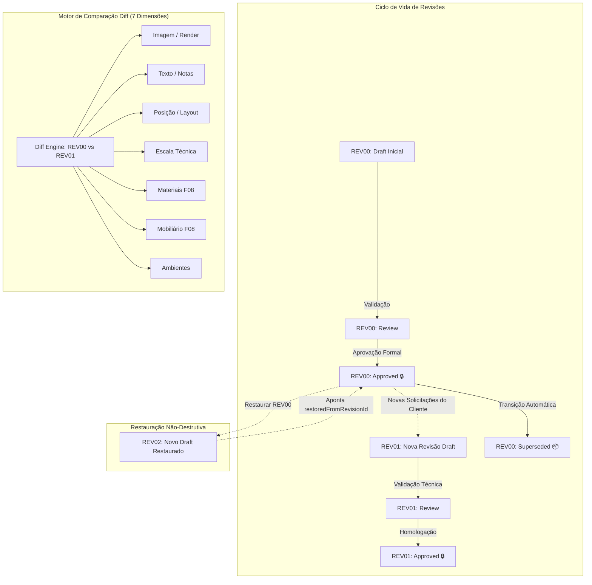

# ArqVértice Studio — Bloco F12: Sistema de Controle Formal de Revisões (Revision System)

## 1. Visão Geral e Filosofia de Governança

O **Sistema de Controle Formal de Revisões (Bloco F12)** é a espinha dorsal de governança documental e integridade do ArqVértice Studio. 

Em arquitetura de alto padrão, cada modificação precisa ser registrada, justificada e rastreável. Modificações inadvertidas ou perda de decisões aprovadas pelo cliente geram retrabalho e riscos contratuais severos. O F12 implementa o princípio da **imutabilidade histórica append-only**:
> **Regra de Ouro do Studio:** Uma apresentação aprovada **nunca é sobrescrita silenciosamente**. Qualquer alteração subsequente gera uma nova revisão (`REV01`, `REV02`), mantendo o ponteiro para a revisão ancestral (`parentRevisionId`) e preservando a árvore histórica completa.



---

## 2. A Entidade Canônica `Revision`

Toda revisão formal registrada no sistema possui estritamente os **9 campos canônicos**:

| Campo | Tipo | Descrição e Regra de Preenchimento |
| :--- | :---: | :--- |
| `id` | `String` | Identificador único imutável (ex.: `rev-prj-praia-01-00`). |
| `projectId` | `String` | ID do projeto vinculado. |
| `presentationId` | `String` | ID da apresentação de projeto associada. |
| `revisionNumber` | `String` | Código canônico normalizado (ex.: `REV00`, `REV01`, `REV02`). |
| `date` | `String` | Timestamp ISO de registro da revisão. |
| `author` | `String` | Nome do arquiteto ou autor da revisão. |
| `description` | `String` | Descrição técnica das alterações e justificativa do escopo. |
| `status` | `String` | Um dos 5 status canônicos (`draft`, `review`, `approved`, `superseded`, `archived`). |
| `parentRevisionId` | `String` | ID da revisão ancestral imediata (`null` para o marco inicial). |

Além dos 9 campos canônicos, cada entidade embute:
- `snapshot`: Cópia profunda imutável de todas as pranchas, elementos, especificações de materiais, mobiliário e ambientes no instante da revisão.
- `changes`: Registro computado do delta de alterações em relação à versão ancestral.
- `approval`: Metadados de homologação (`approvedBy`, `approvedAt`, `notes`).
- `restoredFromRevisionId`: Registro de proveniência quando gerada por restauração.

---

## 3. Máquina de Estados e os 5 Status Canônicos

```text
┌──────────────┬────────────────────────────────────────────────────────────────────────┐
│ STATUS       │ SIGNIFICADO E COMPORTAMENTO OPERACIONAL NO STUDIO                      │
├──────────────┼────────────────────────────────────────────────────────────────────────┤
│ draft        │ Rascunho em elaboração ativa. Permite adição e edição livre.           │
│ review       │ Em processo de revisão técnica e validação pelo arquiteto líder.       │
│ approved     │ HOMOLOGADO FORMALMENTE. Pranchas e dados protegidos contra edição.     │
│ superseded   │ Substituído por uma revisão homologada mais recente. Somente leitura.   │
│ archived     │ Arquivado para guarda técnica e comprovação legal a longo prazo.       │
└──────────────┴────────────────────────────────────────────────────────────────────────┘
```

---

## 4. Proteção de Versões Aprovadas (Anti-Sobrescrita)

> [!IMPORTANT]
> **PROTEÇÃO CONTRA ALTERAÇÃO DIRETA:**
> Quando uma revisão atinge o estado `approved`, o método `StudioState.isSheetRevisionProtected(sheetId)` bloqueia alterações diretas nas pranchas pertencentes àquela revisão.
> Qualquer tentativa de mutação dispara o erro de guarda:
> *"Operação bloqueada: A revisão REV00 já foi formalmente aprovada e está protegida. Crie uma nova revisão para adicionar alterações."*

---

## 5. Motor de Comparação (Diff Engine) em 7 Dimensões

O comparador `StudioState.compareRevisions(revIdA, revIdB)` analisa minuciosamente os snapshots de duas versões e gera o relatório categorizado nas 7 dimensões canônicas:

1. **`imagem`**: Detecta imagens, perspectivas ou renders adicionados, removidos ou com troca de URL/versão entre as pranchas.
2. **`texto`**: Detecta alterações em legendas, títulos de prancha, memoriais e notas técnicas.
3. **`posicao`**: Identifica elementos gráficos, cotas ou plantas que sofreram translação nas coordenadas $(x, y)$ ou redimensionamento de largura e altura.
4. **`escala`**: Detecta alterações nas escalas métricas nominais das pranchas (ex.: de `1:50` para `1:25`).
5. **`material`**: Identifica especificações técnicas de materiais incluídas, excluídas ou com alterações de acabamento, cor ou fornecedor.
6. **`mobiliario`**: Registra alterações em dimensões, modelo, fabricante ou quantitativos de peças de mobiliário solto ou marcenaria.
7. **`ambiente`**: Detecta inclusão, exclusão ou reconfiguração de metragem quadrada de ambientes.

---

## 6. Histórico e Timeline Cronológica

O método `StudioState.getRevisionHistory(projectId)` retorna a linha do tempo sequencial e auditada de todas as revisões do projeto. 

A interface apresenta cada nó da timeline exibindo:
- Código da revisão (`REV00`, `REV01`, etc.);
- Badge colorido do status canônico;
- Autor e data formatada (`pt-BR`);
- Descritivo técnico das alterações;
- Contador de alterações detectadas pelo diff engine;
- Selo de homologação formal quando aprovado;
- Indicação de restauração quando aplicável (`Restaurado de REV00`).

---

## 7. Restauração Não-Destrutiva de Versões Anteriores

> [!TIP]
> **A HISTÓRIA NUNCA É APAGADA:**
> Caso o cliente solicite retornar a uma proposta conceitual anterior (ex.: voltar da `REV02` para a `REV00`), o método `StudioState.restoreRevision(revisionId, user, notes)`:
> 1. **Não exclui** nem sobrescreve `REV01` ou `REV02`.
> 2. Cria uma nova revisão subsequente (`REV03`).
> 3. Conecta `parentRevisionId = REV02` e `restoredFromRevisionId = REV00`.
> 4. Restaura o estado visual exato de `REV00`, atualizando a numeração de pranchas para `REV03`.
> 5. Preserva a rastreabilidade integral de idas e vindas de decisões do cliente.

---

## 8. Interface do Usuário: Módulo de Revisões

O módulo [`RevisionSystemModule`](file:///c:/Users/erick/ARQVERTICE-STUDIO/js/revision-system-module.js) oferece:
- **Painel Dual**: Navegação de timeline cronológica à esquerda e painel de inspeção/diff à direita.
- **Diff Viewer Interativo**: Seletor para confrontar qualquer par de revisões com contadores e listas expansíveis nas 7 categorias.
- **Botão "Nova Revisão"**: Modal para abertura de novo ciclo com cálculo automático do próximo índice (`REV00` $\to$ `REV01`).
- **Botão "Homologar & Proteger"**: Transição de estado com registro do revisor e travamento de edições.
- **Botão "Restaurar Snapshot"**: Restauração limpa e assistida com justificativa técnica.

---

## 9. Cobertura de Testes Automatizados

A suíte [`tests/revision-system.test.js`](file:///c:/Users/erick/ARQVERTICE-STUDIO/tests/revision-system.test.js) valida os seguintes requisitos:

1. **Estrutura de Dados e Constantes**: Presença dos 9 campos obrigatórios e dos 5 status canônicos.
2. **Proteção Anti-Sobrescrita**: Bloqueio de edição direta sobre revisão aprovada e criação de nova revisão sequencial.
3. **Diff Engine em 7 Dimensões**: Detecção precisa de alterações em imagens, textos, posições, escalas, materiais, mobiliários e ambientes.
4. **Timeline e Histórico**: Ordenação cronológica correta com vínculos de parentesco.
5. **Restauração Não-Destrutiva**: Criação de revisão restaurada preservando a integridade das versões intermediárias.
6. **Aprovação e Transição**: Marcação de revisões aprovadas anteriores como `superseded`.
7. **Detecção de Prancha Protegida**: `isSheetRevisionProtected` operando dinamicamente.

Execução da suíte:
```bash
node tests/revision-system.test.js
```
