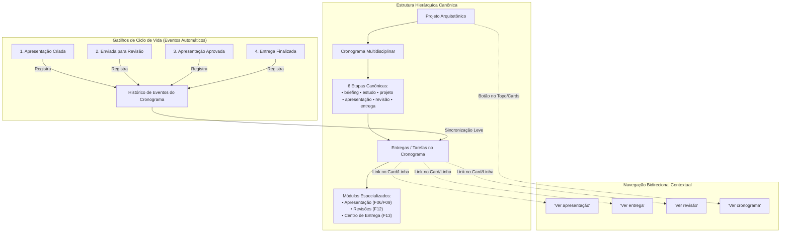

# ArqVértice Studio — Bloco F14: Integração do Módulo de Apresentação/Entrega ao Cronograma

## 1. Visão Geral e Princípios de Governança

O **Bloco F14 (Integração ao Cronograma)** estabelece a ponte operacional e sistêmica entre o motor de Apresentações (F06/F09), o Sistema de Revisões (F12) e o Centro de Entrega (F13) com o **módulo de cronograma multidisciplinar já existente** no ArqVértice Studio.

> [!IMPORTANT]
> **REGRAS DE OURO DA INTEGRAÇÃO:**
> - **Não recriar o cronograma:** Toda a arquitetura do cronograma preexistente (Kanban, Tabela Datagrid, cálculo de fases *"Estamos Aqui"*, Equipe Técnica, KPIs e relatório executivo) é preservada com 100% de integridade.
> - **Não substituir a interface existente:** Novos recursos e links rápidos foram adicionados de forma aditiva sobre a UI consolidada.
> - **Não apagar funcionalidades:** Filtros, drag-and-drop, sliders de porcentagem e modais continuam operando normalmente.
> - **Não duplicar banco desnecessariamente:** A sincronização armazena apenas referências pontuais (`presentationId`, `revisionNumber`, `deliveryId`, `etapa`) e histórico leve de eventos.
> - **Camada de compatibilidade transparente:** Tarefas legadas sem etapa cadastrada têm suas etapas inferidas automaticamente sem mutação destrutiva do banco.



---

## 2. A Relação Canônica: Projeto → Cronograma → Etapas → Entregas → Apresentações

A arquitetura do ArqVértice Studio conecta os domínios seguindo a hierarquia natural da prática arquitetônica:

1. **Projeto (`Project`)**: Empreendimento imobiliário com cliente, código, escopo e metas.
2. **Cronograma (`Schedule`)**: Matriz temporal de tarefas e entregáveis vinculada ao projeto.
3. **Etapas (`Stages`)**: As 6 etapas canônicas do ciclo de vida profissional.
4. **Entregas (`Tasks`)**: Itens do cronograma atribuídos a projetistas, com data de início, conclusão prevista, avanço percentual e etapa vinculada.
5. **Apresentações & Pacotes (`Presentations / Deliveries`)**: Artefatos técnicos concretos (dossiês, pranchas, especificações e pacotes ZIP).

---

## 3. As 6 Etapas Canônicas de Associação

Definidas na constante canônica `StudioState.SCHEDULE_CANONICAL_STAGES`:

| # | Código Canônico | Rótulo Institucional | Escopo de Entrega Típico |
| :-: | :--- | :--- | :--- |
| **1** | `briefing` | Briefing (Requisitos e Necessidades) | Coleta de dados, programa de necessidades, levantamento e condicionantes legais. |
| **2** | `estudo` | Estudo Preliminar (Conceito e Volumetria) | Implantação, volumetria 3D conceitual, fluxogramas e primeiras maquetes digitais. |
| **3** | `projeto` | Projeto (Básico e Executivo) | Detalhamento arquitetônico, compatibilização com engenharias complementares. |
| **4** | `apresentacao` | Apresentação (Dossiê e Pranchas) | Diagramação de pranchas NBR, renders foto-realistas e montagem da apresentação geral. |
| **5** | `revisao` | Revisão (Alterações e Homologação) | Ajustes pós-avaliação do cliente, controle formal de revisões (`REV01`, `REV02`). |
| **6** | `entrega` | Entrega (Centro de Entrega e Emissão Final) | Conferência de QA, emissão do dossiê final e geração do pacote consolidado. |

O método `StudioState.associateTaskToStage(taskId, stage, associations)` permite associar uma entrega a qualquer uma dessas etapas e vincular ponteiros contextuais (`presentationId`, `revisionNumber`, `deliveryId`).

---

## 4. Registro Automático de Eventos de Apresentação

O sistema registra automaticamente no cronograma os 4 marcos cruciais do ciclo de vida:

1. **Apresentação Criada (`PRESENTATION_CREATED`)**:
   - Disparado em: `createPresentation()` ou `generateAutomaticPresentation()`.
   - Sincronização: Localiza tarefas da etapa `apresentacao` e, se ainda não iniciadas, atualiza para `Em Andamento` (20%) e registra o `presentationId`.
2. **Apresentação Enviada para Revisão (`PRESENTATION_IN_REVIEW`)**:
   - Disparado em: `updatePresentation(id, { status: 'in_review' })`.
   - Sincronização: Atualiza o status da tarefa para `Em Andamento` e avança o progresso para no mínimo 75%.
3. **Apresentação Aprovada (`PRESENTATION_APPROVED`)**:
   - Disparado em: `approvePresentation()` e `approveRevision()`.
   - Sincronização: Marca tarefas associadas de `apresentacao` ou `revisao` como `Concluído` (100%) e registra metadados de homologador.
4. **Entrega Finalizada (`DELIVERY_FINALIZED`)**:
   - Disparado em: `finalizeProjectDeliveryPackage()`.
   - Sincronização: Marca tarefas associadas de `entrega` como `Concluído` (100%), vinculando `deliveryId` e código da revisão emitida.

---

## 5. Sincronização Leve (Sem Duplicação de Dados)

Em respeito estrito aos princípios de eficiência e governança:
- O cronograma armazena apenas **ponteiros relacionais** (`presentationId`, `revisionNumber`, `deliveryId`).
- Imagens binárias, pranchas pesadas em SVG/PDF, cadernos e snapshots imutáveis permanecem em suas coleções especializadas (`presentations`, `sheets`, `deliveries`).
- As tarefas de cronograma permanecem leves, garantindo renderização ultra-rápida do Kanban e da Tabela mesmo em projetos com centenas de pranchas e renders.

---

## 6. Links Contextuais no Cronograma

No Kanban (cards) e na Tabela Datagrid (linhas), cada entrega oferece acesso imediato com um clique aos seus módulos correlatos:

- **`"Ver apresentação"`**: Abre diretamente o canvas e dossiê de apresentação no motor de diagramação (`PresentationEngineModule`).
- **`"Ver entrega"`**: Abre o Centro de Entrega do projeto (`DeliveryCenterModule`) contextualizado na revisão atual.
- **`"Ver revisão"`**: Abre o histórico e comparador visual de revisões (`RevisionSystemModule`).

A navegação é orquestrada pelo despachador `CronogramaIntegration`:
```javascript
CronogramaIntegration.openPresentationForTask(taskId);
CronogramaIntegration.openDeliveryForTask(taskId);
CronogramaIntegration.openRevisionForTask(taskId);
```

---

## 7. Acesso ao Cronograma a partir do Projeto

Em consonância com a especificação, as telas de gestão do projeto exibem o link direto:
- **`"Ver cronograma"`**:
  - Nos cards de projeto da visão de lista (`js/projects.js`).
  - No widget "Cronograma Conectado" do Workspace de Desenvolvimento (`js/project-workspace-module.js`).
  - Na barra superior de ferramentas da Apresentação (`js/presentation-engine-module.js`).

---

## 8. Camada de Compatibilidade (Preservação Transparente)

Para tarefas já existentes na base de dados que não possuíam o atributo `etapa`:
- O método `StudioState.resolveTaskStage(task)` atua como resolvedor inteligente em tempo de execução:
  - Analisa título, disciplina e descrição técnica.
  - Converte sinônimos e palavras-chave legadas (*"Estudo Preliminar"* $\to$ `estudo`, *"Renderização 3D"* $\to$ `apresentacao`, *"Entrega Final"* $\to$ `entrega`).
  - Não altera nem corrompe os dados existentes em disco/armazenamento.

---

## 9. Cobertura de Testes Automatizados

A suíte dedicada [`tests/schedule-integration.test.js`](file:///c:/Users/erick/ARQVERTICE-STUDIO/tests/schedule-integration.test.js) cobre todos os 11 cenários canônicos:

1. `1.1`: Relação Projeto $\to$ Cronograma $\to$ Etapas $\to$ Entregas $\to$ Apresentações.
2. `2.1`: Evento 1 — Apresentação criada registra evento no cronograma.
3. `2.2`: Evento 2 — Apresentação enviada para revisão registra evento.
4. `2.3`: Evento 3 — Apresentação aprovada registra evento.
5. `2.4`: Evento 4 — Finalização de entrega registra evento.
6. `3.1`: Catálogo das 6 etapas canônicas e validação de associação.
7. `4.1`: Sincronização leve de status e progresso sem duplicação de dados.
8. `5.1`: Resposta dos links rápidos em `CronogramaIntegration`.
9. `6.1`: Renderização dos links "Ver apresentação", "Ver entrega", "Ver revisão" no HTML.
10. `7.1`: Camada de compatibilidade para tarefas legadas.
11. `8.1`: Preservação integral do cronograma existente (cálculo de avanço e KPIs).

**Resultado:** 11/11 testes aprovados (100% de sucesso).
