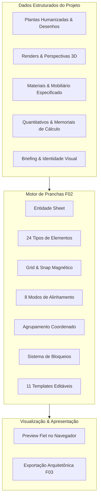

# Motor de Pranchas (Sheet Engine) — ArqVértice Studio
**Documento de Arquitetura, Modelagem, Posicionamento e Especificações Técnicas (Bloco F02)**

---

## 1. Visão Geral e Princípio Fundamental

O **Motor de Pranchas (Sheet Engine)** do ArqVértice Studio é o módulo especializado na diagramação, composição visual e montagem de pranchas arquitetônicas e executivas de alto padrão (A0, A1, A2, A3, A4 e Prancha Métrica).

> [!IMPORTANT]
> **Princípio de Não-Substituição do Revit**: O ArqVértice Studio **não substitui o Autodesk Revit** ou ferramentas CAD/BIM de modelagem paramétrica detalhada. O objetivo do Studio é organizar, diagramar, compor e apresentar com rigor estético e integridade conceitual as imagens, plantas humanizadas, especificações, memoriais, perspectivas e quantitativos produzidos ao longo do ciclo de vida do projeto.



---

## 2. Entidade Sheet (Prancha)

Cada prancha é tratada como um documento cartográfico autônomo associado obrigatoriamente a um `projectId` e opcionalmente a uma `presentationId` (compondo o ecossistema do Bloco F01).

### Campos Canônicos (16 Campos)

| Campo | Tipo | Descrição | Exemplo |
|---|---|---|---|
| `id` | String | Identificador único canônico | `sheet-179005-9a8b` |
| `presentationId` | String / null | Vinculação à apresentação de slides pai | `pres-praia-01` |
| `projectId` | String | Vínculo obrigatório ao projeto arquitetônico | `prj-praia-01` |
| `name` | String | Nome identificador da prancha | `Plantas Baixas e Layout` |
| `sheetNumber` | String | Numeração formal e sequencial de prancha | `PR-01`, `PR-02` |
| `title` | String | Título principal presente no carimbo e topo | `RESIDÊNCIA ALPHAVILLE` |
| `subtitle` | String | Subtítulo descritivo de setor ou disciplina | `LAYOUT E CIRCULAÇÃO` |
| `format` | String | Formato físico nominal (`A0`, `A1`, `A2`, `A3`, `A4`, `PRANCHA_METRICA`) | `A3` |
| `orientation` | String | Orientação da prancha (`landscape`, `portrait`) | `landscape` |
| `scale` | String | Escala nominal de referência arquitetônica | `1:50`, `1:100`, `Indicada` |
| `background` | String | Cor hexadecimal de fundo | `#ffffff` |
| `revision` | String | Código de controle de revisão técnica | `R00`, `R01`, `R02` |
| `status` | String | Ciclo de vida (`rascunho`, `em_revisao`, `aprovada`, `finalizada`) | `rascunho` |
| `sortOrder` | Number | Ordem de apresentação no índice | `0`, `1`, `2` |
| `createdAt` | ISO-8601 | Carimbo de data/hora de criação | `2026-09-22T02:00:00Z` |
| `updatedAt` | ISO-8601 | Carimbo de data/hora da última mutação | `2026-09-22T02:15:00Z` |

---

## 3. Elementos de Prancha (24 Tipos Canônicos)

Uma prancha no ArqVértice Studio pode conter e manipular 24 tipos especializados de elementos:

```
1. texto              9. elevacao          17. simbolo
2. titulo            10. corte             18. norte
3. subtitulo         11. detalhe           19. escala_grafica
4. imagem            12. tabela            20. carimbo
5. planta            13. mobiliario        21. logo
6. planta_humanizada 14. material          22. linha
7. perspectiva       15. legenda           23. retangulo
8. render            16. cota              24. separador
```

### Anatomia do Elemento

Cada elemento possui sistema cartesiano completo:
- `x`, `y`: Coordenadas absolutas na prancha (em pixels virtuais);
- `width`, `height`: Largura e altura do retângulo delimitador;
- `rotation`: Ângulo de rotação em graus (0° a 359°);
- `zIndex`: Ordem de empilhamento de camadas;
- `opacity`: Nível de transparência (0.0 a 1.0);
- `visible`: Visibilidade ativada/desativada;
- `locked`: Bloqueio total (impede edição, exclusão e transformação);
- `lockPosition`: Bloqueio apenas de movimentação (`x`, `y`);
- `lockSize`: Bloqueio apenas de dimensionamento (`width`, `height`);
- `groupId`: Vínculo a grupo de elementos (ou `null`);
- `content`: Payload semântico do elemento (textos, URLs, dados de tabela, cotas, ângulos);
- `style`: Estilização visual (cores, tipografia, bordas, preenchimento).

---

## 4. Grid Visual, Snap e Posicionamento

- **Grid Visual**: Malha isométrica e ortogonal configurável com gradientes CSS leves;
- **Snap Magnético**: Arredonda as coordenadas para o múltiplo mais próximo do grid (ex: passo de 20px) durante o arraste e o redimensionamento;
- **Guias Técnicas**: Linhas estruturais e margens normatizadas (margem de segurança técnica de 20px com borda preta fina de desenho arquitetônico);
- **Zoom Suave**: Controle de escala de 20% a 200% com centralização automática.

---

## 5. Alinhamento e Distribuição (8 Operações)

O motor implementa algoritmos de geometria analítica para alinhamento e distribuição automática de 2 ou mais elementos:

1. **Alinhar Esquerda (`left`)**: Encontra `min(x)` dos elementos selecionados e alinha a face esquerda de todos nesse valor;
2. **Alinhar Direita (`right`)**: Encontra `max(x + width)` e reposiciona `x = maxRight - element.width`;
3. **Alinhar Topo (`top`)**: Encontra `min(y)` e alinha a face superior de todos nesse valor;
4. **Alinhar Base (`bottom`)**: Encontra `max(y + height)` e reposiciona `y = maxBottom - element.height`;
5. **Centralizar Horizontal (`center_h`)**: Calcula o baricentro médio dos centros em X e reposiciona cada elemento para `x = avgCenter - element.width / 2`;
6. **Centralizar Vertical (`center_v`)**: Calcula o baricentro médio dos centros em Y e reposiciona cada elemento para `y = avgCenter - element.height / 2`;
7. **Distribuir Horizontal (`distribute_h`)**: Ordena os elementos por X e distribui o espaço vago uniformemente entre a primeira e a última borda;
8. **Distribuir Vertical (`distribute_v`)**: Ordena os elementos por Y e distribui o espaço vago uniformemente entre o topo e a base.

> Elementos com `locked` ou `lockPosition` são preservados em sua posição original durante as rotinas de alinhamento e distribuição.

---

## 6. Agrupamento Coordenado

- Permite combinar múltiplos elementos em um grupo unificado (`groupId`), como:
  **Imagem + Legenda + Título de Desenho** ou **Planta + Norte + Escala Gráfica**;
- **Translação Coordenada**: Ao movimentar qualquer membro do grupo por um vetor `(dx, dy)`, todos os outros elementos do mesmo grupo são automaticamente transladados pelo mesmo vetor `(dx, dy)`, mantendo milimetricamente o offset relativo interno;
- **Desagrupamento (`ungroup`)**: Libera todos os elementos de volta para manipulação avulsa sem alterar suas posições no canvas.

---

## 7. Sistema de Bloqueios (Locks)

O sistema previne edições indesejadas através de 4 níveis de proteção:
1. **Bloqueio de Posição (`lockPosition`)**: O elemento não pode ser arrastado ou movido;
2. **Bloqueio de Tamanho (`lockSize`)**: O elemento não pode ter sua largura ou altura alteradas;
3. **Bloqueio do Elemento (`locked`)**: O elemento fica 100% blindado contra movimentação, resize, rotação e exclusão;
4. **Bloqueio de Grupo (`group.locked`)**: Blindagem coletiva aplicada em lote a todos os membros do grupo.

---

## 8. Duplicação em Cascata

- **Duplicação de Elemento**: Clona o elemento com novo identificador, desvinculado de grupos anteriores e com pequeno deslocamento visual (`+20px, +20px`);
- **Duplicação de Grupo**: Clona integralmente todos os membros do grupo, gera um novo `groupId` e mapeia todos os clones para o novo grupo;
- **Duplicação de Prancha**: Clona a prancha com novo `sheetNumber` sequencial, duplica todos os grupos gerando novos identificadores mapeados e clona todos os elementos associando-os à nova prancha.

---

## 9. Sistema de Templates Não-Rígidos (11 Tipos Iniciais)

O sistema conta com 11 templates com diagramação balanceada e profissional:

1. **Apresentação Geral**: Título, subtítulo, render principal de impacto, memorial de conceito, tabela de áreas do programa, carimbo e logotipo;
2. **Ambiente**: Planta de layout do ambiente, 2 renders de perspectivas de pontos de vista complementares, tabela de acabamentos e carimbo;
3. **Planta Humanizada**: Desenho central amplo, símbolo do Norte Magnético (SVG interativo), Escala Gráfica segmentada, legenda de compartimentos e carimbo;
4. **Perspectiva**: Enquadramento fotográfico panorâmico com render em alta resolução e notas volumétricas de materiais;
5. **Moodboard**: Composição em grid 3x2 de amostras visuais de texturas, paleta cromática e referências sensoriais de interiores;
6. **Materiais**: Cartões de amostras de acabamentos com código e fornecedor, acompanhados de tabela técnica de superfícies;
7. **Mobiliário**: Catálogo de peças com especificações de designers, dimensões e fabricantes;
8. **Quantitativos**: Quadro resumo de materiais e revestimentos extraído das memórias de cálculo do projeto;
9. **Estudo Preliminar**: 3 colunas comparativas para zoneamento, estudos de massa, croquis e diretrizes espaciais;
10. **Revisão**: Tabela de histórico de revisões (R00, R01, R02), responsável, data e notas de compatibilização;
11. **Entrega Definitiva**: Prancha de fechamento oficial de projeto executivo para obra, com carimbo ampliado e lista de conformidade.

> [!NOTE]
> **Flexibilidade Absoluta**: Nenhum template é rígido. Cada elemento gerado pelo template pode ser livremente redimensionado, movido, bloqueado, agrupado ou excluído pelo usuário.

---

## 10. Performance e Preview de Alta Fidelidade

Para garantir alta taxa de quadros e carregamento fluido mesmo em projetos com dezenas de pranchas e renders pesados:
- **Lazy Loading**: Atributo `loading="lazy"` aplicado em todos os elementos de imagem e render;
- **Símbolos Vetoriais Leves**: Norte, escala gráfica, carimbo e cotas desenhados em SVG puro e CSS de alta definição, consumindo mínima memória de GPU;
- **Modo Preview Fiel**: Alterna a interface escondendo réguas, barras laterais e alças de seleção para visualização 100% limpa da prancha em sua fidelidade final de diagramação.

---

## 11. Validação de Testes Automatizados

A suíte de testes em `tests/sheet-engine.test.js` homologa **39 critérios de aceite rigorosos**:
- Grupo 1: Entidade Sheet, criação e integridade de campos (4 testes)
- Grupo 2: Suporte aos 24 tipos de elementos (1 teste consolidado)
- Grupo 3: Posicionamento, resize e rotação (3 testes)
- Grupo 4: Alinhamentos (esquerda, direita, topo, base, centralizar H, centralizar V, distribuir H, distribuir V) (8 testes)
- Grupo 5: Agrupamento e translação coordenada (3 testes)
- Grupo 6: Sistema de locks (posição, tamanho, elemento e grupo) (4 testes)
- Grupo 7: Duplicação de elementos, grupos e pranchas (3 testes)
- Grupo 8: Aplicação de todos os 11 templates com elementos editáveis (11 testes)
- Grupo 9: Performance, lazy loading e cálculo dimensional de pranchas (2 testes)

**Status de Homologação**: `39 PASSOU | 0 FALHOU` (100% de sucesso).
