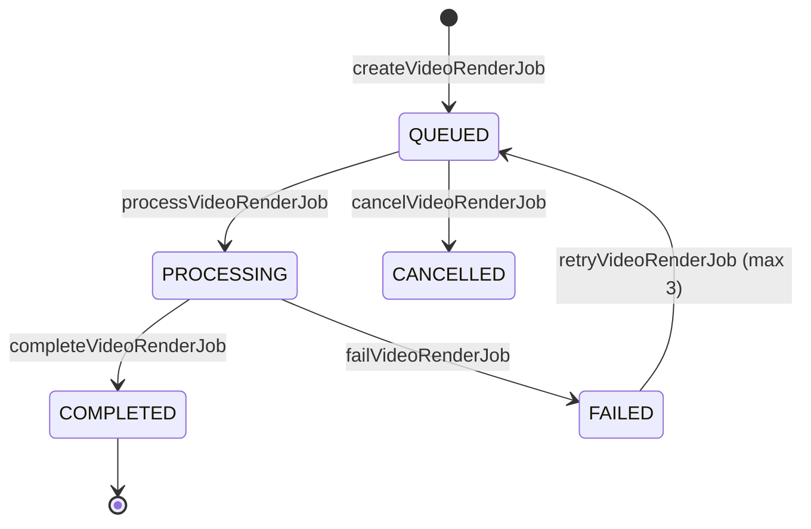

# ARQVERTICE STUDIO — RENDERIZAÇÃO AUDIOVISUAL E PIPELINE
## BLOCO G: MOTOR DE RENDERIZAÇÃO E FILA DETERMINÍSTICA

Data: 2026-09-22  
Módulo: Remotion Architectural Video Engine / Render Pipeline  
Status: Produção / Integrado  

---

### 1. Visão Geral da Renderização
A renderização audiovisual no ArqVertice Studio opera sob o motor determinístico do **Remotion**, garantindo que cada frame seja compilado a partir de código React e do estado real do projeto arquitetônico.

O pipeline de renderização garante:
1. **Determinismo**: $frame(t) = f(\text{Estado do Projeto}, t)$.
2. **Alta Performance**: Processamento concorrente com estimativa de tempo e memória calculadas antes do disparo.
3. **Não-Bloqueio**: Execução assíncrona por meio de fila de render com status rastreáveis (`queued`, `processing`, `completed`, `failed`, `cancelled`).
4. **Proteção de Qualidade (QA Gate)**: Bloqueio automático de render caso haja pendências ativas com status `BLOCKED` no módulo de QA Audiovisual (G14).

---

### 2. Presets e Resoluções Homogêneas
Para evitar discrepâncias entre múltiplos providers ou assets, o sistema adota resoluções e bitrates normalizados:

| Preset | Resolução Horizontal (16:9) | Resolução Vertical (9:16) | FPS | Bitrate Recomendado | Finalidade |
|---|---|---|---|---|---|
| **DRAFT** | 1280 × 720 (720p) | 720 × 1280 | 30 | 3.500 Kbps | Validação rápida de ritmo e enquadramento |
| **WEB** | 1920 × 1080 (1080p) | 1080 × 1920 | 30 | 8.000 Kbps | Apresentação em browser e redes sociais |
| **CINEMA_4K** | 3840 × 2160 (4K) | 2160 × 3840 | 60 | 35.000 Kbps | Telões, mostras e reuniões de alto padrão |
| **EDITORIAL** | 1080 × 1350 (4:5) | — | 30 | 7.000 Kbps | Publicação em pranchas e feeds verticais |

---

### 3. Fila de Renderização e Ciclo de Vida do Job


1. `createVideoRenderJob(jobData)`: Enfileira a solicitação, valida se o QA está liberado e calcula o tempo estimado em segundos.
2. `processVideoRenderJob(jobId)`: Aloca o worker e atualiza o estado para processamento.
3. `updateVideoRenderJobProgress(jobId, progress, phase)`: Atualiza a barra de progresso em tempo real no React (0 a 100%).
4. `completeVideoRenderJob(jobId, result)`: Cria a nova `VideoRenderVersion`, armazena URL final e dispara verificação pós-render.

---

### 4. Integração com RemotionEngine
No arquivo `video/render/remotion-engine.js`:
```javascript
const renderResult = await RemotionEngine.executeRender({
  videoProjectId: 'video-praia-01',
  templateId: 'ARCHITECTURAL_CINEMATIC',
  format: '16:9',
  resolution: '1080p',
  fps: 30
});
```

A saída inclui:
- `outputUrl`: Caminho do arquivo de vídeo gerado.
- `version`: Identificador da versão criada (`v1.0`, `v1.1`...).
- `qaResult`: Avaliação de qualidade gerada no momento da exportação.
- `renderTimeMs`: Duração real do processo de compilação.
